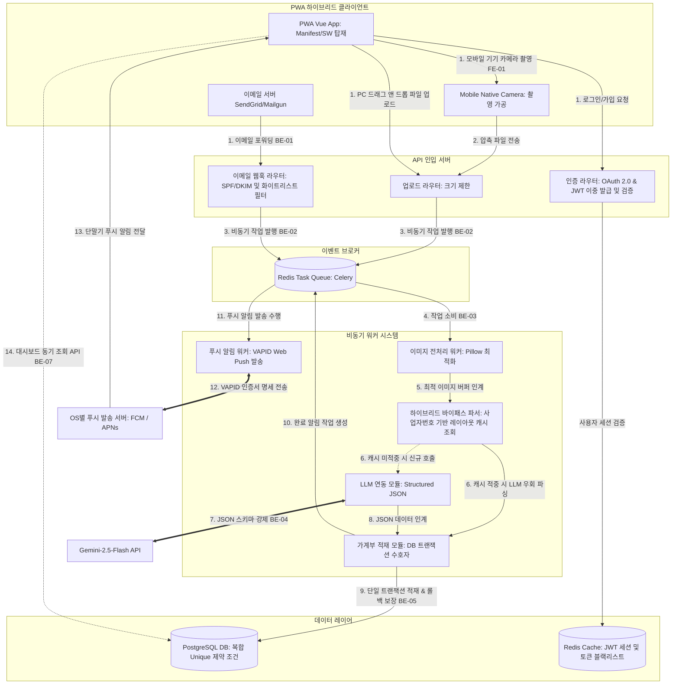

# 🧾 AI 기반 세금/영수증 PDF 분석 및 가계부 자동화

**AI-Powered Tax/Receipt PDF Analyzer & Automated Ledger with Vision-First PWA**

본 프로젝트는 귀찮은 영수증 수동 기입 과정을 전격 자동화하는 서비스입니다. 사용자가 웹 UI 또는 전용 이메일 주소로 영수증 파일(PDF, 이미지)을 포워딩하는 것만으로 **Gemini-2.5-Flash** 멀티모달 AI가 사업자 정보, 결제 금액, 세부 품목 스키마를 판독하여 정밀한 PostgreSQL 가계부 원장 데이터베이스에 적재합니다. 

모바일 웹 네이티브 바로가기(A2HS) 및 카메라 연동을 지원하는 PWA 하이브리드 앱 환경과 대량 처리를 위한 Celery/Redis 비동기 인프라, 그리고 API 비용을 0원으로 수렴하게 하는 하이브리드 바이패스 파서를 구축하여 프리미엄 사용자 경험과 뛰어난 엔지니어링 신뢰성을 완벽하게 제공합니다.

---

## 🌟 핵심 가치 (Value Proposition)

- **제로 터치 수집 (Zero-touch Ingestion):** 파일 업로드 뿐만 아니라 SPF/DKIM 보안 필터가 장착된 전용 수신 주소로 메일을 포워딩하는 것만으로 가계부가 즉시 자동 갱신됩니다.
- **구조화된 AI 분석 (Vision-First Structured Outputs):** 발행처에 상관없이 멀티모달 LLM API가 레이아웃 이미지 및 텍스트를 판독해 완벽히 일관된 JSON 스키마로 강제 변환합니다.
- **하이브리드 비용 최적화 (Bypass Parser Cache):** 사업자번호 기준 정규식 템플릿 캐싱과 자율 학습 파이프라인을 탑재하여, 반복 유입 가맹점은 LLM API 호출을 우회 처리함으로써 API 예산을 0원에 수렴하게 통제합니다.
- **모바일 하이브리드 최적화 (Installable PWA):** 앱스토어 설치 없이 모바일 홈 화면 설치(A2HS), 네이티브 카메라 다이렉트 엑세스, HTML5 Canvas 1차 이미지 리사이징 압축 전송을 통해 트래픽 부담을 억제합니다.

---

## 🏗️ 시스템 아키텍처 (System Architecture)

### 컴포넌트 간 동적 데이터 흐름



---

## 🏛️ 프로젝트 헌법 5대 핵심 원칙 (Core Principles)

본 프로젝트는 수립된 프로젝트 헌법(`.specify/memory/constitution.md`) 규격에 따라 철저하게 통제 및 개발됩니다.

1. **데이터 무결성 및 원자성 트랜잭션 최우선 (Data Integrity & Transaction Atomicity)**
   - 영수증 1장에 대한 가계부 레코드(ledgers)와 품목 배열(ledger_items)의 생성/수정 연산은 반드시 단 하나의 Django ORM 트랜잭션 블록(`transaction.atomic()`) 내에서 원자적으로 처리되어야 하며, 장해 발생 시 전격 전역 롤백됩니다.
   - 중복 결제 적재 방지를 위해 `UNIQUE (user_id, vendor_registration_number, transaction_date, total_amount)` 복합 고유 제약조건을 DB 단에 강력하게 강제합니다.
2. **비동기 큐 전환 및 자원 점유 최적화 (Asynchronous Scale Isolation)**
   - 이미지 처리(Pillow) 및 외부 AI API 호출 등 CPU/네트워크 대기 시간이 긴 연산은 격리된 Celery 비동기 독립 워커 내부에서만 비동기 처리되며, API 서버는 즉시 202 Accepted 및 작업 식별자를 반환합니다.
   - DB 인프라 고갈 방지를 위해 최대 가용 커넥션 수를 api_server 5개, async_worker 3개, 전체 합산 최대 8개 커넥션으로 하드 제한합니다.
3. **하이브리드 비용 최적화 파이프라인 (Hybrid Bypass for Cost Control)**
   - 사업자등록번호가 판별되면 캐시 테이블(`merchant_templates`)을 최우선 조회하여 검증 승인된 정규식 규칙(`is_verified: true`)에 적합할 시 유료 LLM 호출을 완전 바이패스(Bypass)하여 정적 파싱합니다.
   - 미검증 정규식 캐시는 어드민의 수동 검토 및 승인을 거쳐야만 바이패스 루프에 유입되도록 차단벽을 형성합니다.
4. **SPF/DKIM 기반 엄격한 보안 메일 수집 (Secure Inbound Email Ingestion)**
   - 이메일 수신 시 SPF 및 DKIM 전자서명 보안 인장을 정밀 대조하여 위변조 도메인을 필터링하고, 가입 사용자당 사전에 등록된 최대 3개의 화이트리스트 메일 발송인 정보와 100% 일치할 경우에만 비동기 큐 적재를 허용합니다.
5. **Vision-First PWA & HTTPS 보안 환경 강제 (Mobile-first PWA & HTTPS Mandated)**
   - PWA 접속 시 HTML5 Capture API와 Accept 속성을 바인딩해 카메라 촬영 즉시 Canvas API를 활용해 가로 최대 1000px 수준으로 1차 압축 전송합니다.
   - 서비스 워커 등록 및 VAPID 명세의 백그라운드 Web Push 알림 수신을 만족하기 위해 HTTPS SSL 적용을 의무화합니다.

---

## 🛠️ 기술 스택 (Tech Stack)

| 구분 | 기술 사양 |
|------|-----------|
| **Backend Core** | Python 3.11 + Django Framework & Django REST Framework (DRF) (패키지 관리: **uv**) |
| **Task Queue** | Celery + Redis Broker & Celery Worker Process |
| **Storage** | PostgreSQL v18+ (Main ACID, Native UUIDv7 & AIO) & JSONB (Raw LLM JSON Backup) |
| **AI Engine** | Gemini-2.5-Flash Multimodal API (JSON Structured Outputs) |
| **Ingestion** | SendGrid / Mailgun Inbound Webhook Ingestion Router |
| **Frontend** | Vue.js 3 (Vite + Vue 3) + PWA Manifest & Service Worker Cache (iOS Safari용 A2HS 수동 유도 툴팁 포함) + Tailwind CSS |
| **Web Push** | VAPID v2 Web Push API (FCM / APNs 연동 백그라운드 알림) |
| **Infrastructure** | Docker Compose 로컬 통합 인프라 및 HTTPS SSL 배포 규격 |

---

## 📅 4주 개발 로드맵 (Detailed Schedule)

### 1주차: 동기식 핵심 MVP 백엔드 구축 (1일차 ~ 7일차)
- 1일차: 로컬 개발 환경 셋업 및 PostgreSQL 컨테이너 독립 기동.
- 2~3일차: 가계부 데이터베이스 스키마 및 마이그레이션(중복 차단 복합 고유 제약) 정의.
- 4~5일차: Django 웹 프레임워크 보일러플레이트 연동 및 통합 Docker Compose 명세 빌드.
- 6~7일차: PyMuPDF 기반 PDF 텍스트 무손실 추출 유틸리티 클래스 구현 및 1주차 E2E 동기식 단위 통합 테스트 완료.

### 2주차: MVP 프론트엔드 연동 및 동기식 E2E 릴리즈 (8일차 ~ 14일차)
- 8~9일차: Vue 드롭존(Dropzone) 레이아웃 퍼블리싱 및 status/job_id 동기 API 연동.
- 10~11일차: 반응형 그리드 대시보드 리스트 및 클라이언트 Canvas API 1차 압축 리사이징 모듈 내장.
- 12~13일차: JWT 토큰 세션 발급 체계 적용 및 대시보드 내 소비 지출 내역 수동 CRUD 모달 기능 구현.
- 14일차: E2E 동기식 MVP 완전체 통합 테스트 및 2주차 안정화 배포.

### 3주차: 비동기 분산 아키텍처 및 비용/보안 고도화 (15일차 ~ 21일차)
- 15~16일차: Redis Broker 도입 및 Django settings.py 내 DB 커넥션 풀 엄격 크기 제한 튜닝.
- 17~18일차: ORM `transaction.atomic()` 수호 로직 적용 및 `is_verified` 사업자번호 bypass 파서 캐시 엔진 개발.
- 19~20일차: SendGrid 인바운드 메일 웹훅 연동 모듈 신설 및 SPF/DKIM 이중 보안 화이트리스트 필터 구축.
- 21일차: 대량 유입 50종 부하 테스트 가동 및 3주차 비동기 파이프라인 튜닝 성공.

### 4주차: PWA 플랫폼 최적화, Web Push 및 프로덕션 배포 (22일차 ~ 28일차)
- 22~23일차: PWA Manifest/Service Worker 캐시 연동 및 HTML5 Capture API 모바일 기기 카메라 연동.
- 24~25일차: iOS Safari용 A2HS 수동 유도 툴팁 배너 팝업 및 VAPID Web Push 백그라운드 발송 허브 구축.
- 26~27일차: 실 배포 프로덕션 환경용 도커 컨테이너 격리 튜닝 및 SSL HTTPS 리버스 프록시 연동.
- 28일차: 4주 E2E 분산 자동화 통합 운영 테스트 완수 및 프로덕션 정식 출시.

---

## 🚀 로컬 실행 방법 (Quick Start)

### 1. 환경 변수 설정
프로젝트 루트에 `.env` 파일을 생성하고 아래 자격 증명을 올바르게 주입합니다.

```env
POSTGRES_DB=ledgerdb
POSTGRES_USER=dbuser
POSTGRES_PASSWORD=dbpassword_secure
REDIS_PASSWORD=redis_password_secure
GEMINI_API_KEY=your_gemini_api_key_here
JWT_ACCESS_SECRET=your_jwt_access_secret
JWT_REFRESH_SECRET=your_jwt_refresh_secret
VAPID_PUBLIC_KEY=your_vapid_public_key
VAPID_PRIVATE_KEY=your_vapid_private_key
```

### 2. Docker Compose 인프라 기동
아래 명령어를 통해 메인 API 서버, Celery 비동기 워커, PostgreSQL 데이터베이스, Redis 브로커가 단일 bridge 네트워크 상에 일괄 빌드 및 기동됩니다.

```bash
docker compose up -d --build
```

---

## 🔒 로컬 환경 모바일 PWA HTTPS 터널링 명세 (Debugging LAN)

모바일 단말기(iOS, Android Safari/Chrome)를 사용하여 로컬 가동 개발 대역에 접속해 PWA의 A2HS 및 서비스 워커, 백그라운드 Web Push 알림을 완벽하게 디버깅하기 위해서는 HTTPS 보안 통신 터널이 의무적으로 요구됩니다.

1. 로컬 Vue 및 Django API 서버를 가동합니다.
2. 터미널에서 `ngrok` 또는 `localtunnel`을 실행하여 포트를 퍼블릭 HTTPS SSL 가교로 통과시킵니다.
   ```bash
   ngrok http 8080
   ```
3. ngrok이 제공하는 공개 보안 도메인 주소(예: `https://abcd-123.ngrok-free.app`)를 사용하여 모바일 디바이스에서 무결한 네이티브 연동 및 PWA 설치/푸시 전 과정을 완벽히 검증할 수 있습니다.