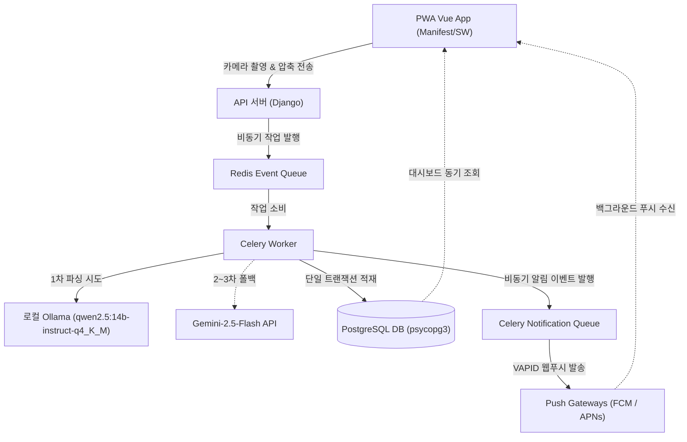

# 🧾 AI 기반 세금/영수증 PDF 분석 및 가계부 자동화

**AI-Powered Tax/Receipt PDF Analyzer & Automated Ledger with Vision-First PWA**

본 프로젝트는 영수증 파일(PDF, 이미지)을 업로드하면 **Gemini-2.5-Flash** 멀티모달 AI가 사업자 정보, 결제 금액, 세부 품목 스키마를 판독하여 PostgreSQL 가계부 원장 데이터베이스에 자동으로 적재해 주는 서비스입니다.

모바일 바로가기(A2HS) 및 카메라 연동을 지원하는 PWA 환경, Celery/Redis 비동기 인프라, 그리고 API 비용을 95% 이상 절감하는 3단계 하이브리드 영수증 파싱 전략을 구축하여 뛰어난 엔지니어링 신뢰성을 제공합니다.

---

## 🌟 핵심 가치 (Value Proposition)

- **하이브리드 비용 최적화 (3-Tier Hybrid Pipeline):** 로컬 OCR 및 로컬 LLM을 1차 기동하고, 실패 시 텍스트 기반 Gemini API 폴백을 태워 API 비용을 95% 이상 절감합니다.
- **모바일 하이브리드 최적화 (Installable PWA):** 모바일 홈 화면 설치(A2HS), 네이티브 카메라 다이렉트 엑세스, HTML5 Canvas 1차 이미지 압축(최대 1920px, 1.5MB 이하)을 지원합니다.
- **실시간 비동기 알림망 & 디바이스 로컬 캐싱 (VAPID Push & IndexedDB Offline Cache):** 알림 전용 Celery 큐와 Redis 분산 락 및 60초 DB 멱등 윈도우 방어막을 장착하고, iOS/APNs 및 Android/FCM 규격을 Generic VAPID 프로토콜로 단일화 처리한 실시간 웹 푸시 알림망을 제공합니다. 특히 단말 오프라인 환경에서 복귀할 때 지연 수신된 알림을 기기 내 IndexedDB에 로컬 영속 캐싱(30일 경과 및 100개 상한 관리 가비지 컬렉션 포함)하고, 백엔드 Acknowledgment POST 및 Sync GET API 델타 동기화로 기기-서버 간 알림 이력 데이터 무결성을 100% 보장합니다.
- **구조화된 AI 분석:** 영수증 레이아웃과 텍스트를 판독해 완벽히 일관된 JSON 스키마로 강제 변환합니다.

---

## 🏗️ 시스템 아키텍처 및 데이터 흐름



---

## 🚀 로컬 실행 방법 (Quick Start)

### 1. 백엔드 자동화 셋업 (setup_boilerplate)
* **Windows (PowerShell):**
  ```powershell
  Set-ExecutionPolicy Bypass -Scope Process -Force
  .\scripts\setup_boilerplate.ps1
  ```
* **macOS / Linux / WSL (Bash):**
  ```bash
  chmod +x ./scripts/setup_boilerplate.sh
  ./scripts/setup_boilerplate.sh
  ```

### 2. 환경 변수 설정
`backend/.env` 파일 내에 `GEMINI_API_KEY`, `POSTGRES_PASSWORD`, `REDIS_PASSWORD` 등의 필수 자격 증명을 입력합니다.

### 3. Docker Compose 로컬 통합 기동
Celery 워커, Redis 브로커, 프론트엔드, 백엔드 API 서버 등 전체 서비스를 기동합니다:
```bash
docker compose up -d --build
```
기동 후 브라우저에서 아래의 주소로 각각 접속할 수 있습니다:
* **프론트엔드 웹 앱**: [http://localhost:5173](http://localhost:5173) (일반 HTTP로 즉시 접속 가능)
* **백엔드 API 서버 및 어드민**: [http://localhost:8000](http://localhost:8000)

---

## 📁 주요 문서 링크 및 지도

프로젝트의 상세한 개발 규칙과 비즈니스 제약 사항은 역할별 문서로 철저히 격리하여 관리됩니다:

* [**`llms.txt`**](file:///llms.txt): AI 에이전트를 위한 마스터 컨텍스트 및 아키텍처 지식 저장소
* [**`AGENTS.md`**](file:///AGENTS.md): 개발 에이전트 마스터 행동 프로토콜 및 비직관적 도메인 지식
* [**`constitution.md`**](file:///.specify/memory/constitution.md): 프로젝트 헌법 및 데이터 무결성 9대 원칙
* [**`project_plan.md`**](file:///docs/project_plan.md): 프로젝트 기능 로드맵 및 백로그 계획서
