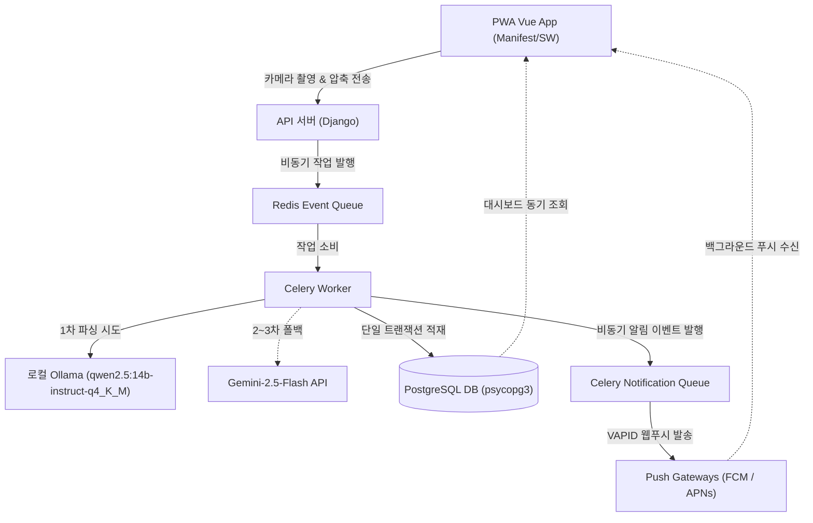

# 🧾 AI 기반 세금/영수증 PDF 분석 및 가계부 자동화

**AI-Powered Tax/Receipt PDF Analyzer & Automated Ledger with Vision-First PWA**

본 프로젝트는 영수증 파일(PDF, 이미지)을 업로드하면 **Gemini-2.5-Flash** 멀티모달 AI가 사업자 정보, 결제 금액, 세부 품목 스키마를 판독하여 PostgreSQL 가계부 원장 데이터베이스에 자동으로 적재해 주는 서비스입니다.

모바일 바로가기(A2HS) 및 카메라 연동을 지원하는 PWA 환경, Celery/Redis 비동기 인프라, 그리고 API 비용을 95% 이상 절감하는 3단계 하이브리드 영수증 파싱 전략을 구축하여 뛰어난 엔지니어링 신뢰성을 제공합니다.

---

## 🌟 핵심 가치 (Value Proposition)

- **하이브리드 비용 최적화 (3-Tier Hybrid Pipeline):** 로컬 OCR 및 로컬 LLM을 1차 기동하고, 실패 시 텍스트 기반 Gemini API 폴백을 태워 API 비용을 95% 이상 절감합니다.
- **모바일 하이브리드 최적화 (Installable PWA):** 모바일 홈 화면 설치(A2HS), 네이티브 카메라 다이렉트 엑세스, HTML5 Canvas 1차 이미지 압축(최대 1920px, 1.5MB 이하)을 지원합니다.
- **실시간 비동기 알림망 & 디바이스 로컬 캐싱 (VAPID Push & IndexedDB Offline Cache):** 알림 전용 Celery 큐와 Redis 분산 락 및 60초 DB 멱등 윈도우 방어막을 장착하고, iOS/APNs 및 Android/FCM 규격을 Generic VAPID 프로토콜로 단일화 처리한 실시간 웹 푸시 알림망을 제공합니다. 특히 단말 오프라인 환경에서 복귀할 때 지연 수신된 알림을 기기 내 IndexedDB에 로컬 영속 캐싱(30일 경과 및 100개 상한 관리 가비지 컬렉션 포함)하고, 백엔드 Acknowledgment POST 및 Sync GET API 델타 동기화로 기기-서버 간 알림 이력 데이터 무결성을 100% 보장합니다.
- **구조화된 AI 분석:** 영수증 레이아웃과 텍스트를 판독해 완벽히 일관된 JSON 스키마로 강제 변환합니다.

---

## 🏗️ 시스템 아키텍처 및 데이터 흐름



---

## 🚀 로컬 실행 방법 (Quick Start)

### 💻 일반 사용자용 원클릭 실행 (초보자 / 비개발자 권장)
명령줄 터미널 환경이 낯선 분들도 더블클릭 한 번으로 가계부 프로그램을 즉시 구동하고 안전하게 종료할 수 있습니다.

#### 1단계: 준비물 설치 (Docker Desktop)
프로그램을 실행하기 위해서는 백그라운드에 가상화 엔진인 **Docker (도커)**가 켜져 있어야 합니다.
1. [Docker Desktop 공식 다운로드](https://www.docker.com/products/docker-desktop/)에 접속합니다.
2. 컴퓨터 운영체제(Windows / Mac)에 맞는 설치 프로그램을 받아 설치합니다.
3. 설치 완료 후 **Docker Desktop** 프로그램을 실행합니다. (고래 모양 아이콘이 녹색으로 활성화될 때까지 약 1~2분 대기)

#### 2단계: Gemini AI API 키 발급 및 설정
영수증 구조화 판독에 활용되는 구글 Gemini API 키를 얻어 설정합니다.
1. [Google AI Studio (구글 AI 스튜디오)](https://aistudio.google.com/)에 구글 계정으로 로그인합니다.
2. **"Get API Key"** 버튼을 눌러 무료 API 키를 새로 발급받아 복사합니다.
3. 프로젝트 폴더 내 `backend/` 폴더로 이동합니다.
4. `.env.docker.example` 파일을 복제(또는 다른 이름으로 저장)하여 동일한 폴더에 [**`.env.docker`**](file:///D:/Projects/Private/ai-ledger-automation/backend/.env.docker) 파일을 생성합니다.
5. 메모장 등 텍스트 에디터로 `.env.docker` 파일을 열어 복사한 키를 붙여넣고 저장합니다:
   ```env
   GEMINI_API_KEY=복사한_구글_API_키_여기에_붙여넣기
   ```

#### 3단계: 더블클릭하여 기동
* **Windows 사용자:**
  `scripts/` 폴더 내부에 위치한 [**`start_app.bat`**](file:///D:/Projects/Private/ai-ledger-automation/scripts/start_app.bat) 파일을 더블클릭합니다.
* **macOS / Linux 사용자:**
  터미널을 열어 실행 권한을 1회 부여한 뒤 더블클릭 또는 직접 실행합니다:
  ```bash
  chmod +x ./scripts/start_app.sh
  ./scripts/start_app.sh
  ```
  *(컨테이너 부팅이 완료되면 웹 브라우저가 자동 기동되어 가계부 서비스로 즉시 진입합니다.)*

#### 4단계: 브라우저 접속 및 계정 가입
* **가계부 서비스 접속 주소:** [http://localhost:5173](http://localhost:5173)
* 회원가입(Register)을 누르고 테스트용 계정을 생성하여 로그인하면 영수증 분석 기능을 즉시 이용할 수 있습니다.

#### 5단계: 프로그램 종료 및 자원 반환
이용을 마치고 컴퓨터 메모리 자원을 깨끗이 돌려주기 위해 종료 스크립트를 더블클릭하여 안전하게 끕니다.
* **Windows 사용자:**
  `scripts/` 폴더 내부에 위치한 [**`stop_app.bat`**](file:///D:/Projects/Private/ai-ledger-automation/scripts/stop_app.bat) 파일을 더블클릭합니다.
* **macOS / Linux 사용자:**
  `scripts/` 폴더 내부의 `stop_app.sh`를 실행하거나 더블클릭합니다.

---

### 🛠️ 개발자 전용 수동 빌드 (Developer Quick Start)
개발 환경 디버깅 또는 pytest 테스트 러너 구동을 위한 수동 설정 절차입니다.

#### 1. 로컬 의존성 및 백엔드 환경 자동 셋업 (setup_boilerplate)
* **Windows (PowerShell):**
  ```powershell
  Set-ExecutionPolicy Bypass -Scope Process -Force
  .\scripts\setup_boilerplate.ps1
  ```
* **macOS / Linux / WSL (Bash):**
  ```bash
  chmod +x ./scripts/setup_boilerplate.sh
  ./scripts/setup_boilerplate.sh
  ```

#### 2. 로컬 개발 환경 변수 기입
`backend/.env` 파일 내에 `GEMINI_API_KEY`, `POSTGRES_PASSWORD`, `REDIS_PASSWORD` 등 상세 자격 증명을 기입합니다.

#### 3. Docker Compose 통합 서비스 기동
```bash
docker compose up -d --build
```
* **프론트엔드 웹 앱**: [http://localhost:5173](http://localhost:5173)
* **백엔드 API 서버 & 어드민**: [http://localhost:8000](http://localhost:8000)

### 4. 운영 및 진단 CLI 도구 (Production & Diagnostics)
* **Nginx 리버스 프록시 및 SSL Offloading:**
  실서버 프로덕션 배포는 `docker-compose.prod.yml`을 통해 PostgreSQL 및 Redis의 호스트 포트 외부 노출을 완벽히 차단하고 Nginx 게이트웨이를 전면 탑재합니다. 외부 로드밸런서(Cloudflare, AWS ALB 등)로부터 HTTPS Offloading을 적용받기 위해 컨테이너는 포트 80만 개방하며, HTTP 접속을 HTTPS로 301 리다이렉트 처리합니다. 프론트엔드 SPA 자산(`/`) 및 백엔드 API(`/api/`)를 단일 도메인 subpath 구조로 중계하여 CORS 오버헤드 없이 서빙합니다.
* **VAPID 웹푸시 E2E 진단 CLI 커맨드:**
  정규 Celery 비동기 큐를 완전히 우회하여 특정 사용자에게 VAPID 테스트 푸시를 즉시 동기 발송하고 결과를 데이터베이스 감사 로그에 영속화하는 관리자용 Django 커스텀 명령어를 지원합니다:
  ```bash
  uv run python src/manage.py trigger_test_push --username <대상유저명>
  ```
* **크로스 플랫폼 E2E 통합 테스트 러너:**
  프론트엔드 및 백엔드 서버의 포트 가동 상태를 자율 진단하고, Playwright 브라우저 에뮬레이터로 네트워크 단절 상황(오프라인 -> 온라인)에서의 푸시 캐싱, 멱등성 및 ACK 백엔드 피드백 정합성을 100% 자동 검증하는 크로스 플랫폼 대칭형 러너를 제공합니다:
  * **Windows (PowerShell):** `.\scripts\run_e2e_push_test.ps1`
  * **macOS / Linux / WSL (Bash):** `./scripts/run_e2e_push_test.sh`

---

## 📁 주요 문서 링크 및 지도

프로젝트의 상세한 개발 규칙과 비즈니스 제약 사항은 역할별 문서로 철저히 격리하여 관리됩니다:

* [**`llms.txt`**](file:///llms.txt): AI 에이전트를 위한 마스터 컨텍스트 및 아키텍처 지식 저장소
* [**`AGENTS.md`**](file:///AGENTS.md): 개발 에이전트 마스터 행동 프로토콜 및 비직관적 도메인 지식
* [**`constitution.md`**](file:///.specify/memory/constitution.md): 프로젝트 헌법 및 데이터 무결성 9대 원칙
* [**`project_plan.md`**](file:///docs/project_plan.md): 프로젝트 기능 로드맵 및 백로그 계획서
