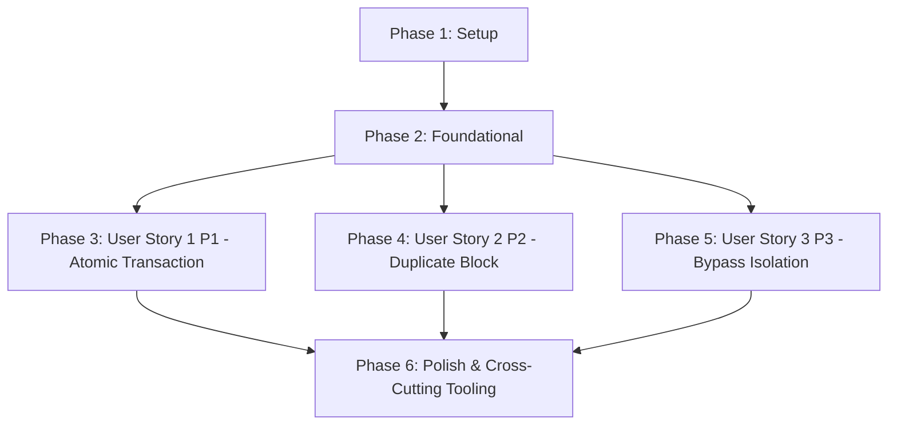

# Tasks: Django Model Design for AI Ledger

**Input**: Design documents from `/specs/002-django-model-design/`

**Prerequisites**: plan.md (required), spec.md (required for user stories), research.md, data-model.md, contracts/

**Tests**: 아래 명시된 모델 및 비즈니스 정합성 테스트 태스크들은 명세서(`spec.md`) 상에 필수적인 독립적 테스트(Independent Test) 시나리오 검증 요건이 포함되어 있으므로 전격 구현 대상에 포함합니다.

**Organization**: 각 사용자 스토리별로 태스크를 엄밀히 격리 그룹화하여, 상호 독립적인 개발 및 안전 격리 테스트가 가능하도록 설계했습니다.

---

## Format: `[ID] [P?] [Story] Description`

- **[P]**: 병렬 실행 가능 (수정 파일이 다르며 선행 태스크에 의존하지 않는 독립 작업)
- **[Story]**: 매핑되는 사용자 스토리 식별자 (예: US1, US2, US3)
- 모든 태스크는 체크박스와 순차적 3자리 번호 ID, 작업 명령어, 그리고 **구체적인 대상 소스 파일 경로**를 반드시 명시합니다.

## Path Conventions

- 본 프로젝트는 Django REST Framework 백엔드와 Vue 3 PWA 프론트엔드가 상호 결합된 하이브리드 웹 애플리케이션 구조이므로, 백엔드 데이터 모델 경로는 **`backend/src/apps/`** 디렉토리를 준수합니다.

---

## Phase 1: Setup (Shared Infrastructure)

**Purpose**: 프로젝트 초기화 및 가계부용 신규 장고 앱 구조 구성

- [ ] T001 `backend/src/apps/` 디렉토리 하위에 가계부 및 사용자 기능 처리를 위한 Django 앱 구조(`accounts`, `ledgers`, `tasks`) 폴더 생성
- [ ] T002 `backend/src/config/settings.py` 경로의 `INSTALLED_APPS` 설정에 신규로 추가된 3대 비즈니스 앱들(`apps.accounts`, `apps.ledgers`, `apps.tasks`) 등록
- [ ] T003 [P] `backend/src/config/settings.py` 경로에 Supabase Free Tier 가용한계 자원 보존을 위해 최대 데이터베이스 커넥션 풀 크기 제약(api_server 5개, async_worker 3개, 전체 합산 8개 이하)을 강제하는 DB Connection 튜닝 세팅 반영

---

## Phase 2: Foundational (Blocking Prerequisites)

**Purpose**: 사용자 스토리 개발 착수 전에 완결되어야 하는 마스터 정보 및 공통 인프라 모델 수립

**⚠️ CRITICAL**: 본 기반 마련 페이즈의 모든 공통 모델링 작업이 완결 및 마이그레이션 준비가 완료되기 전까지 개별 사용자 스토리 구현은 절대 착수할 수 없습니다.

- [ ] T004 `backend/src/apps/accounts/models.py` 경로에 1차 스팸 방어용 이메일 화이트리스트 주소 3개 매핑 필드(`registered_forward_email_1`, `registered_forward_email_2`, `registered_forward_email_3`)를 장착한 `User` 모델 구현
- [ ] T005 [P] `backend/src/apps/accounts/models.py` 경로에 PWA 알림을 위한 VAPID v2 표준 웹 푸시 수신 명세를 관리하는 `UserPushSubscription` 모델 구현
- [ ] T006 `backend/src/apps/accounts/` 하위에 초기 스키마 상태를 기록하는 Django 마이그레이션 생성 스크립트 실행 및 `backend/src/apps/accounts/migrations/0001_initial.py` 생성
- [ ] T007 [P] `backend/tests/unit/models/test_user.py` 경로에 `User` 및 `UserPushSubscription` 스키마 제약조건과 VAPID 정보 보존 여부를 증명하는 유닛 테스트 코드 구현

**Checkpoint**: Foundation ready - 이제 사용자 스토리 개발 페이즈에 안전하게 진입하여 병렬로 작업을 가동할 수 있습니다.

---

## Phase 3: User Story 1 - E2E 가계부 및 세부 품목 트랜잭션 적재 (Priority: P1) 🎯 MVP

**Goal**: 단일 원자적 데이터베이스 트랜잭션(`transaction.atomic()`) 수명 블록 내에서 부모 가계부 레코드(`Ledgers`)와 자식 품목 레코드 배열(`LedgerItems`)을 1:N 원자적 일괄 영구 적재하고, 예외 장해 시 전격 롤백 처리.

**Independent Test**: 영수증 파싱 결과 데이터를 전달하여 데이터베이스 인서트를 트리거하고, 세부 품목 인서트 도중 오류가 유발되었을 때 부모 가계부 행까지 흔적 없이 롤백되어 데이터베이스 파편화가 발생하지 않는지 E2E로 안전 독립 검증.

### Tests for User Story 1
> **NOTE: 구현 작업 착수 전에 계약 테스트를 선제적으로 설계하고, 구현 전 기계적으로 실패(FAIL)함을 우선 확인하십시오.**

- [ ] T008 [P] [US1] `backend/tests/unit/models/test_ledger_atomic.py` 경로에 품목 상세 인서트 연산 중 오류 발생 시, 이미 생성되었던 `Ledger` 마스터 레코드까지 안전하고 무결하게 전격 롤백(Rollback)되어 데이터 파편화가 일어나지 않음을 검증하는 독립 원자성 계약 테스트 작성

### Implementation for User Story 1

- [ ] T009 [P] [US1] `backend/src/apps/ledgers/models.py` 경로에 UUIDv7 PK 및 `UNIQUE (user, vendor_registration_number, transaction_date, total_amount)` 복합 고유 키를 정의한 `Ledger` 모델 구현
- [ ] T010 [P] [US1] `backend/src/apps/ledgers/models.py` 경로에 부모 `Ledger` 연쇄 소멸 정합성을 지키기 위해 외래 키 옵션 `ON DELETE CASCADE`를 구성하고 단가, 수량, 합산 가격을 보존하는 `LedgerItem` 모델 구현
- [ ] T011 [US1] `backend/src/apps/ledgers/services.py` 경로에 `transaction.atomic()` 세션 블록을 장착하여 마스터 가계부와 자식 품목 배열을 단일 원자적 트랜잭션 수명 내에서 일괄 삽입 처리하는 `create_ledger_transactional` 비즈니스 서비스 구현
- [ ] T012 [US1] `backend/src/apps/ledgers/models.py` 경로의 `Ledger` 세부 필드 유효성 검사 규칙 적용 및 10자리 사업자등록번호 부재(간이 영수증 등) 시 null 충돌 방지를 위해 `'0000000000'` 기본값으로 변환 적재하는 예외 안전 처리 필터 탑재

**Checkpoint**: 본 페이즈 완료 시, User Story 1은 단독으로 완벽하게 컴파일 및 구동되며 독립 원자성 트랜잭션 롤백 정합성이 테스트를 통해 완벽히 기계적으로 증명됩니다.

---

## Phase 4: User Story 2 - 중복 영수증 무차별 복사 차단 (Priority: P2)

**Goal**: 사용자가 동일 영수증을 중복으로 첨부하여 업로드하는 사태를 DB 레이어의 복합 유니크 인덱스를 활용해 사전에 완벽히 원천 차단하고, 장해 예외 로그는 Dead Letter Queue 구조의 `FailedTask` 모델에 격리 저장.

**Independent Test**: 이미 저장된 특정 결제 내역과 동일 정보(동일 사용자, 사업자등록번호, 결제 날짜, 총액) 인서트 재시도 시, 중복 키 위배 오류를 감지하고 실패 페이로드 및 콜스택이 `failed_tasks` 모델에 무결하게 안전 격리 적재되는지 독립 검증.

### Tests for User Story 2

- [ ] T013 [P] [US2] `backend/tests/unit/models/test_ledger_duplicate.py` 경로에 동일 정보로 2회 연속 가계부 삽입 실행 시 데이터베이스 단의 복합 UNIQUE 제약에 의해 2번째 내역이 차단되고 실패 사유가 `FailedTask`에 성공 격리 수집되는지 검증하는 독립 중복 차단 테스트 작성

### Implementation for User Story 2

- [ ] T014 [P] [US2] `backend/src/apps/tasks/models.py` 경로에 비동기 파싱 예외 및 중복 적재 오류 발생 시 원시 데이터 페이로드 및 오류 콜스택 스택 trace를 격리하여 디버깅 로그를 무손실 보존하는 Dead Letter Queue 패턴의 `FailedTask` 모델 구현
- [ ] T015 [US2] `backend/src/apps/ledgers/services.py` 경로의 `create_ledger_transactional` 서비스에 데이터베이스 복합 고유 키 위배 예외(`IntegrityError`) 포착 시 작업을 Celery 큐 리소스 낭비 없이 강제 중단하고 `FailedTask` 모델에 페이로드를 격리 적재하는 핸들러 코드 통합
- [ ] T016 `backend/src/apps/tasks/` 및 `backend/src/apps/ledgers/` 하위에 신규 모델들을 반영하고 데이터베이스 물리 제약사항을 적용하기 위한 Django 마이그레이션 생성 스크립트 실행 및 파일 구성 완수

**Checkpoint**: 본 페이즈 완료 시, User Stories 1 및 2가 동시에 긴밀하게 협력 가동되며, 중복 거래 내역 유입 시 DB 복합 유니크 제약 차단 및 비동기 예외 DLQ 격리 로깅 무결성이 기계적으로 완벽히 입증됩니다.

---

## Phase 5: User Story 3 - 템플릿 캐싱 바이패스 및 미검증 템플릿 완전 격리 (Priority: P3)

**Goal**: 10자리 사업자등록번호 기반 정적 정규식 캐시 테이블(`MerchantTemplate`)을 조회하여 파싱 처리를 우회시키되, 오직 수동 검증 승인 마크(`is_verified: true`)가 지정된 정적 규칙만 바이패스 루프에 진입시키고 미검증 규칙(`is_verified: false`)은 완벽히 격리 차단.

**Independent Test**: 검증 마크가 거짓(`is_verified: false`)인 신규 제안 템플릿을 인서트하고 쿼리 호출 시, 바이패스 파서 우회 조회 루프에서 완벽히 필터링 차단되어 템플릿이 유실되거나 미반영 상태로 Gemini LLM API 폴백이 가동될 수 있는 상태를 영구 증명.

### Tests for User Story 3

- [ ] T017 [P] [US3] `backend/tests/unit/models/test_merchant_template.py` 경로에 `is_verified: false` 상태인 템플릿 조회 시 필터에 차단되어 결과가 반환되지 않고, 오직 `is_verified: true`인 승인 완료 규칙만 반환됨을 검증하는 우회 바이패스 격리 검증 테스트 작성

### Implementation for User Story 3

- [ ] T018 [P] [US3] `backend/src/apps/ledgers/models.py` 경로에 10자리 사업자등록번호, 정규식 레이아웃 JSONB, 그리고 `is_verified` 불리언 필드(기본값 `False` 필히 지정)를 갖춘 `MerchantTemplate` 모델 구현
- [ ] T019 [US3] `backend/src/apps/ledgers/models.py` 경로에 `is_verified=True` 조건만을 데이터베이스에서 즉시 추출하도록 규정하는 전용 Custom Manager `VerifiedTemplateManager` 구현 및 모델 바인딩
- [ ] T020 `backend/src/apps/ledgers/` 하위 앱의 정규식 캐시 템플릿 마이그레이션을 데이터베이스에 완벽하게 빌드 및 적용

**Checkpoint**: 모든 3대 사용자 스토리가 독립적으로 완벽히 구동 가능하며, 미검증 캐시 템플릿의 bypass 진입율 0% 격리 통제 규칙이 완벽하게 공인 검증 완료됩니다.

---

## Phase 6: Polish & Cross-Cutting Concerns

**Purpose**: 횡단 관심사 보완 및 양대 실행 환경의 대칭적 이중 툴링 스크립트 완성

- [ ] T021 [P] `.specify/scripts/powershell/manage-db.ps1` 및 `.specify/scripts/bash/manage-db.sh` 경로에 신규 6대 데이터 모델 마이그레이션 일괄 빌드 및 로컬 테스트 스위트 구동, 더미 데이터 초기화를 유기적으로 수행하기 위한 Windows/Linux 대칭형 DB 관리용 스크립트 구현 수립
- [ ] T022 [P] `docs/project_plan.md` 및 `README.md` 등 프로젝트 마스터 문서들에 금번 수립된 6대 핵심 데이터 모델 사양 및 마이그레이션 툴 가동 방법 설명서 교차 동기화 업데이트 완수
- [ ] T023 `specs/002-django-model-design/quickstart.md` 가이드에 수립된 모든 로컬 pytest 명령어 및 데이터베이스 정합성 유효 검증을 기계적으로 실시간 완수하여 최종 릴리즈 품질 게이트 통과 완료

---

## Dependencies & Execution Order

### Phase Dependencies

- **Setup (Phase 1)**: 인프라 기초 설정으로 선행 의존성 없이 즉각 개시할 수 있습니다.
- **Foundational (Phase 2)**: 공통 마스터 정보 모델 및 초기 마이그레이션 빌드로, Phase 1 완료에 완벽히 종속되며 **모든 사용자 스토리 착수의 블로킹 게이트**입니다.
- **User Stories (Phase 3+)**: 마스터 뼈대가 수립된 후 병렬 실행이 가능하며 우선순위(P1 → P2 → P3) 순으로 완수를 정렬합니다.
- **Polish (Final Phase)**: 횡단 대칭 스크립트 마무리 단계로 모든 스토리가 완성된 후 일괄 기동 검증합니다.

### Within Each User Story

- 테스트 코드 작성 및 기계적 실패 확인[TDD] → 물리 모델 구현 → 비즈니스 로직 및 서비스 적재 → 스키마 마이그레이션 빌드 → 유닛 테스트 검증 통과 → 다음 스토리 전진.

---

## Parallel Opportunities

- **Setup Phase 1**: T003의 DB 커넥션 풀 튜닝과 T001/T002의 기초 디렉토리 구성은 병렬 처리가 가능합니다.
- **Foundational Phase 2**: UserPushSubscription(T005) 모델 구성과 User(T004) 모델 구성은 서로 다른 테이블이므로 완벽히 병렬 개발이 가능합니다.
- **User Story 3**: MerchantTemplate(T018) 설계와 Custom Manager(T019) 구성은 병렬 기동이 용이합니다.
- **최종 검증**: 3대 사용자 스토리의 각 모델 유닛 테스트 코드는 선행 의존 모델이 충족되는 시점부터 완벽히 동시에 분산 작성 및 테스트가 가능합니다.

---

## Implementation Strategy

### MVP First (User Story 1 Only)

1. **Phase 1 & Phase 2 완수**: 데이터베이스 마스터 계정 `User` 및 기초 토대 스키마 반영.
2. **Phase 3 (User Story 1) 돌파**: Ledgers & LedgerItems의 1:N 원자적 트랜잭션 수립 및 롤백 기능 완성.
3. **독립 검증**: `test_ledger_atomic.py` 테스트만 단독 가동하여 MVP 코어가 안전하게 안착했는지 정합성 확인 후 즉각 배포/공인.

### Incremental Delivery

1. MVP(US1) 안착으로 기본 결제 수집 기능 보장.
2. US2 릴리즈 추가로 중복 영수증 차단 및 FailedTask 비동기 격리 DLQ 적재 안전망 확보 (가계부 통계 무결성 1차 강화).
3. US3 릴리즈 추가로 가맹점 사업자번호 정규식 캐싱 및 bypass 차단 통제 작동 (API 비용 절감 0원 통제 작동).
4. 각 스토리는 이전 스토리를 훼손하지 않는 독립 증분으로 순차 유입되어 안전성을 유지합니다.
