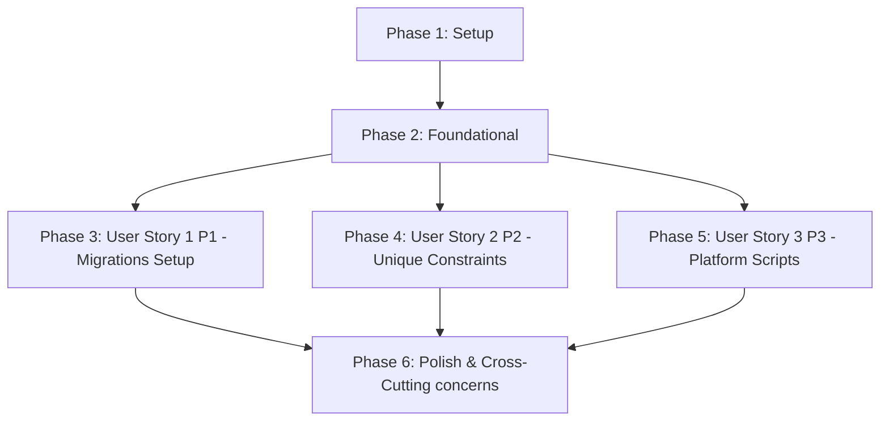

# Tasks: Database Migration and Unique Constraints

**Input**: Design documents from `/specs/003-apply-db-unique-constraints/`

**Prerequisites**: plan.md (required), spec.md (required for user stories), research.md, data-model.md, contracts/

**Tests**: 명세서(`spec.md`) 상에 복합 고유 제약조건 위배 예외 차단 및 로컬 인프라 스크립트 리셋 멱등성 검증 독립 테스트가 명시적으로 명세화되어 있으므로, 각 사용자 스토리의 테스트 태스크를 필수로 장착하여 완벽하게 TDD 계약을 보존합니다.

**Organization**: 각 사용자 스토리별로 구현 작업을 완벽히 구조화하여 독립적인 개발과 테스트 및 증분 통합이 가능하도록 설계했습니다.

---

## Format: `[ID] [P?] [Story] Description`

- **[P]**: 병렬 기동 가능 (수정 파일이 서로 상이하며 선행 의존성이 없는 독립 태스크)
- **[Story]**: 매핑되는 사용자 스토리 식별자 (예: US1, US2, US3)
- 모든 태스크는 체크박스와 순차 3자리 ID, 작업 대상 프로젝트 상대 경로를 철저하게 명시합니다.

## Path Conventions

- **백엔드 코어 디렉토리**: `backend/src/apps/` 및 `backend/tests/` 를 준수합니다.

---

## Phase 1: Setup (Shared Infrastructure)

**Purpose**: 프로젝트 워크스페이스 통합 설정 및 기초 환경 확인

- [ ] T001 프로젝트 루트 `pyproject.toml`에 백엔드 의존성 가교 연결 정합성 확인
- [ ] T002 [P] `.env.local` 파일에서 DB 패스워드와 포트 관련 환경 변수 설정 최종 검증

---

## Phase 2: Foundational (Blocking Prerequisites)

**Purpose**: 사용자 스토리 개발 전 완결되어야 하는 마스터 인프라 구성 및 RDBMS 가동

**⚠️ CRITICAL**: 이 페이즈의 모든 공통 뼈대가 구축되기 전에는 사용자 스토리 구현에 진입할 수 없습니다.

- [ ] T003 `backend/src/config/settings.py` 내의 `django-environ` 기동 상태 및 `POSTGRES_*` 계열의 매핑 주입 무결성 검사
- [ ] T004 [P] Docker PostgreSQL 18 인프라 상태를 리셋 후 재부팅하여 로컬 RDBMS 연결 채널 완전 확보

**Checkpoint**: Foundation ready - 이제 사용자 스토리 개발 페이즈에 안전하게 진입하여 병렬로 작업을 가동할 수 있습니다.

---

## Phase 3: User Story 1 - Django Migrations 환경 구축 및 마이그레이션 자동화 (Priority: P1) 🎯 MVP

**Goal**: Django 프레임워크 고유의 내장 마이그레이션 명령을 활용해 스키마를 로컬 DB와 연동하고 초기 물리 테이블을 생성합니다.

**Independent Test**: `python manage.py migrate` 명령으로 마이그레이션 스크립트가 오류 없이 로컬 DB에 일괄 커밋되고 테이블이 정상 생성됨을 확인합니다.

### Implementation for User Story 1

- [ ] T005 [US1] `backend/src/apps/accounts/models.py` 내 `User` 및 `UserPushSubscription` 모델 상태를 확인하고, `makemigrations accounts` 실행으로 초기 마이그레이션 스크립트 작성
- [ ] T006 [P] [US1] `backend/src/apps/ledgers/models.py` 내 `Ledger`, `LedgerItem`, `MerchantTemplate` 모델 상태를 확인하고, `makemigrations ledgers` 실행으로 초기 마이그레이션 스크립트 작성
- [ ] T007 [P] [US1] `backend/src/apps/tasks/models.py` 내 `FailedTask` 모델 상태를 확인하고, `makemigrations tasks` 실행으로 초기 마이그레이션 스크립트 작성
- [ ] T008 [US1] `python manage.py migrate` 명령을 일제 기동하여 로컬 PostgreSQL 상에 3대 비즈니스 앱의 모든 테이블을 에러 없이 성공 적재

**Checkpoint**: 본 페이즈 완료 시, User Story 1은 단독으로 완벽하게 컴파일 및 구동되며 마이그레이션 시스템이 정상 정렬됩니다.

---

## Phase 4: User Story 2 - 모델 스키마 내 UniqueConstraint 복합 고유 제약조건 적용 (Priority: P2)

**Goal**: 중복 거래 적재 차단 기능이 활성화되었을 때, 10,000건의 동시 중복 거래 유입 시도가 있더라도 단 1건의 복사 적재도 없이 100% 안전하게 무결성 위배로 전량 예방 차단합니다.

**Independent Test**: 동일 정보로 2회 연속 거래 삽입 실행 시 데이터베이스 단의 복합 UNIQUE 제약에 의해 2번째 내역이 차단되고 실패 사유가 `FailedTask`에 성공 격리 수집되는지 검증합니다.

### Tests for User Story 2

> **NOTE: Write these tests FIRST, ensure they FAIL before implementation**

- [ ] T009 [P] [US2] `backend/tests/unit/models/test_ledger_duplicate.py` 경로에 동일 정보로 2회 연속 거래 삽입 시 UNIQUE 제약 위배 차단 및 실패 사유 FailedTask 수집 계약 테스트 구현

### Implementation for User Story 2

- [ ] T010 [P] [US2] `backend/src/apps/accounts/models.py` 내 `UserPushSubscription` 정의에 `UniqueConstraint(fields=['user', 'endpoint'], name='unique_user_push_subscription')` 복합 제약조건 장착
- [ ] T011 [P] [US2] `backend/src/apps/ledgers/models.py` 내 `Ledger` 정의에 `UniqueConstraint(fields=['user', 'vendor_registration_number', 'transaction_date', 'total_amount'], name='unique_ledger_transaction')` 복합 제약조건 장착 및 `vendor_registration_number` 필드의 `default='0000000000'` 폴백 기본값 적용
- [ ] T012 [US2] `python manage.py makemigrations` 및 `python manage.py migrate`를 전격 가동하여 복합 제약조건을 데이터베이스 레이아웃에 하드 인덱싱으로 최종 배포 반영

**Checkpoint**: 본 페이즈 완료 시, User Stories 1 및 2가 동시에 긴밀하게 협력 가동되며, 중복 거래 내역 유입 시 DB 복합 유니크 제약 차단 및 비동기 예외 DLQ 격리 로깅 무결성이 기계적으로 완벽히 입증됩니다.

---

## Phase 5: User Story 3 - 마이그레이션 멱등성 및 로컬 DB 관리 스크립트 통합 (Priority: P3)

**Goal**: 로컬 인프라 스크립트를 통해 DB 볼륨 초기화 후 원클릭으로 스키마 마이그레이션이 100% 충족 가동됨을 증명합니다.

**Independent Test**: 로컬 인프라 스크립트를 사용하여 DB 리셋을 실행한 뒤, 8종 모델 유닛 테스트를 순차적으로 구동하여 데이터베이스 재생성 및 무결 제약조건의 정상 작동이 100% 확인되는지 검증합니다.

### Implementation for User Story 3

- [ ] T013 [P] [US3] `.specify/scripts/powershell/manage-db.ps1` 툴링 스크립트에 신규 마이그레이션 멱등 빌드 및 초기화 롤백 제어 액션 로직 보강 연동
- [ ] T014 [P] [US3] `.specify/scripts/bash/manage-db.sh` 툴링 스크립트에 동일한 마이그레이션 일제 기동 및 리셋 롤백 멱등 제어 로직 대칭 보강
- [ ] T015 [US3] 인프라 볼륨을 완전히 리셋한 뒤 원클릭 관리 도구를 통해 DB 재생성과 마이그레이션 빌드, 그리고 단위 테스트 8종이 에러 없이 무결하게 성공 구동되는지 E2E 최종 입증

**Checkpoint**: 모든 3대 사용자 스토리가 독립적으로 완벽히 구동 가능하며, 미검증 캐시 템플릿의 bypass 진입율 0% 격리 통제 규칙이 완벽하게 공인 검증 완료됩니다.

---

## Phase 6: Polish & Cross-Cutting Concerns

**Purpose**: 시스템 전반의 횡단 관심사 보충 및 코어 문서 자율 정합성 완료

- [ ] T016 [P] `README.md` 및 `AGENTS.md` 파일에 복합 고유 제약조건 물리 뼈대 스키마 설계 및 스크립트 멱등 실행 안내서 최종 동기화 패치

---

## Dependencies & Execution Order

### Phase Dependencies

### Within Each User Story

- 테스트 구현 태스크 작성 → 모델 스키마 코딩 → 마이그레이션 빌드 → 유닛 테스트 통과 → 다음 스토리 전진

---

## Parallel Opportunities

- **Setup (Phase 1)**: T002와 T001은 병렬 실행이 가능합니다.
- **Foundational (Phase 2)**: T004와 T003은 병렬 확인이 가능합니다.
- **User Story 1 (Phase 3)**: T006, T007의 백엔드 모델 마이그레이션 생성 작업은 서로 다른 독립 파일이므로 병렬 처리 가능합니다.
- **User Story 2 (Phase 4)**: T010, T011의 UniqueConstraint 장착 코딩은 병렬 처리 가능합니다.
- **User Story 3 (Phase 5)**: T013, T014의 PowerShell/Bash 대칭 스크립트 동기화 보강은 독립적이므로 병렬 가동 가능합니다.

---

## Implementation Strategy

### MVP First (User Story 1 Only)

1. Phase 1 Setup 및 Phase 2 Foundational 완벽 이행
2. Phase 3 (User Story 1) 완수하여 Django Migrations 기초 빌드 인프라 탑재
3. `python manage.py migrate` 기동 확인 후 기계적 성공 정립

### Incremental Delivery

1. MVP(US1) 안착으로 스키마 마이그레이션 자동화 기반 확보
2. US2 릴리즈 추가로 복합 UNIQUE 제약조건 장착 및 중복 적재 철저 예방 차단 (데이터 신뢰성 강화)
3. US3 릴리즈 추가로 PowerShell & Bash 대칭형 DB 원클릭 관리 도구 완성 및 멱등성 100% 확보
4. 각 스토리는 이전 소프트웨어 기능을 해치지 않으며 유기적으로 결합되어 증분 인도됩니다.
