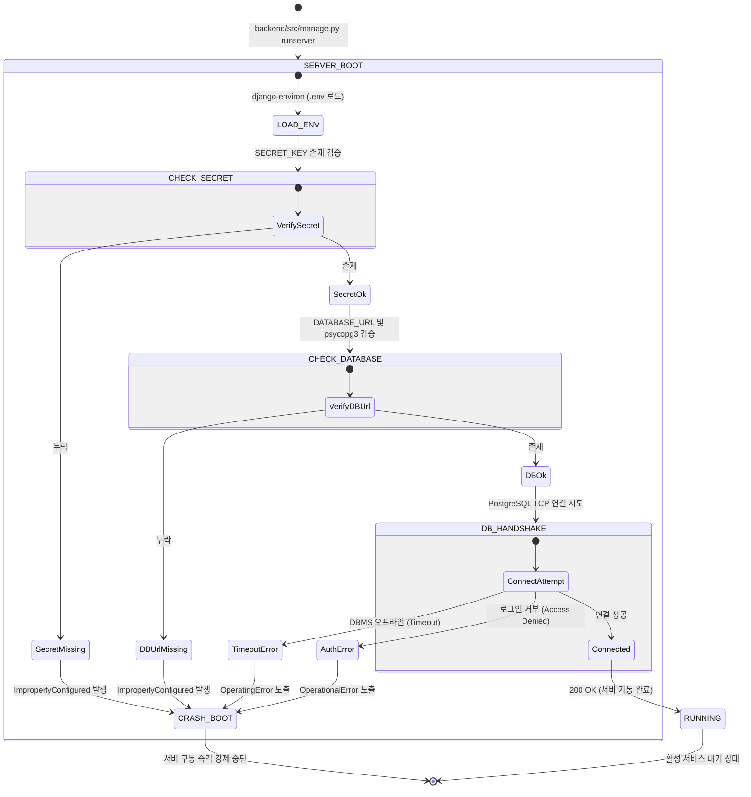

# Data Model & Configuration Specifications: django-initial-setup

본 문서에는 Django 초기 보일러플레이트 가동에 사용되는 설정 데이터(Runtime Settings Configuration) 및 데이터베이스 커넥션 속성(Database Connection Entity)의 필드, 검증 규칙, 그리고 제약 사항을 명세합니다.

---

## 1. Runtime Environment Settings (설정 데이터 모델)

Django의 `settings.py`에 바인딩되어 시스템 구동 환경을 제어하는 설정 데이터 속성 모델입니다.

| 속성명 (Attribute) | 데이터 타입 | 필수 여부 | 유효성 검사 및 정합성 규칙 (Validation Rules) |
| :--- | :--- | :--- | :--- |
| **`SECRET_KEY`** | `String` | **필수 (Required)** | - 하드코딩 절대 금지 - 최소 50자 이상의 고엔트로피 무작위 문자열로 구성 - `.env` 누락 시 즉시 구동 차단 및 예외 발생 |
| **`DEBUG`** | `Boolean` | **필수 (Required)** | - 기본값: `False` (보안 안전성 최우선) - 오직 로컬 개발 시에만 `.env`에서 `True`로 명시적 선언 허용 |
| **`ALLOWED_HOSTS`** | `List[String]` | **필수 (Required)** | - 운영 환경에서는 특정 HTTPS 와일드카드 도메인만 엄격히 지정 - 로컬 개발 환경용 폴백 대역: `['localhost', '127.0.0.1']` |
| **`CORS_ALLOWED_ORIGINS`** | `List[String]` | **필수 (Required)** | - SPA 클라이언트(Vue.js) 도메인 주소 매핑 - `CORS_ALLOW_ALL_ORIGINS`는 절대 `True` 지정 금지 |
| **`REST_FRAMEWORK`** | `Dict` | **필수 (Required)** | - `DEFAULT_PERMISSION_CLASSES`: `['rest_framework.permissions.IsAuthenticated']` 강제 잠금 - `DEFAULT_AUTHENTICATION_CLASSES`: 기본 세션 및 토큰 인증 지정 |

---

## 2. Database Connection Entity (데이터베이스 커넥션 모델)

PostgreSQL v18+ 및 `psycopg3` 드라이버와의 실시간 데이터 통신을 성립시키는 커넥션 엔티티 정보입니다.

| 속성명 (Attribute) | 데이터 타입 | 필수 여부 | 기본값 (Default) 및 제약 조건 (Constraints) |
| :--- | :--- | :--- | :--- |
| **`DATABASE_URL`** | `String (URI)` | **필수 (Required)** | - 스키마 규격: `postgres://<user>:<password>@<host>:<port>/<db_name>` - `.env`에 누락되어 빈 값 유입 시 서버 구동 즉시 중단 |
| **`CONN_MAX_AGE`** | `Integer` | 선택 (Optional) | - 기본값: `60` (초 단위 연결 재사용 보장) - `.env`에 정의된 `DATABASE_CONN_MAX_AGE`를 통해 오버라이드 지원 |
| **`CONN_HEALTH_CHECKS`** | `Boolean` | 선택 (Optional) | - 기본값: `True` - 연결 풀에서 꺼내 재사용하기 직전 커넥션의 생존 상태(Liveness)를 사전 체크하여 유실 통신 방지 |
| **`MAX_CONN_POOL`** | `Integer` | 선택 (Optional) | - 최대 커넥션 크기 제약: `5` (api_server 개별 컨테이너 당 제한) - Supabase 무료 티어 고갈 병목 방지를 위한 엄격 제약 |

---

## 3. 환경 변수 누락 대응 예외 상태 전이 (Exception State Transitions)

필수 환경변수 누락 또는 데이터베이스 컨테이너 정지 시 발생하는 시스템 예외 처리 흐름을 정의합니다.

