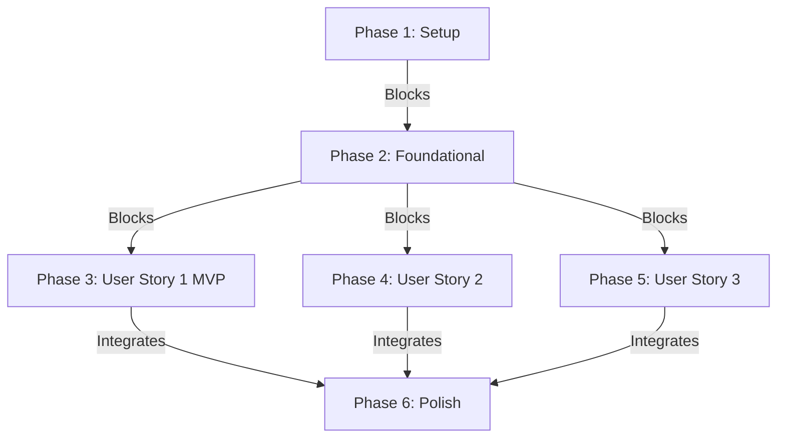

# Tasks: django-initial-setup

**Input**: Design documents from `/specs/004-django-initial-setup/`

**Prerequisites**: plan.md (required), spec.md (required for user stories), research.md, data-model.md, contracts/health_check_contract.md

**Tests**: 아래 명세된 테스트 및 진단 확인 태스크는 `health_check_contract.md`에 규정된 인수 기준(AC-001, AC-002) 기계적 검증을 위해 반드시 병행 수행되어야 합니다.

**Organization**: 각 사용자 스토리의 정합성 입증 및 조기 딜리버리(MVP)가 가능하도록 태스크들을 스토리별로 엄격히 그룹화하였습니다.

## Format: `[ID] [P?] [Story] Description`

- **[P]**: 다른 태스크에 종속되지 않고 병렬 처리가 가능한 태스크 (서로 다른 파일 편집)
- **[Story]**: 매핑되는 사용자 스토리 식별자 (e.g., US1, US2, US3)
- 모든 태스크는 정밀 작업 명령과 함께 타겟 소스 파일 경로를 명확히 명시해야 합니다.

---

## Phase 1: Setup (Shared Infrastructure)

**Purpose**: 프로젝트 가상 환경 및 크로스 플랫폼 대칭 자동화 인프라 셋업

- [ ] T001 `backend/pyproject.toml` 및 `backend/uv.lock` 파일에 필수 라이브러리(`django-environ`, `djangorestframework`, `django-cors-headers`, `psycopg[binary]`)를 선언적으로 추가하고 `uv sync`를 실행해 격리된 가상환경(`.venv`) 패키지 동기화 완수
- [ ] T002 `scripts/setup_boilerplate.ps1` 경로에 헌법 제VI조에 의거하여 Windows 환경에서 가상 환경 구축, `.env` 캐시 유효성 검증을 일괄 처리하는 대칭형 자동화 셋업 스크립트 작성
- [ ] T003 [P] `scripts/setup_boilerplate.sh` 경로에 헌법 제VI조에 의거하여 macOS/Linux/WSL 환경에서 작동하는 대칭형 셋업 자동화 쉘 스크립트 작성

---

## Phase 2: Foundational (Blocking Prerequisites)

**Purpose**: 사용자 스토리 기동 전 완결되어야 하는 settings.py 핵심 뼈대 설정 및 격리

**⚠️ CRITICAL**: 이 페이즈의 전역 설정 및 뼈대 코드 구축이 끝나기 전까지는 하위의 어떠한 사용자 스토리 기능 구현도 시작할 수 없습니다.

- [ ] T004 `backend/src/config/settings.py` 파일 내에 `django-environ` 패키지를 바인딩하여 `.env` 로딩 엔진을 수립하고, `SECRET_KEY` 및 `DATABASE_URL`에 대한 하드코딩 폴백 기본값 완전 제거 및 누락 시 `ImproperlyConfigured` 즉시 Crash 예외 차단 로직 구현
- [ ] T005 [P] `backend/src/config/settings.py` 파일 내에 PostgreSQL v18+ 연동을 위한 psycopg3(`django.db.backends.postgresql`) 커넥션 셋업을 완료하고, Supabase 리소스 병목 방지를 위해 기본 연결 유지 시간 `CONN_MAX_AGE: 60` 설정 주입 (환경변수 동적 변경 연동)
- [ ] T006 [P] `backend/src/config/settings.py` 파일 내에 글로벌 API 보안 기본 권한 정책을 `IsAuthenticated`로 강력하게 잠금 셋업하고, CORS 허용 설정을 주입

**Checkpoint**: Foundation ready - 이제 개별 사용자 스토리 구현을 독립적으로 진행할 수 있습니다.

---

## Phase 3: User Story 1 - Local Development Startup (Priority: P1) 🎯 MVP

**Goal**: Django 보일러플레이트 로컬 가동 여부 검증 및 settings.py 설정 정합성 확인

**Independent Test**: 백엔드 서버를 기동하고 로컬 호스트 진입 시 Django 환영 페이지가 성공적으로 반환되는지 확인

### Implementation for User Story 1

- [ ] T007 [P] [US1] `backend/src/config/urls.py` 경로의 최상위 라우터 설정에 CORS 미들웨어 매핑 및 뼈대 프로젝트 단일 진입점 바인딩 완수
- [ ] T008 [US1] `backend/src/config/settings.py` 파일 내에 로컬 디버그용 호스트 대역 `ALLOWED_HOSTS = ['localhost', '127.0.0.1']` 및 CORS 허용 프론트엔드 호스트 명세 동적 주입 완수
- [ ] T009 [US1] `backend/src/manage.py runserver` 명령을 내려 로컬 개발용 웹 서버를 기동하고, 브라우저 접속을 통해 3초 이내에 Django 기본 환영 페이지가 로딩되는지 E2E 독립 기계적 검증 완료

**Checkpoint**: User Story 1 완료 - 독립 구동이 완벽히 입증된 백엔드 코어 MVP 달성

---

## Phase 4: User Story 2 - Database Connection & Health Verification (Priority: P1)

**Goal**: Django 백엔드와 PostgreSQL 데이터베이스가 정상적으로 통신하고 연동됨을 진단

**Independent Test**: 데이터베이스 컨테이너 구동 후 마이그레이션이 작동하며, 헬스 체크 엔드포인트 `/api/health/`에 익명 GET 접속 시 정상 생존 JSON이 반환되는지 확인

### Tests for User Story 2

- [ ] T010 [P] [US2] `backend/tests/test_health_check.py` 경로에 익명 헬스체크 API 호출 시 `AllowAny` 우회 지정이 잘 작동하는지 진단하는 계약 검증 테스트 코딩 수행

### Implementation for User Story 2

- [ ] T011 [P] [US2] `backend/src/apps/health/views.py` 경로에 `AllowAny` 화이트리스트 접근 제어 권한을 명시적으로 매핑하고, 데이터베이스 커넥션 헬스(Liveness `SELECT 1`)를 검사하여 `contracts/health_check_contract.md` 규격에 맞는 JSON을 반환하는 HealthCheck API 뷰 구현
- [ ] T012 [US2] `backend/src/config/urls.py` 파일 내 최상위 라우터에 `/api/health/` GET 헬스 체크 API 엔드포인트 다이렉트 바인딩 완료
- [ ] T013 [US2] `backend/src/manage.py migrate` 명령을 수행하여 PostgreSQL v18 데이터베이스로 Django 초기 앱용 스키마 마이그레이션이 100% 에러 없이 성공 전송되는지 검증 완료

**Checkpoint**: User Story 2 완료 - RDBMS 마이그레이션 및 헬스 체크 진단 E2E 정합성 수립 완료

---

## Phase 5: User Story 3 - Environment Variable Hot Reloading (Priority: P2)

**Goal**: 코드 수정 없이 `.env` 자격증명 값 변경만으로 서버 가동을 유연히 제어

**Independent Test**: 필수 환경 변수 강제 누락 또는 DB 자격 증명 오타 주입 시 서버가 즉각 정지되며, 정상 수정 시 즉시 원상 복구됨을 검증

### Implementation for User Story 3

- [ ] T014 [P] [US3] `backend/.env` 파일에서 `DATABASE_URL`을 잘못된 로그인 주소로 임의 조작한 뒤 `uv run src/manage.py runserver` 구동 시, 하드코딩 폴백 부재로 인해 `OperationalError` 예외가 정상 콘솔 출력되며 즉각 구동이 정지되는지 검증 완료
- [ ] T015 [US3] `backend/.env` 파일의 자격 증명을 올바른 정보로 원상 복구한 후 웹 서버를 가동하고, `curl -X GET http://localhost:8000/api/health/` 호출 시 `"database": "up"` 상태 코드가 원활히 회신되는지 최종 런타임 검증 완료

**Checkpoint**: User Story 3 완료 - 보안 격리 및 환경 변수 연동 멱등성 검증 완료

---

## Phase 6: Polish & Cross-Cutting Concerns

**Purpose**: 프로젝트 거버넌스 문서 정합성 동기화 및 횡단 관심사 보완

- [ ] T016 [P] `README.md` 문서에 백엔드 구동용 핵심 명령 및 `scripts/` 내 셋업 스크립트 실행 가이드를 헌법 제VI조 규정에 맞춰 전면 수정 및 최신화
- [ ] T017 `backend/pyproject.toml`에 명시된 버전 정보가 최상위 헌법 버전 정책(v1.4.0)에 위배되지 않고 100% 동형 일치 갱신(Parity)되었는지 최종 정밀 검증 완수

---

## Dependencies & Execution Order

### Phase Dependencies

### Parallel Opportunities

- **의존성 격리**: `T002` (Windows 스크립트)와 `T003` (macOS 스크립트)는 타겟 파일이 완벽히 분리되어 있어 **병렬 처리**가 가능합니다.
- **설정 작업 병렬화**: `T005` (DB 풀 설정)와 `T006` (CORS/DRF 보안 설정)은 settings.py 내의 서로 다른 단락을 다루므로 설계 완료 단계에서 **병렬 작업**이 용이합니다.
- **헬스 체크 구현 병렬화**: `T010` (진단 테스트 코딩)과 `T011` (진단 API 뷰 구현)은 테스트 주도 개발(TDD) 흐름 하에 독립적으로 작성될 수 있습니다.

---

## Implementation Strategy

### MVP First (User Story 1 Only)

1. **Phase 1 Setup 완수**: `uv` 선언적 의존성을 세팅하고 크로스 플랫폼 스크립트를 `scripts/`에 배포합니다.
2. **Phase 2 Foundational 완수**: settings.py의 `.env` 엄격 파서 및 DB 풀 설정을 구축합니다.
3. **Phase 3 User Story 1 완수**: Django 로컬 스타트업 기동을 검증하여 **MVP 단계의 무결성을 최우선으로 확보**합니다.

### Incremental Delivery

1. `Setup` + `Foundational`을 통해 뼈대 인프라를 완성합니다.
2. `User Story 1` (Startup MVP)을 기계적 검증 후 릴리즈합니다.
3. `User Story 2` (DB 및 Health Check) 기능을 증분 추가하고 마이그레이션 정합성을 입증합니다.
4. `User Story 3` (보안 격리 및 변수 핫 리로딩)를 안착시켜 시스템 견고함을 최종 입증합니다.
