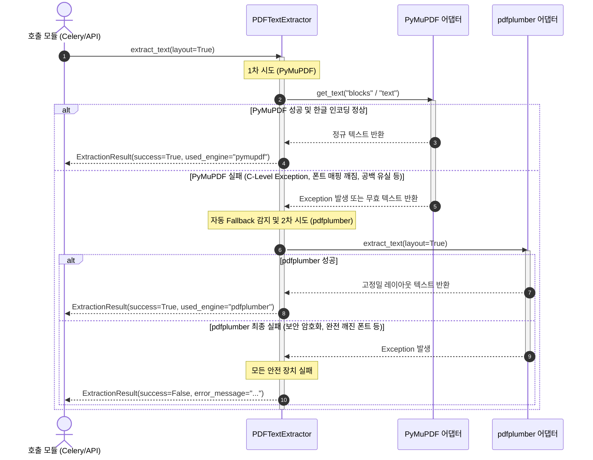

# Interface Contracts: PDF Text Extraction Utility

**Feature**: PDF Text Extraction Utility | **Date**: 2026-05-31
**Status**: Approved

본 계약(Contracts) 문서는 유틸리티 모듈 `PDFTextExtractor`가 노출하는 공개 인터페이스와 형식 정의 및 오류 전파에 관한 소프트웨어 프로토콜을 철저히 규정합니다.

---

## 1. 공개 인터페이스 계약 (Public API Contract)

### `PDFTextExtractor` 클래스
메인 인터페이스로서 파일 경로, 원시 바이트, 혹은 메모리 내 BytesIO 스트림 등 다양한 소스로부터 PDF를 주입받아 텍스트를 무손실로 추출하는 클래스입니다.

#### 클래스 초기화 시그니처
```python
class PDFTextExtractor:
    def __init__(
        self,
        file_source: Union[str, bytes, BytesIO],
        engine_preference: Optional[str] = "pymupdf",
        normalize_unicode: bool = True
    ) -> None:
        """
        PDFTextExtractor 인스턴스를 초기화합니다.
        
        Args:
            file_source: PDF 파일의 물리 경로(str), 원시 바이트 버퍼(bytes), 혹은 BytesIO 객체
            engine_preference: 최우선(Primary)으로 사용할 엔진명 ("pymupdf" 또는 "pdfplumber")
            normalize_unicode: 한글 자모 깨짐을 방어하기 위해 NFC 정규화를 강제 적용할지 여부
            
        Raises:
            ValueError: file_source가 유효한 타입이 아니거나 빈 바이트 스트림인 경우
        """
        pass
```

#### 텍스트 추출 실행 메서드 시그니처
```python
    def extract_text(
        self,
        layout: bool = True,
        start_page: Optional[int] = None,
        end_page: Optional[int] = None
    ) -> ExtractionResult:
        """
        지정된 조건에 맞춰 PDF 문서에서 텍스트를 추출하고 결과를 반환합니다.
        
        Args:
            layout: 참(True)인 경우 탭/공백을 유지하는 시각적 레이아웃 보존 모드, 거짓(False)인 경우 단순 텍스트 나열 모드
            start_page: 부분 추출 시작 페이지 번호 (1-indexed, inclusive)
            end_page: 부분 추출 종료 페이지 번호 (1-indexed, inclusive)
            
        Returns:
            ExtractionResult DTO 객체 (절대 Exception을 호출부로 전파하지 않고 안전하게 실패 메타데이터를 감싸 반환)
        """
        pass
```

---

## 2. 하이브리드 자동 Fallback 시퀀스 (Engine Fallback Protocol)


