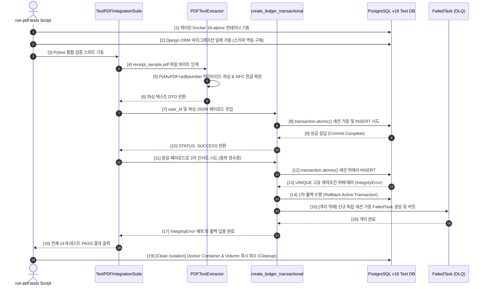

# Interface Contracts: 1주차 인프라 중간 점검 및 로컬 통합 테스트 수행 (Infra Integration Test)

본 문서는 PDF 영수증 데이터의 파싱 및 Django ORM 적재 흐름에서 사용되는 컴포넌트 간 인터페이스 계약, 시퀀스 데이터 흐름 및 입출력 스키마 규격을 명세합니다.

---

## 1. 가계부 트랜잭션 적재 인터페이스 규격 (DRF Service Level)

영수증 데이터를 단일 원자적 트랜잭션 내에서 영속화하는 파이썬 서비스 함수인 `create_ledger_transactional`의 입출력 계약 명세입니다.

### 1.1 입력 매개변수 스키마 (Input Schema)

```json
{
  "user_id": "UUID String",
  "ledger_data": {
    "vendor_registration_number": "1208147528",
    "vendor_name": "홍콩반점",
    "transaction_date": "2026-05-29",
    "total_amount": 24000.00,
    "supply_value": 21818.18,
    "vat_amount": 2181.82
  },
  "items_data": [
    {
      "item_name": "짜장면 곱빼기",
      "quantity": 2,
      "unit_price": 7000.00,
      "total_price": 14000.00
    },
    {
      "item_name": "탕수육 소",
      "quantity": 1,
      "unit_price": 10000.00,
      "total_price": 10000.00
    }
  ]
}
```

### 1.2 출력 응답 스키마 (Output Response)

*   **성공 시 (SUCCESS)**:
    ```json
    {
      "status": "SUCCESS",
      "ledger_id": "UUIDv7 String",
      "message": "Ledger transactions successfully committed."
    }
    ```
*   **실패 시 (FAILURE - 복합 고유 키 위배 등)**:
    *   **동작**: 상위 호출 계층으로 `django.db.IntegrityError` 예외를 전격 Throw하여 원본 트랜잭션 롤백을 즉각 보장합니다.

---

## 2. 통합 검증 컴포넌트 간 시퀀스 흐름 계약 (Sequence Diagram)

통합 테스트 스위트(`TestPDFIntegrationSuite`)가 작동할 때 각 컴포넌트와 데이터베이스가 맺는 원자적 시퀀스 상호작용 계약입니다.



---

## 3. 크로스 플랫폼 CLI 자동화 도구 계약 (run-pdf-tests Script)

Windows PowerShell 및 UNIX/macOS Bash 양대 쉘 도구의 인터페이스 CLI 표준 파라미터 및 동작 계약 명세입니다.

*   **기본 옵션**:
    *   **Windows**: `.\scripts\run-pdf-tests.ps1`
    *   **UNIX**: `./scripts/run-pdf-tests.sh`
*   **리턴 코드 계약 (Exit Code)**:
    *   `0`: 모든 검증 성공 (DB 기동 -> 마이그레이션 -> 테스트 패스 -> 리소스 정리 성공)
    *   `1` 이상: 검증 실패 (DB 에러, 테스트 실패, 자원 Cleanup 실패 등 발생)
