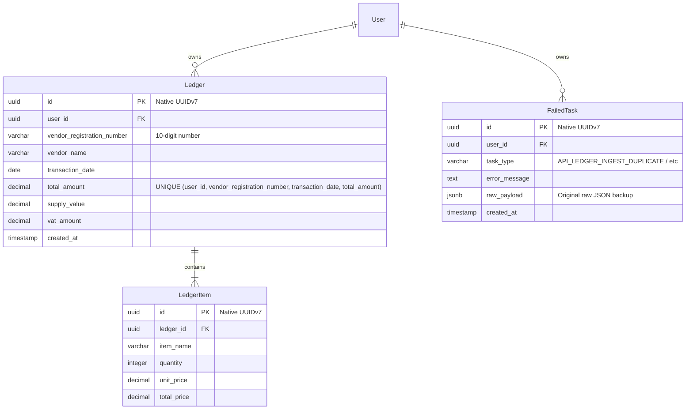

# Data Model: 1주차 인프라 중간 점검 및 로컬 통합 테스트 수행 (Infra Integration Test)

본 문서는 PDF 영수증 정보 추출 및 통합 적재 파이프라인에서 취급하는 핵심 엔티티의 물리 스키마 사양, 복합 제약조건 및 유효성 검사 규칙을 명세합니다.

---

## 1. 개요 및 엔티티 연관 다이어그램 (ERD)

본 통합 검증 시나리오에서 활성화되어 연동되는 엔티티 관계는 다음과 같습니다. 

`User` 마스터 엔티티가 `Ledger` 마스터 가계부를 소유하고, `Ledger`는 N개의 상세 `LedgerItem` 세부 품목 목록을 포함합니다. 적재 중복 및 장애 발생 시에는 해당 원시 페이로드가 `FailedTask` 테이블로 안전하게 우회 수집됩니다.

---

## 2. 상세 엔티티 물리 명세

### 2.1 `Ledger` (가계부 마스터 테이블)
영수증 1장의 기본 결제 및 가맹점 마스터 정보를 저장합니다.

*   **물리적 복합 고유 제약조건 (Unique Constraint)**:
    *   **제약명**: `unique_ledger_transaction`
    *   **조건**: `UNIQUE (user_id, vendor_registration_number, transaction_date, total_amount)`
    *   **목적**: 동일한 사용자가 같은 가맹점에서 같은 날짜에 동일한 금액의 영수증을 무차별 중복 적재하는 금융 파편화를 차단합니다 (헌법 제I조 수호).
*   **유효성 검사 규칙**:
    *   `vendor_registration_number`: 10자리 숫자 포맷 정규식 통과 필수.
    *   `total_amount`: `supply_value` + `vat_amount` 정합성 교차 대조 검증.
    *   `transaction_date`: 미래 날짜 입력 불가 검증.

### 2.2 `LedgerItem` (가계부 세부 품목 테이블)
영수증 본문에 수록된 개별 상세 상품 및 품목 명세 목록을 저장합니다.

*   **외래키 연관 관계**:
    *   `ledger_id`를 통해 `Ledger` 레코드와 1:N 단방향 부모-자식 연관 관계를 맺습니다.
    *   **참조 무결성**: 부모인 `Ledger` 삭제 시 `ON DELETE CASCADE` 처리되어 세부 품목들도 동반 멱등 삭제됩니다.
*   **유효성 검사 규칙**:
    *   `quantity` (수량): 1 이상의 정수만 허용.
    *   `total_price` (총액): `quantity` * `unit_price` 공식과 일치해야 함.

### 2.3 `FailedTask` (실패 보존 및 DLQ 격리 테이블)
트랜잭션 충돌이나 비즈니스 정합성 실패 시, 파편화를 막기 위해 원시 인입 버퍼 데이터를 그대로 영구 격리 보존하는 비상 금고 테이블입니다.

*   **주요 속성**:
    *   `task_type`: 실패가 유발된 발생 지점의 작업 유형을 식별합니다 (`API_LEDGER_INGEST_DUPLICATE` 등).
    *   `raw_payload` (JSONB): 복구 및 추후 재적재 가공이 가능하도록 인입되었던 PDF 텍스트 파싱 원시 JSON 데이터 전체를 무손실 백업 적재합니다.
