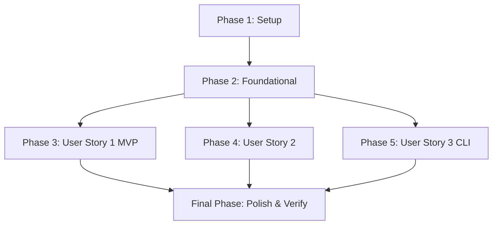

# Tasks: 1주차 인프라 중간 점검 및 로컬 통합 테스트 수행 (Infra Integration Test)

**Input**: Design documents from `/specs/006-infra-integration-test/`

**Prerequisites**: plan.md (required), spec.md (required for user stories), research.md, data-model.md, contracts/contracts.md

**Tests**: 본 태스크 목록에는 TDD 기계적 검증을 위해 설계된 명시적인 통합 테스트 코딩 태스크가 포함되어 있습니다.

**Organization**: 각 태스크는 독립적인 구현 및 점진적 인도가 가능하도록 윈도우/배시 대칭 검증과 사용자 스토리별 그룹화로 정밀하게 조직화되었습니다.

## Format: `[ID] [P?] [Story] Description`

- **[P]**: 병렬 처리 가능 (대상 파일이 상이하고, 상호 의존성이 없는 독립 태스크)
- **[Story]**: 매핑되는 사용자 스토리 라벨 (예: US1, US2, US3)
- 모든 태스크는 구체적인 구현 대상 파일의 물리 경로를 명시합니다.

---

## Phase 1: Setup (Shared Infrastructure)

**Purpose**: 프로젝트 기본 구조 초기화 및 테스트 전용 공통 리소스 디렉토리 격리 확보

- [ ] T001 `backend/tests/resources/` 디렉토리를 생성하고, 통합 테스트용 표준 한글 영수증 PDF 파일(`receipt_sample.pdf`)을 해당 폴더 하위에 격리 배치
- [ ] T002 `backend/tests/integration/` 디렉토리를 구축하여 신규 인프라 통합 검증용 소스 파일이 격리 적재될 폴더 구조를 마련

---

## Phase 2: Foundational (Blocking Prerequisites)

**Purpose**: 사용자 스토리 기동 전 반드시 선결 완료되어야 하는 로컬 테스트용 환경 포트 구성 및 DB 연결 검증

**⚠️ CRITICAL**: 이 페이즈가 100% 완료되기 전에는 어떠한 사용자 스토리 코드 작업도 개시할 수 없습니다.

- [ ] T003 `backend/config/settings.py` 경로 내에서 테스트 기동 시 전용 테스트 데이터베이스 포트(`54321`) 및 환경 연결 매핑이 안정적으로 바인딩되는지 검토 및 설정 검증
- [ ] T004 `backend/pyproject.toml`에 명세된 `pytest-django` 플러그인 의존성을 기반으로, 로컬 격리 테스트 DB가 올라왔을 때 Django 부트스트랩 컨텍스트가 멱등하게 셋업되는지 사전 연결 검증

**Checkpoint**: Foundational Phase 완료 - 이제 각 사용자 스토리의 정밀 구현 및 테스트 가동을 병렬 또는 순차적으로 개시할 수 있습니다.

---

## Phase 3: User Story 1 - 정상 PDF 영수증 통합 인입 및 Django ORM 적재 (Priority: P1) 🎯 MVP

**Goal**: 로컬 PDF 파일 바이트를 추출하여 데이터베이스 원자적 삽입 및 커밋 정합성 증명

**Independent Test**: `uv run pytest backend/tests/integration/test_pdf_integration.py -k test_normal_pdf_ingestion` 단독 구동으로 통과 증명

### Implementation for User Story 1

- [ ] T005 [P] [US1] `backend/tests/integration/test_pdf_integration.py` 경로에 Django `TestCase`를 상속받는 통합 테스트 슈트 클래스 `TestPDFIntegrationSuite` 기본 구조를 코딩
- [ ] T006 [US1] `backend/tests/integration/test_pdf_integration.py`에 `setUpTestData(cls)` 클래스 메서드를 가동하여 공통 테스트용 사용자 마스터 레코드(`User`)를 DB에 단 1회 생성하도록 코딩
- [ ] T007 [US1] `backend/tests/integration/test_pdf_integration.py`에 `test_normal_pdf_ingestion` 테스트 메서드를 신설하고, 실제 `receipt_sample.pdf` 파일을 바이트로 로드해 `PDFTextExtractor`를 기동하여 무손실 NFC 한글 복원 정규화 파싱을 완수하도록 코딩
- [ ] T008 [US1] `backend/tests/integration/test_pdf_integration.py` 내 `test_normal_pdf_ingestion` 서비스 구동부에서 `create_ledger_transactional` API를 호출하고, `Ledger` 1개 레코드와 `LedgerItem` 2개 레코드가 단일 트랜잭션(`transaction.atomic()`)으로 성공 커밋되어 DB에 영속화됨을 단언문(Assert)으로 증명하도록 코딩

**Checkpoint**: 이 시점에서 User Story 1의 정상적인 PDF 파싱 및 ORM 영속 커밋 E2E 동기화 파이프라인이 완벽히 기동하며 독립 테스트를 100% 통과해야 합니다.

---

## Phase 4: User Story 2 - 중복 영수증 유입 차단 및 DLQ 격리 통합 검증 (Priority: P2)

**Goal**: 동일 결제 영수증 연속 유입 차단 및 롤백 후 FailedTask DLQ 격리 영속화 입증

**Independent Test**: `uv run pytest backend/tests/integration/test_pdf_integration.py -k test_duplicate_pdf_isolation` 단독 구동으로 통과 증명

### Implementation for User Story 2

- [ ] T009 [US2] `backend/tests/integration/test_pdf_integration.py`에 `test_duplicate_pdf_isolation` 테스트 메서드를 신설하고, 동일 유저 및 페이로드 정보로 1차 적재를 성공시킨 후 연속하여 2차 중복 인서트 적재를 동기식으로 시도하는 테스트 시나리오를 코딩
- [ ] T010 [US2] `backend/tests/integration/test_pdf_integration.py` 내 2차 적재 연산 시 DB 복합 고유 제약조건 위배에 따른 `IntegrityError` 예외가 정확하게 발생함을 단언문으로 포착하고, 2차 영수증 삽입이 차단되어 `Ledger` 개수가 여전히 1개로 완전 롤백됨을 보장하도록 코딩
- [ ] T011 [US2] `backend/tests/integration/test_pdf_integration.py` 내에서 `FailedTask` 격리 수집 테이블을 쿼리하여 `API_LEDGER_INGEST_DUPLICATE` 타입의 실패 로그 레코드가 성공적으로 생성되었는지 단언하고, `raw_payload` JSONB 데이터 내에 원시 영수증 페이로드가 무손실로 안전하게 보존되어 복원 가능한지 최종 입증하도록 코딩

**Checkpoint**: 이 시점에서 중복 영수증 유입에 따른 헌법적 트랜잭션 원자성 롤백과 DLQ 비상 금고 격리 적재의 무결성이 독립적으로 완벽하게 검증되어야 합니다.

---

## Phase 5: User Story 3 - 크로스 플랫폼 대칭 원클릭 통합 검증 CLI 가동 (Priority: P3)

**Goal**: 윈도우 파워쉘 및 배시 쉘 대칭 스크립트를 통한 15초 원터치 통합 프로세스 멱등 자동화 수호

**Independent Test**: 윈도우와 UNIX/macOS 각 CLI를 직접 단독 가동하여 exit code `0` 최종 획득 입증

### Implementation for User Story 3

- [ ] T012 [P] [US3] `scripts/run-pdf-tests.ps1` 경로에 Windows PowerShell용 원클릭 E2E 자동화 도구를 코딩하여 [격리된 PostgreSQL 18-alpine 컨테이너 기동 -> 54321 포트 바인딩 대기 -> uv run Django 마이그레이션 기동 -> pytest 통합 스위트 가동 -> 에러 가로채기(Catch) 및 docker compose down -v 격리 청소] 자동화 흐름을 구축
- [ ] T013 [P] [US3] `scripts/run-pdf-tests.sh` 경로에 UNIX/macOS/Linux Bash용 대칭형 원클릭 E2E 자동화 도구를 동일 동형하게 코딩하여 헌법 제VI조(양대 쉘 대칭적 동등 지원)의 툴링 멱등성과 격리 회수를 완벽히 수호

**Checkpoint**: 이 시점에서 개발자는 어느 운영체제 환경에서든 단 한 줄의 명령어만으로 로컬 인프라 세팅부터 테스트 완료 및 격리 청소까지 15초 내에 원클릭으로 가동할 수 있어야 합니다.

---

## Final Phase: Polish & Cross-Cutting Concerns

**Purpose**: 사용자 환경 회복성 마감 및 횡단 관심사 보완

- [ ] T014 `scripts/` 하위 스크립트 실행 시 로컬 도커 데몬(Docker Desktop)이 꺼져있을 경우 사용자에게 명확하고 친절한 예외 복구 지침 메시지를 출력하도록 오류 안내문 다듬기
- [ ] T015 [P] 1주차 퀵스타트 가이드 [quickstart.md](file:///D:/Projects/Private/ai-ledger-automation/specs/006-infra-integration-test/quickstart.md)의 기동 스펙에 따라 윈도우 및 UNIX 쉘에서 각각 단독 기동을 최종 확인하고 exit code `0` 멱등 반환을 수동 검증 완결

---

## Dependencies & Execution Order

### Phase Dependencies



*   **Setup (Phase 1)**: 아무런 종속성이 없으며 즉시 개시 가능합니다.
*   **Foundational (Phase 2)**: 셋업이 완료되어야 수행 가능하며, **모든 사용자 스토리를 강력하게 블로킹**합니다.
*   **User Stories (Phase 3 ~ 5)**: Foundational 인프라 연결이 확보되면 병렬 또는 순차 실행할 수 있습니다.
*   **Polish (Final Phase)**: 3대 사용자 스토리가 모두 PASS된 후 횡단 검증을 수행합니다.

### Within Each User Story

*   통합 테스트 기본 클래스 구조 및 `setUpTestData`가 먼저 코딩되어야 합니다 (T005, T006).
*   정상 파싱 및 적재 흐름(US1)이 선행 완결되어야, 중복 차단 및 DLQ 검증(US2) 시나리오 작성이 가능합니다 (T007, T008 선행 후 T009~T011 기동).
*   통합 테스트용 `.py` 소스 및 비즈니스 적재 컴포넌트가 완성되어야, 비로소 원클릭 CLI 스크립트(US3) 내에서 pytest 커맨드가 유의미하게 기동하여 멱등 자동화를 이룰 수 있습니다.

### Parallel Opportunities

*   **셋업 병렬화**: T001 (테스트 리소스 배치)과 T002 (통합 테스트 디렉토리 구축)는 서로 파일이 겹치지 않아 즉시 병렬 실행이 가능합니다.
*   **시나리오 코딩과 CLI 스크립트 작성의 병렬화**: `backend/` 하위의 파이썬 테스트 코드 구현(US1, US2)과 `scripts/` 하위의 인프라 기동 쉘 스크립트 구현(US3)은 수정 대상 파일 경로가 완전히 물리 격리되어 있으므로 서로 충돌 없이 동시에 병렬 개발할 수 있습니다.

---

## Parallel Example: User Story 1 & 3

```bash
# 개발자 A: 백엔드 통합 테스트 시나리오 구현 가동 (T005~T008)
Task: "backend/tests/integration/test_pdf_integration.py에 test_normal_pdf_ingestion 코딩"

# 개발자 B: 크로스 플랫폼 CLI 인프라 기동 스크립트 작성 가동 (T012~T013)
Task: "scripts/run-pdf-tests.ps1 및 scripts/run-pdf-tests.sh 코딩"
```

---

## Implementation Strategy

### MVP First (User Story 1 Only)

1.  **Phase 1: Setup**을 구동하여 샘플 영수증 PDF를 이탈 없이 안전하게 적재 배치합니다.
2.  **Phase 2: Foundational**을 가동해 테스트용 전용 DB 포트(`54321`) 및 settings.py 연동 상태를 확인합니다.
3.  **Phase 3: User Story 1**을 코딩하여 로컬 PDF 바이트 파싱과 `create_ledger_transactional` ORM 단일 커밋의 무결성을 TDD로 가동합니다.
4.  **STOP and VALIDATE**: 해당 시점에서 `pytest` 단독 구동으로 정상 적재 흐름(US1)이 100% 녹색불로 통과함을 객관적으로 최종 입증합니다. (MVP 성공!)

### Incremental Delivery

1.  **MVP 완성 및 인도**: P1 정상 적재 흐름 완성으로 1주차 1단계 인도 완료.
2.  **DLQ 복원성 증명**: P2를 얹어 중복 PDF 인서트에 따른 원자적 롤백과 DLQ 데이터 무손실 적재를 연동하고 1단계 유실 없이 완전성을 점증합니다.
3.  **대칭형 원클릭 자동화 탑재**: P3 스크립트를 최종 얹어 윈도우/리눅스 환경 불문하고 15초 원클릭 멱등 자동화를 완성하여 1주차의 완결된 배포 통합본을 완성합니다.
