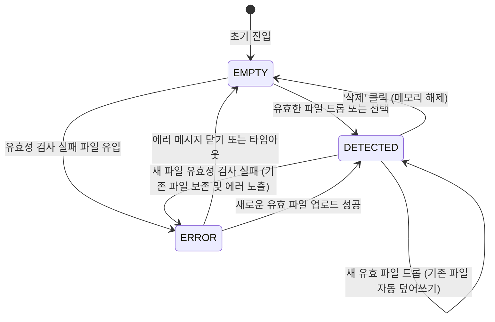

# Data Model Specification: frontend-dropzone-layout

**Created**: 2026-06-02

## 1. 프론트엔드 업로드 상태 엔티티 (ReceiptFile)

사용자가 드롭존에 업로드하여 브라우저 메모리 단에 임시 유지하는 영수증 파일 모델의 구조입니다.

### ReceiptFile 엔티티 구조

| 필드명 | 데이터 타입 | 설명 | 예시 |
| :--- | :--- | :--- | :--- |
| **id** | String (UUIDv7 포맷) | 파일에 부여되는 브라우저 단의 임시 고유 키 | `018fe670-8b1d-7a6c-94eb-f072bbab4567` |
| **name** | String | 영수증의 원래 파일명 | `receipt_20260602.png` |
| **size** | Number | 파일 크기 (바이트 단위) | `1543200` (약 1.47MB) |
| **type** | String | 파일의 MIME 확장자 분류 | `image/png` 또는 `application/pdf` |
| **previewUrl** | String | 이미지 미리보기를 위한 임시 브라우저 Object URL | `blob:http://localhost:5173/bf24-a789` |
| **rawFile** | File Object | 브라우저 네이티브 File 객체 원본 | `[object File]` |
| **createdAt** | String (ISO 8601) | 파일이 감지 및 등록된 일시 | `2026-06-02T07:34:00.000Z` |

---

## 2. 요구사항 기반 프론트엔드 유효성 검사 규칙 (Validation Rules)

* **파일 용량 상한선 검사**:
  - 조건: `size <= 10485760` (10MB 이하)
  - 실패 피드백: "최대 파일 용량(10MB)을 초과하는 파일은 업로드할 수 없습니다."
* **지원 파일 포맷 검사**:
  - 조건: `type`이 `["image/png", "image/jpeg", "image/jpg", "application/pdf"]` 중 하나에 포함되어야 함.
  - 실패 피드백: "지원하지 않는 파일 형식입니다. 이미지(JPG, PNG) 또는 PDF 파일만 업로드할 수 있습니다."
* **업로드 개수 제약 (MVP 단일화)**:
  - 조건: 드롭존 상태 모델 내의 활성 `ReceiptFile` 개수는 상시 `0` 또는 `1` 개이어야 함.
  - 실패 피드백: 별도 경고 없이 기존에 등록된 `ReceiptFile` 및 `previewUrl` 리소스를 명시적으로 해제한 후 새 파일로 즉시 덮어씌움.

---

## 3. 업로드 라이프사이클 및 상태 전이 (State Transitions)

### 상태 전이 세부 조치 사항
1. **EMPTY (빈 상태)**:
   - 드롭존 UI 상에 "영수증 파일을 여기에 드래그하거나 클릭하여 선택하세요" 기본 메시지 렌더링.
2. **DETECTED (감지 완료 상태)**:
   - 브라우저 메모리 관리를 위해 기존에 생성된 `URL.revokeObjectURL(previewUrl)`을 안전하게 선실행하여 메모리 누수를 완전히 방지함.
   - 드롭존 하단에 영수증의 파일명, 파일 크기, 썸네일 미리보기를 반응형 목록으로 즉각 렌더링.
3. **ERROR (에러 상태)**:
   - 드롭존 하단 또는 상단에 빨간색 경고 알럿 또는 토스트를 노출하고, 잘못 유입된 파일 객체는 상태 모델에 등록하지 않고 거부 처리함.
