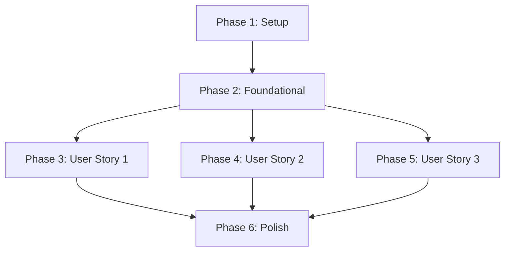

# Tasks: frontend-dropzone-layout

**Input**: Design documents from `/specs/007-frontend-dropzone-layout/`

**Prerequisites**: plan.md (required), spec.md (required for user stories), research.md, data-model.md, contracts/

**Tests**: 사용자 명시 요청("TDD를 진행 할 것.")에 따라, 모든 컴포넌트 및 핵심 UI 로직 구현에 앞서 테스트 코드를 선행 작성(TDD)하고 실패(FAIL) 상태를 확인한 후 구현하여 통과(PASS)시키는 TDD 개발 주기를 엄격히 설계에 반영합니다.

**Organization**: 각 사용자 스토리(US1, US2, US3)별로 그룹화 및 독립 조직화하여 각각을 완전하고 독립적으로 테스트 및 MVP 증분 개발이 가능하도록 설계했습니다.

---

## Format: `[ID] [P?] [Story] Description`

- **[P]**: 병렬 처리 가능 (대상 파일이 상호 다르고 비종속적일 때 지정)
- **[Story]**: 매핑되는 사용자 스토리 라벨 (예: US1, US2, US3)
- 상세 설명에 구체적인 대상 파일 경로 및 TDD 지침 명시

---

## Path Conventions

- **Web app**: `frontend/src/`, `frontend/src/components/`, `frontend/src/components/__tests__/`

---

## Phase 1: Setup (Shared Infrastructure)

**Purpose**: 프로젝트 구조 초기화, Tailwind CSS 설정 및 프론트엔드 TDD 테스트 구동 환경 장착

- [ ] T001 `frontend` 디렉토리를 신규 생성하고 `npm create vite@latest frontend -- --template vue`를 기동하여 Vue 3 + Vite 기본 뼈대 구조 비대화형 초기화
- [ ] T002 `frontend/` 경로에서 테일윈드 및 PostCSS 의존 패키지(`npm install -D tailwindcss postcss autoprefixer lucide-vue-next vitest @vue/test-utils jsdom`)를 패키지 매니저로 설치
- [ ] T003 [P] `frontend/tailwind.config.js` 및 `frontend/postcss.config.js` 파일을 작성하여 Slate 다크 테마 커스텀 색상(Slate-900, Indigo accent) 환경 구성
- [ ] T004 [P] `frontend/vite.config.js` 파일을 수정하여 Vitest 및 jsdom 단위 테스트 실행을 위한 프론트엔드 테스트 환경 세팅

---

## Phase 2: Foundational (Blocking Prerequisites)

**Purpose**: 공통 테마 디자인 시스템 적용 및 전역 테스트 헬퍼 초기 인프라 구축

**⚠️ CRITICAL**: 본 페이즈의 전역 스타일 세팅 및 공통 모킹 환경 구축이 완결되어야 각 사용자 스토리별 TDD 주기를 개시할 수 있습니다.

- [ ] T005 `frontend/src/index.css`를 생성하고 Tailwind CSS 디렉티브 주입 및 헌법에 규정된 `slate-900` 다크 모드 뼈대 백그라운드 색상 정의
- [ ] T006 `frontend/src/main.js` 및 `frontend/index.html` 파일을 수정하여 테일윈드 CSS가 메인 뷰포트 영역 전체에 은은하게 바인딩되도록 전역 로드 선언
- [ ] T007 [P] `frontend/src/components/__tests__/setup.js` 경로에 브라우저 URL 모킹 및 전역 테스트 인프라 환경 헬퍼 모듈 구축

**Checkpoint**: Foundational Phase 완료 - 사용자 스토리별 격리 TDD 개발을 시작할 수 있습니다.

---

## Phase 3: User Story 1 - 반응형 영수증 업로드 드롭존 레이아웃 (Priority: P1) 🎯 MVP

**Goal**: 드래그앤드롭 및 파일 선택기를 지원하는 반응형 기본 드롭존을 구성하여 영수증 파일을 올리면 상태값에 안전하게 감지되도록 구축함.

**Independent Test**: 드롭존에 파일을 올리면 `currentFile` 상태가 파일 속성에 맞게 감지되는지 단위 테스트(`Dropzone.spec.js`) 및 브라우저에서 입증함.

### Tests for User Story 1 (TDD 선행 구현) ⚠️

> **TDD 지침: 아래 테스트 코드를 먼저 작성하고, 실제 구현 파일이 빈 껍데기일 때 테스트를 돌려 FAIL 상태가 됨을 반드시 확인하십시오.**

- [ ] T008 [P] [US1] `frontend/src/components/__tests__/Dropzone.spec.js` 경로에 드래그 앤 드롭 파일 투하 및 클릭 이벤트 감지 시 `file-detected` 이벤트를 발생시키는 단위 테스트 구현 (FAIL 상태 도달 검증)
- [ ] T009 [P] [US1] `frontend/src/components/__tests__/Dropzone.spec.js` 경로에 헌법 제V조(카메라 직촬영 속성 `capture="environment"`, `accept` 제한) HTML 속성 정합성을 검증하는 테스트 구현 (FAIL 상태 도달 검증)

### Implementation for User Story 1

- [ ] T010 [US1] `frontend/src/components/Dropzone.vue` 경로에 헌법 제V조(PWA 카메라 최적화)를 충족하는 파일 선택 인풋 마크업(`accept="image/png, image/jpeg, application/pdf" capture="environment"`) 및 은은한 점선 테두리를 갖춘 슬레이트 디자인 레이아웃 퍼블리싱
- [ ] T011 [US1] `frontend/src/components/Dropzone.vue` 경로에 Drag event handler(`dragover`, `dragleave`, `drop`) 및 파일 선택 연동 스크립트를 구현하여 정상적인 감지 데이터 바이패스 수립
- [ ] T012 [US1] 단위 테스트(`npm run test`)를 구동하여 작성된 `Dropzone.spec.js` 테스트가 완벽하게 **통과(PASS)**함을 확인하여 TDD 주기 완결

**Checkpoint**: 드롭존 단독 컴포넌트의 반응형 구조 및 1차 감지E2E 동작 테스트 합격 완료.

---

## Phase 4: User Story 2 - 업로드 영수증 파일 목록 피드백 및 개별 삭제 (Priority: P2)

**Goal**: 업로드된 파일의 썸네일 미리보기와 파일 정보를 동적 목록으로 렌더링하고 개별 제거 버튼을 지원함.

**Independent Test**: 파일을 드롭하여 목록에 추가한 후 삭제 버튼을 누르면 `currentFile` 상태가 리셋되고 화면에서 목록이 즉각 제거되는지 검증함.

### Tests for User Story 2 (TDD 선행 구현) ⚠️

> **TDD 지침: 아래 테스트 코드를 먼저 작성하고 실행하여 FAIL 상태가 됨을 확인한 뒤 구현을 시작하십시오.**

- [ ] T013 [P] [US2] `frontend/src/components/__tests__/ReceiptList.spec.js` 경로에 업로드 완료된 영수증의 파일명, 파일 용량, 썸네일이 화면에 바인딩되고 삭제 버튼 클릭 시 `file-removed` 이벤트를 송출하는 단위 테스트 작성 (FAIL 확인)
- [ ] T014 [P] [US2] `frontend/src/__tests__/App.spec.js` 경로에 파일 감입 시 미리보기 blob(Object URL)을 동적 매핑하고, 삭제 수신 시 `URL.revokeObjectURL` 실행 후 상태를 `null`로 안전 해제하는지 검증하는 상태 정합성 테스트 작성 (FAIL 확인)

### Implementation for User Story 2

- [ ] T015 [US2] `frontend/src/components/ReceiptList.vue` 경로에 썸네일 이미지 및 파일명, 바이트 용량을 시각화하는 반응형 목록 레이아웃 퍼블리싱 및 개별 삭제 액션용 호버 활성 X 버튼 삽입
- [ ] T016 [US2] `frontend/src/App.vue` 메인 뷰포트에 드롭존과 영수증 목록 컴포넌트를 조율 렌더링하고, reactive `currentFile` 데이터 모델의 변경에 따라 `blob: URL` 생성 및 해제 라이프사이클 핸들링 상태 로직 구현
- [ ] T017 [US2] 단위 테스트를 작동하여 `ReceiptList.spec.js` 및 `App.spec.js` TDD 테스트가 모두 **통과(PASS)**하는지 검증

**Checkpoint**: 파일 감지 시 실시간 썸네일 바인딩과 수량 제약(1개 제한 덮어쓰기) 및 메모리 해제 검증 완료.

---

## Phase 5: User Story 3 - 영수증 업로드 관련 에러 핸들링 및 형식 검증 (Priority: P3)

**Goal**: 지원 외 확장자(비 JPEG/PNG/PDF) 및 10MB 초과 파일 접수 시, 상태 검증을 통해 차단하고 화면에 경고 알럿 또는 토스트 피드백을 노출함.

**Independent Test**: 비정상 파일 드롭 시 목록에 추가되지 않고 즉각 에러 메시지가 렌더링되는지 검증함.

### Tests for User Story 3 (TDD 선행 구현) ⚠️

> **TDD 지침: 아래 테스트 코드를 먼저 작성하고 실행하여 FAIL 상태가 됨을 확인한 뒤 구현을 시작하십시오.**

- [ ] T018 [P] [US3] `frontend/src/components/__tests__/Validation.spec.js` 경로에 10MB 초과 파일 업로드 차단, 지원 규격 외 확장자(.txt, .exe 등) 차단 및 부모 컴포넌트에 올바른 에러 메시지와 함께 `validation-error` 이벤트 송출을 확인하는 검사 테스트 작성 (FAIL 확인)

### Implementation for User Story 3

- [ ] T019 [US3] `frontend/src/components/Dropzone.vue` 내부에 1차 유효성 검사 로직(`file.size > 10 * 1024 * 1024` 등)을 기재하여 예외 감지 시 즉각 이벤트를 발송하고 파일 바이패스를 원천 차단하도록 구현
- [ ] T020 [US3] `frontend/src/App.vue` 내에 에러 수신 시 슬레이트-레드(`bg-rose-950 text-rose-200`) 계열의 세련되고 반응형이 뛰어난 경고 피드백 배너/토스트 레이아웃을 퍼블리싱하고 3초 후 페이드아웃 상태 변경 추가
- [ ] T021 [US3] 프론트엔드 테스트 스위트를 전수 실행하여 유효성 및 예외 대응 단위 테스트가 전원 **통과(PASS)**함을 검증

**Checkpoint**: 비정상 파일 필터링 및 시각적 에러 상태 피드백 E2E 정합성 입증 완료.

---

## Phase 6: Polish & Cross-Cutting Concerns

**Purpose**: 마이크로 애니메이션 최적화, 불필요한 빌드 플레이스홀더 청소 및 퀵스타트 정상 작동 검증

- [ ] T022 [P] `frontend/src/App.vue` 및 `frontend/src/components/Dropzone.vue` 등 소스코드 상의 미사용 보일러플레이트 자산(기본 Vite 로고 및 헬로월드)을 전수 정리하고 테일윈드 중첩 스타일 간결화
- [ ] T023 `frontend/src/index.css` 파일 내에 마우스 호버 및 드래그 오버 시 은은한 GPU 가속(`will-change: transform`) Glow 효과와 액티브 트랜지션 애니메이션을 삽입하고, 모바일 친화적인 정적 폴백 구조를 구현하여 사용자 인터랙션 극대화 (Aesthetics WOW 구현)
- [ ] T024 `frontend/README.md` 문서를 작성하고 저장소 루트의 `quickstart.md` 지침에 따라 로컬 `npm run dev` 구동을 통한 최종 E2E 퍼블리싱 빌드 기계식 검증 완수

---

## Dependencies & Execution Order

### Phase Dependencies



### User Story Dependencies

* **User Story 1 (P1)**: Foundational 페이즈가 끝나면 즉시 시작할 수 있으며, 타 스토리 완성도와 완전히 격리되어 단독 실행할 수 있는 MVP 타겟입니다.
* **User Story 2 (P2)**: Story 1의 드롭존 감지 이벤트를 기반으로 상태를 공유하지만, 모의 객체를 이용해 단독 독립 검증이 가능합니다.
* **User Story 3 (P3)**: Story 1의 업로드 채널 유입부에 검사 필터를 장착하므로 Story 1 완료 후 또는 모킹을 통해 독립 구현 및 테스트할 수 있습니다.

### Parallel Opportunities

* Setup 페이즈의 린팅/테마 설정 및 Vitest 연동(`T003`, `T004`)은 서로 영향을 주지 않으므로 완벽한 병렬 작업이 가능합니다.
* 각 사용자 스토리의 선행 TDD 테스트 코드 작성 태스크들(`T008`, `T009`, `T013`, `T014`, `T018`)은 구현부 파일이 없더라도 작성될 수 있으므로, 다수의 작업자가 분담하여 고속으로 병렬 작성이 가능합니다.

---

## Parallel Example: User Story 1

```bash
# User Story 1의 TDD 검사용 테스트 케이스 다발을 동시에 병렬 작성:
Task T008: "frontend/src/components/__tests__/Dropzone.spec.js 경로에 drag&drop 단위 테스트 구현"
Task T009: "frontend/src/components/__tests__/Dropzone.spec.js 경로에 카메라 capture 속성 검증 테스트 구현"

# TDD 테스트를 기동하여 FAIL 상태를 일제히 확인:
npm run test:unit
```

---

## Implementation Strategy

### MVP First (User Story 1 Focus)
1. **Phase 1 (Setup)** 및 **Phase 2 (Foundational)** 환경 구성을 완료합니다.
2. **Phase 3 (User Story 1)**의 TDD 테스트(`T008`, `T009`)를 선제 작성하여 의도된 실패(FAIL)를 확보합니다.
3. `Dropzone.vue` 컴포넌트 마크업 및 카메라 바인딩(`T010`, `T011`)을 완성하여 단위 테스트를 **통과(PASS)**시킵니다.
4. 드롭존이 화면상에 단독 노출되어 파일을 감지해 내는 MVP 상태를 브라우저에서 직접 수동 증명 및 종결합니다.
