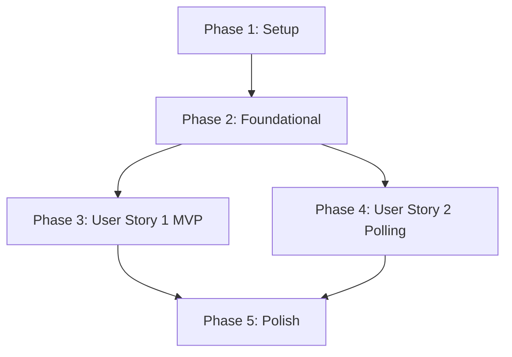

# Tasks: Upload API Integration & Async Schema Design

**Input**: Design documents from `/specs/008-upload-api-integration/`

**Prerequisites**: plan.md (required), spec.md (required for user stories), research.md, data-model.md, contracts/

**Tests**: TDD(테스트 주도 개발) 요구에 따라, 각 구현 작업에 상응하는 테스트 태스크가 명시적으로 선배치되었습니다. 테스트 코드는 반드시 구현 코드보다 먼저 작성하여 실패함을 확인하고 점진적으로 통과시켜야 합니다.

**Organization**: 각 사용자 스토리 완료 시 독립적인 E2E 동작 및 검증이 가능하도록 스토리 단위로 그룹화되어 있습니다.

---

## Phase 1: Setup (Shared Infrastructure)

**Purpose**: 프로젝트 구조 및 프론트엔드/백엔드 기본 환경 확인

- [X] T001 `backend/` 및 `frontend/` 경로에 피처 개발을 위한 모노레포 폴더 구조 및 플레이스홀더 파일 생성
- [X] T002 `backend/pyproject.toml`에 필요한 추가 의존성 존재 여부를 확인하고 `uv lock` 및 `uv sync`를 실행하여 가상환경 동기화
- [X] T003 [P] `frontend/package.json`에서 npm 의존성 상태를 점검하고 린터/포맷터 설정을 완료

---

## Phase 2: Foundational (Blocking Prerequisites)

**Purpose**: 본격적인 비즈니스 로직 작성 전에 요구되는 데이터베이스 뼈대와 공통 아키텍처 셋업

**⚠️ CRITICAL**: 본 페이즈 완료 전에 어떠한 사용자 스토리도 착수할 수 없습니다.

- [X] T004 `backend/src/apps/ledgers/models.py` 내부 및 데이터베이스에 Ledger, LedgerItem, ReceiptUploadJob 기본 마이그레이션 틀 구성
- [X] T005 [P] `backend/src/config/settings.py`에 최대 데이터베이스 커넥션 풀 크기를 5개 이하로 제약하는 설정 값 검증 및 셋업
- [X] T006 [P] `backend/src/apps/ledgers/views.py`에 API 공통 예외 처리(Error Handling) 구조 및 로깅 유틸리티 구조 셋업
- [X] T007 `backend/src/config/urls.py`에 `/api/v1/receipts/` API 라우팅 정의 및 드라이버 뷰 기본 스켈레톤 구축

**Checkpoint**: Foundation ready - 사용자 스토리 구현 단계 진입 준비 완료

---

## Phase 3: User Story 1 - Receipt Upload and Immediate Reflection (Priority: P1) 🎯 MVP

**Goal**: 사용자가 영수증 이미지를 업로드하면 1차 Canvas 리사이징(최대 1000px) 후 동기식 API로 즉시 업로드되어 분석 결과가 화면에 바로 반영됩니다.

**Independent Test**: Mock 영수증 이미지를 화면에 드롭하여 API 서버로의 업로드와 단일 트랜잭션 적재 및 COMPLETED 응답 결과가 UI에 즉시 바인딩되는지 확인합니다.

### Tests for User Story 1 (TDD - Write FIRST and ensure they FAIL) ⚠️

- [X] T008 [P] [US1] `backend/tests/test_views.py` 경로에 동기식 영수증 업로드 API(`POST /api/v1/receipts/upload/`)의 데이터 적재 및 응답 스키마(status: COMPLETED, job_id 반환) 검증용 Django TestCase 작성 및 실패 확인
- [X] T009 [P] [US1] `backend/tests/test_parser.py` 경로에 영수증 OCR 정적 파서 및 가맹점 사업자등록번호 기반 `merchant_templates` 우회 로직(`is_verified` 필터 통제 규칙 포함)을 검증하는 unittest.TestCase 작성 및 실패 확인
- [X] T010 [P] [US1] `frontend/src/__tests__/uploadService.spec.js` 경로에 HTML5 Canvas 가로 최대 1000px 1차 압축 및 리사이징 로직을 검증하는 단위 테스트 작성 및 실패 확인

### Implementation for User Story 1

- [X] T011 [P] [US1] `backend/src/apps/ledgers/models.py` 경로에 Ledger, LedgerItem 및 ReceiptUploadJob 모델 구현 (UNIQUE 복합 고유 제약조건 포함)
- [X] T012 [US1] `backend/src/apps/ledgers/services/parser.py` 경로에 10자리 사업자등록번호 기반 `merchant_templates` 캐시 인덱스 조회 및 `is_verified: true`인 정적 규칙 파이프라인 우회 로직 구현 (T009 테스트 통과 확인)
- [X] T013 [US1] `backend/src/apps/ledgers/serializers.py` 경로에 영수증 분석 결과 및 하위 호환 응답 구조(`job_id`, `status`) 직렬화 스키마 구현
- [X] T014 [US1] `backend/src/apps/ledgers/views.py` 경로에 단일 `transaction.atomic()` 트랜잭션 블록 내에서 Ledger/LedgerItem을 원자적으로 적재하고 COMPLETED 상태를 반환하는 업로드 API 구현 (T008, T012 테스트 통과 확인)
- [X] T015 [P] [US1] `frontend/src/services/uploadService.js` 경로에 Canvas 1차 이미지 리사이징(가로 최대 1000px, quality: 0.85) 및 API 송신 로직 구현 (T010 테스트 통과 확인)
- [X] T016 [US1] `frontend/src/components/Dropzone.vue` 및 `frontend/src/App.vue` 경로에 영수증 드롭존 UI 및 드래그앤드롭 이벤트 바인딩, 업로드 및 즉시 렌더링 연동부 구현

**Checkpoint**: User Story 1(MVP)이 독립적으로 완전히 작동하고 테스트 케이스가 모두 통과됨을 입증

---

## Phase 4: User Story 2 - Pre-installation of Client-side Polling Virtual Module (Priority: P2)

**Goal**: 백엔드가 Celery 비동기 처리로 전환될 경우에 대비해, API 응답 상태(PENDING/PROCESSING)에 맞춰 상태를 주기적으로 확인하는 프론트엔드 가상 폴링 대기 루프를 선배치합니다.

**Independent Test**: Mock API 응답으로 PROCESSING 상태를 인위 주입한 후, 가상 대기 루프가 정상 구동되다가 최종 COMPLETED 시점에 완료 데이터를 렌더링하는지 검증합니다.

### Tests for User Story 2 (TDD - Write FIRST and ensure they FAIL) ⚠️

- [X] T017 [P] [US2] `backend/tests/test_views.py` 경로에 가상 상태 조회 API(`GET /api/v1/receipts/status/<job_id>/`)의 가상 응답(PROCESSING / COMPLETED) 및 UUID 파라미터 매핑을 검증하는 Django TestCase 작성 및 실패 확인
- [X] T018 [P] [US2] `frontend/src/__tests__/pollingService.spec.js` 경로에 응답의 status가 `"COMPLETED"`이면 즉시 완료하고, 그 외의 경우에는 setInterval 가상 폴링 루프가 정상 개시 및 정지되는지 검증하는 단위 테스트 작성 및 실패 확인

### Implementation for User Story 2

- [X] T019 [US2] `backend/src/apps/ledgers/views.py` 경로에 job_id를 수신하여 현재 작업 상태를 반환하는 가상 상태 조회 API 구현 (T017 테스트 통과 확인)
- [X] T020 [US2] `frontend/src/services/pollingService.js` 경로에 추상화된 가상 폴링 매니저(`VirtualPollingManager`)를 구현 (T018 테스트 통과 확인)
- [X] T021 [US2] `frontend/src/App.vue` 및 `frontend/src/components/Dropzone.vue` 경로에서 업로드 수신 후 `pollingService.js`를 구동하여 상태 흐름에 따라 UI 대기 상태 및 데이터 렌더링을 처리하도록 연동

**Checkpoint**: User Story 1 & 2 모두 각각 및 동시 통합 환경에서 테스트 케이스가 통과됨을 입증

---

## Phase 5: Polish & Cross-Cutting Concerns

**Purpose**: 문서 최신화, 최종 최적화 및 횡단 관심사 보완

- [X] T022 [P] `README.md` 및 `docs/` 내의 업로드 API 스키마 및 가상 폴링 통합 매뉴얼 문서화 갱신
- [X] T023 `backend/src/config/settings.py`에 Supabase 가용 한계를 감안한 DB 최대 허용 커넥션 풀 크기(api_server 5개 이하) 설정 최종 검증
- [X] T024 `specs/008-upload-api-integration/quickstart.md` 시나리오를 바탕으로 전체 E2E 동기식 업로드 루프 속도(3초 이내) 및 가상 폴링 결과 UI 바인딩 시간 검증

---

## Dependencies & Execution Order

### Phase Dependencies

### Within Each User Story
1. TDD에 의거하여 테스트 코드를 먼저 설계 및 작성하고, 테스트가 실패하는 것을 관측합니다.
2. 이후 모델(Model) → 파서/비즈니스 서비스(Service) → 뷰/엔드포인트(View) 순서로 구현을 완성하여 테스트를 점진적으로 패스시킵니다.
3. 스토리 내의 개별 태스크들이 완전히 통과되어야 다음 우선순위 스토리 페이즈로 진행합니다.

### Parallel Opportunities
- Phase 1 & Phase 2 내의 `[P]` 마커 태스크들은 서로 영향도가 없는 독립 파일이므로 병렬 작업이 가능합니다.
- TDD 테스트 작성 태스크(`T008`, `T009`, `T010`)는 백엔드와 프론트엔드가 병렬로 동시에 시나리오 테스트를 정의할 수 있습니다.
- `T011`(모델 구현) 및 `T015`(프론트엔드 Canvas 압축 구현)는 서로 병렬로 개발을 진행할 수 있습니다.
