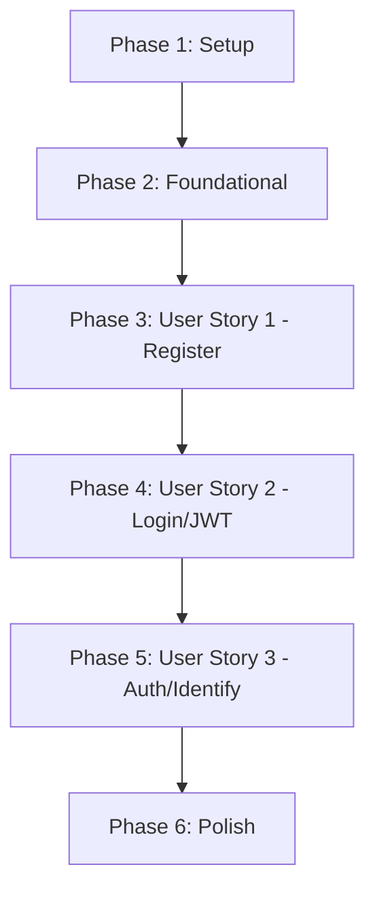

# Tasks: Setup Local Authentication with JWT

**Input**: Design documents from `specs/009-jwt-local-auth/`

**Prerequisites**: plan.md (required), spec.md (required for user stories), research.md, data-model.md, contracts/

**Tests**: TDD 방식이 요청되었으므로 모든 사용자 스토리 구현에 테스트 작성 및 선검증 태스크를 필수로 구성합니다.

**Organization**: 각 사용자 스토리별로 구현 및 테스트가 독립적으로 완결되도록 구조화하였습니다.

---

## Phase 1: Setup (Shared Infrastructure)

**Purpose**: 프로젝트 초기화 및 인증 라이브러리 의존성 장착

- [X] T001 backend/pyproject.toml 및 backend/uv.lock 파일에 djangorestframework-simplejwt 의존성 패키지 선언적 추가 및 환경 동기화 (uv sync 실행)
- [X] T002 backend/config/settings.py 내 INSTALLED_APPS 및 REST_FRAMEWORK 인증 환경 설정에 SimpleJWT 라이브러리 추가 구성
- [X] T003 [P] backend/apps/accounts/ 신규 사용자 계정 및 인증 처리를 담당하는 장고 앱 초기 디렉토리 및 보일러플레이트 모듈 생성

---

## Phase 2: Foundational (Blocking Prerequisites)

**Purpose**: 사용자 스토리 구현 전 필수적인 기본 Custom User 데이터베이스 스키마 구성

- [X] T004 backend/apps/accounts/models.py 경로에 Django AbstractUser를 상속받은 Custom User 모델 초기 뼈대 생성 및 provider 필드 정의
- [X] T005 backend/config/settings.py 내 AUTH_USER_MODEL 설정을 Custom User 모델(accounts.User)로 교체 선언
- [X] T006 [P] Custom User 모델 초기 마이그레이션 생성 및 docker-compose DB 마이그레이션 실행 검증 (docker compose exec api_server python manage.py migrate)

---

## Phase 3: User Story 1 - Local Account Registration (Priority: P1) 🎯 MVP

**Goal**: 사용자가 이메일 주소와 패스워드로 로컬 회원가입을 완료하고 데이터베이스에 안전하게 계정을 적재합니다.

**Independent Test**: POST `/api/auth/register/` 요청 시, 중복 이메일이 차단되고 정상 가입된 유저의 정보가 UUIDv7 식별자와 함께 반환되는지 확인합니다.

### Tests for User Story 1 (TDD 필수)

> **NOTE: 구현 작업 착수 전에 아래 테스트 코드를 먼저 작성하고, 테스트가 실패(FAIL)하는지 확인해야 합니다.**

- [X] T007 [P] [US1] backend/tests/accounts/test_models.py 경로에 Custom User 모델의 이메일 유일성(unique=True) 및 기본 가입처(local) 정합성 검증 테스트 코드 작성
- [X] T008 [P] [US1] backend/tests/accounts/test_views.py 경로에 회원가입 API(/api/auth/register/) 호출 및 중복 메일 가입 에러 핸들링을 테스트하는 API 계약 테스트 코드 작성

### Implementation for User Story 1

- [X] T009 [P] [US1] backend/apps/accounts/models.py 내 Custom User 모델에 이메일 주소를 고유 식별자로 설정(USERNAME_FIELD = 'email', email unique 제약)하는 비즈니스 스키마 구현
- [X] T010 [US1] backend/apps/accounts/serializers.py 경로에 비밀번호 암호화 해싱 및 이메일 포맷 규격을 검증하는 UserRegisterSerializer 구현
- [X] T011 [US1] backend/apps/accounts/views.py 경로에 회원가입 처리 시 DB 트랜잭션 원자성 보장 블록(transaction.atomic())을 적용하여 가입 처리하는 UserRegisterView 구현
- [X] T012 [US1] backend/apps/accounts/urls.py 및 backend/config/urls.py 경로에 회원가입(/api/auth/register/) 엔드포인트 URL 라우팅 바인딩 설정 적용
- [X] T013 [US1] 로컬 테스트 러너를 실행하여 작성된 US1 가입 테스트 코드가 정상적으로 통과(Pass)하는지 E2E 검증 (docker compose exec api_server pytest backend/tests/accounts/)

**Checkpoint**: 본 단계 완료 시, 로컬 회원가입 API가 안전하게 독립 기동 및 E2E 테스트 검증 완료 상태가 됩니다.

---

## Phase 4: User Story 2 - User Login & Token Acquisition (Priority: P2)

**Goal**: 올바른 가입 정보를 입력하여 로그인에 성공하고 Access Token(30분) 및 Refresh Token(14일)을 획득하며, 로그아웃 시 토큰 무효화(블랙리스트) 처리를 수행합니다.

**Independent Test**: POST `/api/auth/login/` 성공 시 JWT 자격 증명 획득을 확인하고, POST `/api/auth/logout/` 호출 시 리프레시 토큰이 블랙리스트에 올라가며 세션이 완전히 폐기되는지 확인합니다.

### Tests for User Story 2 (TDD 필수)

- [X] T014 [P] [US2] backend/tests/accounts/test_views.py 경로에 올바른 자격 증명으로 로그인 시 JWT 토큰 세트 정상 수신 및 잘못된 자격 증명 유입 시 401 Unauthorized 에러 검증 테스트 코드 작성
- [X] T015 [P] [US2] backend/tests/accounts/test_views.py 경로에 로그아웃 API(/api/auth/logout/) 호출 시 수신된 리프레시 토큰이 블랙리스트 데이터베이스에 등재되어 무효화되는지 검증하는 테스트 코드 작성

### Implementation for User Story 2

- [X] T016 [US2] backend/apps/accounts/views.py 경로에 simplejwt의 TokenObtainPairView를 래핑하거나 바인딩하여 /api/auth/login/ 뷰 구현
- [X] T017 [US2] backend/apps/accounts/views.py 경로에 리프레시 토큰을 데이터베이스 블랙리스트로 이동시켜 파기 처리하는 UserLogoutView 구현
- [X] T018 [US2] backend/apps/accounts/urls.py 경로에 로그인(/api/auth/login/) 및 로그아웃(/api/auth/logout/) 엔드포인트 URL 라우팅 추가 연동
- [X] T019 [US2] 로컬 테스트 러너를 실행하여 작성된 로그인/로그아웃 JWT 토큰 제어 테스트 코드가 정상적으로 통과(Pass)하는지 기계적으로 증명

**Checkpoint**: 본 단계 완료 시, 로컬 가입 및 로그인/로그아웃으로 연결되는 사용자 보안 세션 및 인증 토큰 제어 파이프라인 E2E 흐름이 완결됩니다.

---

## Phase 5: User Story 3 - Authenticated Data Identification (Priority: P3)

**Goal**: 로그인에 성공하여 발급받은 Access Token을 API 요청 헤더에 포함시켜, 사용자가 자신의 가계부 데이터에만 안전하게 접근하도록 권한을 필터링 및 통제합니다.

**Independent Test**: Authorization GET `/api/ledgers/` API 요청 시 Bearer 토큰의 유무 및 타 유저 토큰 사용 여부에 따라 권한 에러(401) 또는 본인의 데이터만 안전 격리 조회되는지 확인합니다.

### Tests for User Story 3 (TDD 필수)

- [X] T020 [P] [US3] backend/tests/accounts/test_tokens.py 경로에 위조되거나 만료된 JWT Access Token을 헤더에 실어 요청을 보냈을 때 미들웨어가 401 Unauthorized 오류로 안전하게 방어하는지 검증하는 테스트 코드 작성
- [X] T021 [P] [US3] backend/tests/ledgers/test_views.py 경로에 로그인된 사용자가 가계부 리스트를 요청할 시 오직 자신의 데이터만 데이터베이스에서 필터링 조회되며 타인의 데이터 유출이 차단되는지 검증하는 격리 테스트 코드 작성

### Implementation for User Story 3

- [X] T022 [US3] backend/config/settings.py 내 DRF 전역 인증 설정(DEFAULT_PERMISSION_CLASSES 및 DEFAULT_AUTHENTICATION_CLASSES)에 IsAuthenticated 및 JWTAuthentication 기본 탑재
- [X] T023 [US3] backend/apps/ledgers/views.py 또는 가계부 조회 API 뷰의 get_queryset() 메서드를 오버라이드하여 request.user와 일치하는 데이터만 반환하도록 사용자 격리 쿼리 필터 구현
- [X] T024 [US3] 로컬 테스트 러너를 기동하여 토큰 검증 미들웨어 및 가계부 조회 유저 격리 테스트 스위트가 최종 통과(Pass)하는지 통합 검증 수행

**Checkpoint**: 본 단계 완료 시, 가계부 데이터 CRUD와 대시보드 리스트 조회가 로그인 사용자 단위로 안전하게 데이터가 격리 통제됩니다.

---

## Phase 6: Polish & Cross-Cutting Concerns

**Purpose**: 코드 최적화, 보안 리팩토링 및 최종 수동 작동성 멱등 검증

- [X] T025 [P] specs/009-jwt-local-auth/quickstart.md 문서에 기록된 로컬 E2E 테스트(curl 가입 및 로그인) 시나리오대로 전체 시스템 멱등 가동성 최종 확인
- [X] T026 [P] backend/config/settings.py 내 SimpleJWT 설정 값(Access/Refresh 토큰 만료 시간)을 환경 변수와 바인딩하여 유연하게 동작하도록 리팩토링
- [X] T027 [P] backend/apps/accounts/ 디렉토리 내에 구현된 모든 Python 코드에 스타일 포매터 및 린터(black/flake8 등)를 기동하여 코드 품질 규격 완수

---

## Dependencies & Execution Order

### Phase Dependencies

- **Setup (Phase 1)**: 즉시 시작 가능.
- **Foundational (Phase 2)**: Setup(Phase 1) 완료 후 기동 가능 (이후 모든 사용자 스토리 구현을 블로킹하는 기본 스키마 수립).
- **User Stories (Phase 3~5)**: Foundational(Phase 2) 스키마 반영 이후 시작 가능.
  - [US1] 회원 가입 및 계정 생성 -> [US2] 로그인 세션/JWT 획득 및 파기 -> [US3] 토큰 검증 인가 적용 및 가계부 조회 사용자 격리.
- **Polish (Phase 6)**: 모든 사용자 스토리가 완결된 뒤 횡단 리팩토링 및 퀵스타트 수동 최종 확인 실행.

### Parallel Opportunities

- **Setup 단계 (Phase 1):** T003 앱 생성 태스크는 의존성 셋업과 병렬 실행 가능.
- **Foundational 단계 (Phase 2):** T006 DB 마이그레이션 실행은 뼈대 작성 이후 실행 가능.
- **User Story 1 단계 (Phase 3):** 
  - T007 모델 테스트와 T008 뷰 테스트 코딩은 병렬 작성 가능.
  - T009 User 모델 세부 작성은 T007 테스트 구성과 동시에 병렬 개발 가능.
- **User Story 2 단계 (Phase 4):**
  - T014 로그인 테스트와 T015 로그아웃 테스트 코딩은 병렬 작성 가능.
- **User Story 3 단계 (Phase 5):**
  - T020 만료 토큰 테스트와 T021 데이터 격리 테스트 코딩은 병렬 작성 가능.

---

## Implementation Strategy

### MVP First (User Story 1 Only)

1. **Phase 1 & 2 완료:** 의존성 탑재 및 Custom User 모델 초기 스키마 반영.
2. **Phase 3 (User Story 1) 완결:** 회원가입 API 및 중복 이메일 체크 테스트 작성 후 가입 뷰 및 API 구현.
3. **독립 검증:** 로컬 개발 환경에서 curl 또는 pytest로 가입 성공 상태 및 DB UUIDv7 식별자 인서트 E2E E2E 검증.

### Incremental Delivery

1. 회원가입 API 인도 (Phase 3) -> 로컬 가입 테스트 가능.
2. 로그인/로그아웃 API 인도 (Phase 4) -> JWT 토큰 획득 및 블랙리스트를 통한 토큰 파기 테스트 가능.
3. 가계부 API 토큰 격리 인도 (Phase 5) -> 로그인된 토큰으로 가계부 CRUD 및 대시보드 리스트 안전 조회 작동 검증 완결.
