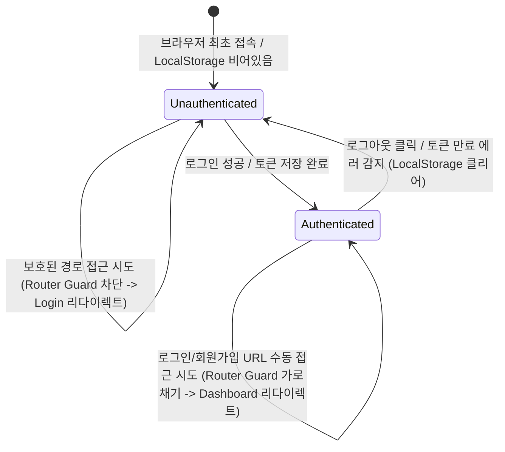

# Data Model: Frontend Authentication and Client-side Image Resizing

본 문서는 프론트엔드 로그인 세션 및 클라이언트 사이드 이미지 리사이징 데이터 모델 설계를 규정합니다. 본 피처는 프론트엔드 중심의 아키텍처이므로 클라이언트 애플리케이션의 메모리 및 브라우저 영속화 저장 상태 명세에 집중합니다.

## 1. 프론트엔드 인증 세션 데이터 모델

### UserSession (사용자 세션)

사용자의 현재 로그인 및 인증 토큰 상태를 표현하는 핵심 세션 개체입니다.

| 속성명 | 타입 | 필수 여부 | 설명 |
| :--- | :--- | :--- | :--- |
| `accessToken` | String | 필수 | 백엔드 API 요청 시 Bearer 헤더에 실어 보낼 단기 JWT 엑세스 토큰 |
| `refreshToken` | String | 필수 | 엑세스 토큰 만료 시 재발급(Refresh)에 사용될 장기 리프레시 토큰 |
| `username` | String | 필수 | 로그인에 성공한 사용자 이름/닉네임 (화면 노출용) |
| `email` | String | 선택 | 사용자 가입 계정 이메일 주소 |
| `isAuthenticated` | Boolean | 필수 | 현재 클라이언트가 유효한 세션 상태를 유지하고 있는지 판별하는 플래그 |

### LocalStorage 영속화 스키마

새로고침을 하거나 브라우저를 다시 켜도 로그인 상태가 유지되도록 브라우저 `LocalStorage`에 다음 키 규격으로 세션 정보를 영속 저장합니다.

- **Storage Key**: `ai_ledger_auth_session`
- **JSON Payload Format**:
  ```json
  {
    "accessToken": "eyJhbGciOiJIUzI1NiIsInR5cCI6IkpXVCJ9...",
    "refreshToken": "eyJhbGciOiJIUzI1NiIsInR5cCI6IkpXVCJ9...",
    "username": "홍길동",
    "email": "user@example.com",
    "loginTimestamp": 1718000000000
  }
  ```

---

## 2. 이미지 업로드 전처리 페이로드 데이터 모델

### ImageUploadPayload (이미지 업로드 페이로드)

모바일 브라우저에서 사용자가 업로드 단추를 누른 즉시, Canvas API 리사이징 처리를 거쳐 완성되어 서버로 전송하기 직전의 변형된 이미지 바이트 데이터 객체입니다.

| 속성명 | 타입 | 필수 여부 | 설명 |
| :--- | :--- | :--- | :--- |
| `originalFileName` | String | 필수 | 원본 파일의 이름 (예: `receipt_2026.png`) |
| `mimeType` | String | 필수 | 최종 변환된 이미지의 MIME 타입 (항상 `image/jpeg`로 전환) |
| `originalSize` | Number | 필수 | 압축 전 원본 이미지의 크기 (Byte 단위) |
| `compressedSize` | Number | 필수 | HTML5 Canvas 리사이징/압축 후의 크기 (Byte 단위) |
| `reductionRatio` | String | 필수 | `(1 - compressedSize / originalSize) * 100` 계산을 통한 트래픽 절감율 (%) |
| `compressedBlob` | Blob/File | 필수 | HTTP Multi-part FormData에 탑재되어 실제 서버 API로 발송될 최종 바이너리 데이터 |

---

## 3. 상태 전이 모델 (State Transition)

프론트엔드 라우터 가드는 토큰의 상태 변화에 따라 다음과 같이 사용자를 각 경로로 통제 전이시킵니다.


