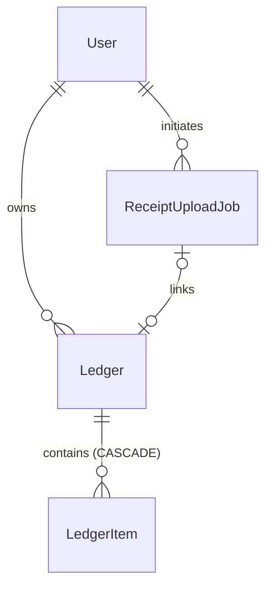
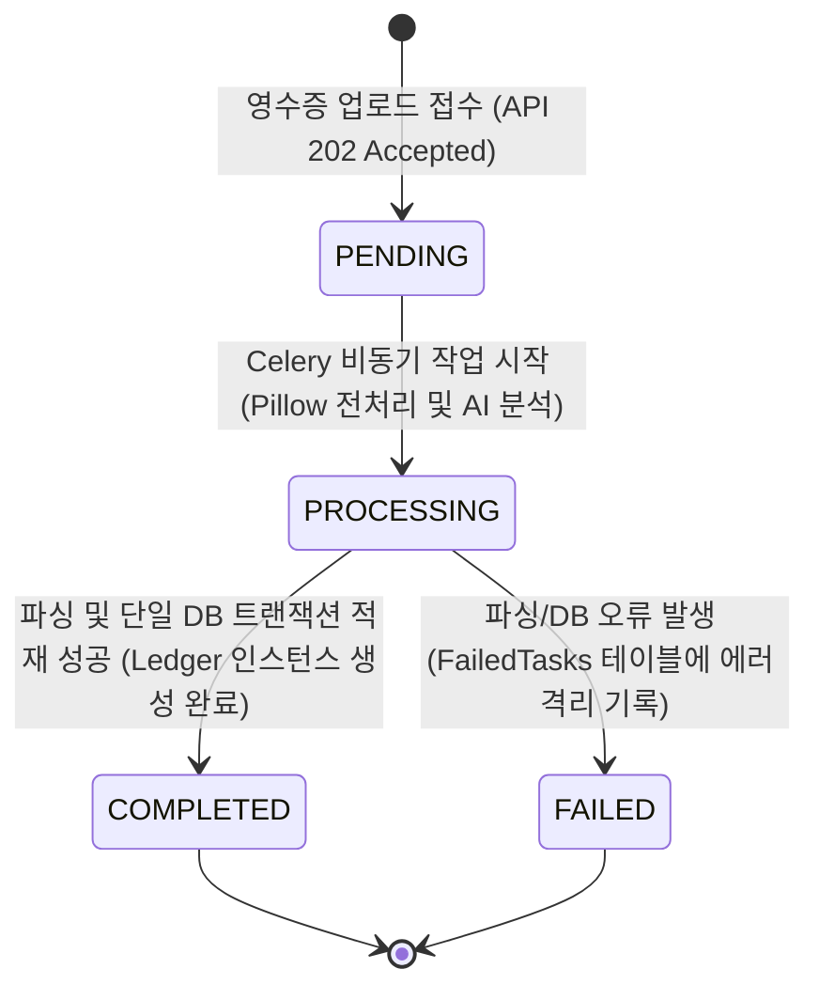

# Data Model Specification

**Feature**: Dashboard Ledger List and Detail Accordion Component

본 설계 문서는 가계부 리스트 조회 및 아코디언 컴포넌트 렌더링에 필요한 핵심 데이터베이스 엔티티 정보, 관계, 유효성 검증 규칙 및 작업의 상태 전이도를 명세합니다.

## Entities & Relationships

### 1. Ledger (가계부 마스터 테이블)
* **설명**: 사용자의 개별 영수증 결제 거래의 대표 메타데이터 및 집계 수치를 보존하는 마스터 테이블.
* **필드 구성 (Django Model 기준)**:
  * `id` (`UUIDv7`): 기본 키 (Primary Key)
  * `user` (`ForeignKey` -> `User`): 가계부 소유 사용자 식별 번호 (`on_delete=CASCADE`)
  * `vendor_name` (`CharField`): 가맹점명
  * `vendor_registration_number` (`CharField`): 사업자등록번호 (10자리)
  * `transaction_date` (`DateField`): 결제일자
  * `total_amount` (`DecimalField`): 최종 총 결제 금액
  * `supply_value` (`DecimalField`): 공급가액 (선택 사항)
  * `vat_amount` (`DecimalField`): 부가세액 (선택 사항)
  * `raw_llm_response` (`JSONField`): AI 파싱 원본 데이터 백업 (JSONB)
  * `created_at` (`DateTimeField`): 생성 일시
  * `updated_at` (`DateTimeField`): 수정 일시
* **고유 제약조건 (Constraints)**:
  * `UNIQUE (user_id, vendor_registration_number, transaction_date, total_amount)`
  * 복합 유니크 제약을 강력하게 적용하여 중복 결제 영수증의 무차별적인 중복 적재를 사전에 차단합니다.

### 2. LedgerItem (가계부 상세 품목 테이블)
* **설명**: 단일 영수증 내부에 포함된 개별 세부 품목 명세.
* **필드 구성**:
  * `id` (`UUIDv7`): 기본 키
  * `ledger` (`ForeignKey` -> `Ledger`): 소속 가계부 마스터 번호 (`on_delete=CASCADE` 연쇄 삭제 보장)
  * `item_name` (`CharField`): 품목명
  * `quantity` (`IntegerField`): 수량 (기본값: 1)
  * `unit_price` (`DecimalField`): 품목별 단가
  * `created_at` (`DateTimeField`): 생성 일시
* **유효성 검증 규칙 (Validation)**:
  * `quantity`는 무조건 1 이상의 자연수여야 합니다.
  * `unit_price`는 0원 이상이어야 합니다.

### 3. ReceiptUploadJob (비동기 작업 상태 테이블)
* **설명**: 3주차 비동기 구조 전환을 대비하고 9일차 렌더링 폴링 가이드를 준수하기 위한 파싱 작업 생명주기 트래킹 테이블.
* **필드 구성**:
  * `id` (`UUIDv7`): 기본 키
  * `user` (`ForeignKey` -> `User`): 작업을 요청한 사용자 (`on_delete=CASCADE`)
  * `status` (`CharField`): 작업 상태 (`PENDING`, `PROCESSING`, `COMPLETED`, `FAILED` 중 하나)
  * `ledger` (`ForeignKey` -> `Ledger`, `null=True`): 파싱이 완료되어 생성된 가계부 마스터 연결
  * `raw_file_name` (`CharField`): 사용자가 업로드한 원본 파일명
  * `created_at` (`DateTimeField`): 생성 일시

## Lifecycle & State Transitions

`ReceiptUploadJob`의 상태 머신은 비동기 파이프라인의 안전한 복구를 위해 다음과 같이 제한적으로 제어됩니다.

