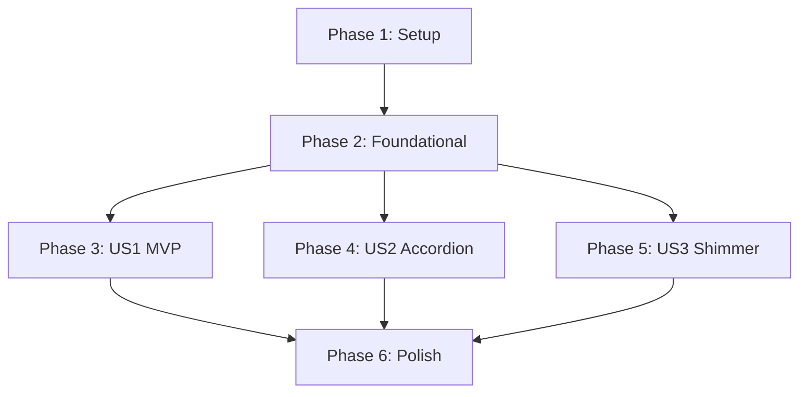

# Tasks: Dashboard Ledger List and Detail Accordion Component

**Input**: Design documents from `/specs/011-dashboard-ledger-list/`

**Prerequisites**: [plan.md](file:///D:/Projects/Private/ai-ledger-automation/specs/011-dashboard-ledger-list/plan.md), [spec.md](file:///D:/Projects/Private/ai-ledger-automation/specs/011-dashboard-ledger-list/spec.md), [research.md](file:///D:/Projects/Private/ai-ledger-automation/specs/011-dashboard-ledger-list/research.md), [data-model.md](file:///D:/Projects/Private/ai-ledger-automation/specs/011-dashboard-ledger-list/data-model.md), [contracts/api_contract.md](file:///D:/Projects/Private/ai-ledger-automation/specs/011-dashboard-ledger-list/contracts/api_contract.md)

**Tests**: **[MANDATORY]** 사용자가 **TDD(테스트 주도 개발)** 모드를 지정하였으므로, 모든 신규 기능 및 API 수정 전에 실패하는 검증 테스트 코드를 먼저 선배치하여 작성하고 점진적으로 해결합니다.

---

## Phase 1: Setup (Shared Infrastructure)

**Purpose**: 프로젝트 구조 검증 및 모노레포 TDD 테스트 환경 동기화

- [x] T001 프론트엔드와 백엔드의 모노레포 구조 및 10일차 로그인 연동 관련 디렉토리 구조 검증
- [x] T002 `backend/pyproject.toml`에 `pytest-django` 등 TDD 테스트 의존성이 등록되어 있는지 확인하고 `uv sync`로 동기화
- [x] T003 [P] `pre-commit` 훅 설정이 활성화되어 있는지 확인하고 로컬 린터/포매터 작동 테스트

---

## Phase 2: Foundational (Blocking Prerequisites)

**Purpose**: 가계부 조회 API 가동을 위한 인증 세션 바인딩 및 라우팅 기초 셋업

- [x] T004 `backend/src/apps/ledgers/models.py` 내의 `Ledger`, `LedgerItem` 모델 스키마와 마이그레이션 적용 상태 확인 및 SQLite/PostgreSQL 로컬 테스트 DB 셋업
- [x] T005 [P] 프론트엔드 `frontend/src/services/authService.js` 내 JWT Access Token 파싱 및 로컬스토리지 보존 상태 검증
- [x] T006 [P] 백엔드 `backend/src/apps/ledgers/urls.py` 경로에 `api/v1/receipts/` 목록 조회 URL 패턴이 존재 및 뷰 매핑 상태 확인

---

## Phase 3: User Story 1 - 메인 가계부 리스트 조회 (Priority: P1) 🎯 MVP

**Goal**: 로그인된 유저가 대시보드 진입 시 자신의 이번 달 가계부 내역(가맹점, 날짜, 금액) 목록을 최신순으로 렌더링

**Independent Test**: 백엔드 API에 JWT 토큰을 동봉하여 `GET /api/v1/receipts/` 호출 시 로그인 사용자 본인의 당월 가계부 데이터가 올바르게 반환되고, 타인 데이터가 차단 및 격리(Isolation)되는지 검증.

### Tests for User Story 1 (MANDATORY - TDD) ⚠️

> **TDD 원칙: 아래 테스트 코드를 먼저 구현하고 실행하여 테스트가 실패(FAIL)하는 것을 먼저 확인하십시오.**

- [x] T007 [P] [US1] `backend/tests/ledgers/test_ledger_views.py` 경로에 로그인된 사용자의 당월 지출 내역만 격리 조회하는 뷰 유닛 테스트 코드 작성
- [x] T008 [P] [US1] `frontend/tests/services/ledger.spec.js` 경로에 JWT Authorization 헤더가 정상 주입되어 가계부 리스트를 요청하는 프론트엔드 API 통신 TDD 테스트 코드 작성

### Implementation for User Story 1

- [x] T009 [US1] `backend/src/apps/ledgers/views.py` 의 `LedgerListView.get` 메소드에 당월(현재 월) 범위 조회 쿼리 필터 추가 및 로그인 유저 격리 쿼리(`Ledger.objects.filter(user=request.user).order_by("-transaction_date")`) 구현
- [x] T010 [US1] `frontend/src/services/ledgerService.js` 경로에 Axios를 사용해 JWT Access Token 토큰을 헤더에 실어 백엔드 API `/api/v1/receipts/`를 호출하는 함수 구현
- [x] T011 [US1] `frontend/src/pages/Dashboard.vue` 에 가계부 리스트 레이아웃 생성 및 마운트 시 `ledgerService`를 호출하여 데이터를 목록 변수에 할당하는 로직 구현 (DashboardView.vue 로 연동 완수)
- [x] T012 [US1] `backend` 디렉토리에서 `uv run pytest` 및 프론트엔드 테스트를 기동하여 가계부 리스트 조회 성공 및 사용자 데이터 격리 테스트가 정상 통과(Pass)함을 확인

**Checkpoint**: 이 단계 완료 시, 사용자는 로그인 후 대시보드 화면에서 자신의 가계부 목록을 당월 최신순으로 완벽히 독립 조회할 수 있어야 합니다 (MVP 완결).

---

## Phase 4: User Story 2 - 개별 상세 내역 조회 아코디언 컴포넌트 (Priority: P1)

**Goal**: 가계부 목록의 항목 클릭 시 상세 품목 정보(품목명, 단가, 수량, 합계)와 사업자등록번호가 300ms 이내에 아코디언 형태로 슬라이드다운되며 노출

**Independent Test**: 특정 가계부 행을 클릭했을 때 추가 API 호출 없이 로컬 데이터의 `items` 배열을 바인딩하여 아코디언 영역이 슬라이딩 다운되며 품목 상세 정보를 정확하게 렌더링하는지 테스트.

### Tests for User Story 2 (MANDATORY - TDD) ⚠️

> **TDD 원칙: 아래 테스트 코드를 먼저 구현하고 실행하여 테스트가 실패(FAIL)하는 것을 먼저 확인하십시오.**

- [x] T013 [P] [US2] `backend/tests/ledgers/test_ledger_serializers.py` 경로에 `LedgerListSerializer` 직렬화 결과로 `items` 상세 품목 배열이 동봉되어 오는지 검증하는 직렬화기 TDD 테스트 코드 작성
- [x] T014 [P] [US2] `frontend/tests/components/LedgerAccordion.spec.js` 경로에 상세 품목 테이블 및 사업자등록번호 렌더링과 트랜지션 제어를 검증하는 프론트엔드 TDD 컴포넌트 테스트 코드 작성

### Implementation for User Story 2

- [x] T015 [US2] `backend/src/apps/ledgers/serializers.py` 의 `LedgerListSerializer.Meta` 필드 배열에 `items` 관계 필드 명시 및 `LedgerItemResponseSerializer` 관계 매핑 적용
- [x] T016 [US2] `frontend/src/components/LedgerAccordion.vue` 경로에 상세 품목 테이블(품목명, 수량, 단가, 합계)과 사업자등록번호 및 300ms 슬라이드다운 CSS 트랜지션을 내포한 전용 컴포넌트 신규 구현
- [x] T017 [US2] `frontend/src/components/LedgerListItem.vue` 경로에 클릭 시 아코디언 활성화 유무를 토글하는 상태 제어 로직과 상세 데이터를 `LedgerAccordion` 컴포넌트로 전달하는 바인딩 구현
- [x] T018 [US2] 백엔드 및 프론트엔드 테스트를 재실행하여 직렬화에 `items`가 포함되는지와 아코디언 컴포넌트 렌더링 정합성 TDD 테스트가 통과(Pass)함을 확인

**Checkpoint**: 이 단계 완료 시, 대시보드 리스트의 개별 항목을 클릭했을 때 추가적인 네트워크 레이턴시 없이 상세 품목 목록이 슬라이딩 애니메이션과 함께 즉각 노출되어야 합니다.

---

## Phase 5: User Story 3 - 파싱 미완료/대기 작업 로딩 상태 표현 (Priority: P2)

**Goal**: 분석 진행 중("PENDING")인 가계부 항목을 목록 최상단에 Shimmer Skeleton 행으로 배치하고 완료 시 실제 행으로 교체

**Independent Test**: 작업 상태 API를 주기적으로 폴링하며, 상태가 "PENDING"일 때는 Shimmer 로더를 렌더링하고 "COMPLETED"로 상태 전환 시 부드럽게 가계부 리스트로 업데이트되는지 확인.

### Tests for User Story 3 (MANDATORY - TDD) ⚠️

> **TDD 원칙: 아래 테스트 코드를 먼저 구현하고 실행하여 테스트가 실패(FAIL)하는 것을 먼저 확인하십시오.**

- [x] T019 [P] [US3] `frontend/tests/components/LedgerShimmer.spec.js` 경로에 `status`가 `PENDING`일 때 Shimmer 로더가 렌더링되는지 확인하고 `COMPLETED`로 전환 시 실제 목록 행으로 교체되는 상태 전이 TDD 테스트 코드 작성

### Implementation for User Story 3

- [x] T020 [US3] `frontend/src/components/LedgerShimmer.vue` 경로에 가로형 뼈대 레이아웃과 흐르는 배경 효과(Shimmer Effect)를 내장한 Skeleton UI 컴포넌트 신규 구현
- [x] T021 [US3] `frontend/src/pages/Dashboard.vue` 에 분석 미완료 작업 목록이 존재하는 경우, 목록 최상단에 `LedgerShimmer` 컴포넌트를 매핑 배치하고 9일차 설계에 따른 `/api/v1/receipts/status/<uuid:job_id>/` API 폴링 기능 구현
- [x] T022 [US3] `frontend/src/pages/Dashboard.vue` 에 폴링 성공 완료 시점에 해당 작업 항목을 Shimmer UI에서 실제 가계부 아이템(`LedgerListItem`)으로 부드럽게 트랜지션하여 데이터 행을 교체 및 리스트 갱신 로직 구현
- [x] T023 [US3] 프론트엔드 테스트를 재실행하여 폴링 로직 가동에 따른 로더 상태 전환 TDD 테스트가 통과(Pass)함을 확인

**Checkpoint**: 이 단계 완료 시, 영수증 비동기 적재 흐름 속에서 사용자가 대시보드 화면을 볼 때, 분석 대기 중인 영수증이 로딩 중임을 직관적으로 확인하고 분석 완료 시 리스트에 실시간 갱신되는 완전한 동기화 흐름을 보장합니다.

---

## Phase 6: Polish & Cross-Cutting Concerns

**Purpose**: 성능 최적화, 보안 예외 핸들링 통합 및 자동 품질 보장

- [x] T024 [P] 대시보드 리스트의 CSS 트랜지션 및 100건 이상 적재 시 스크롤 성능(프레임 드랍 방지) 점검
- [x] T025 프론트엔드 Axios 에러 인터셉터를 통해 JWT 토큰 만료 에러(401 Unauthorized) 발생 시 안전하게 쿠키/로컬 스토리지를 클리어하고 로그인 화면으로 리디렉션하는 보안 연계 마감
- [x] T026 [P] `specs/011-dashboard-ledger-list/quickstart.md` 가이드를 한 번 더 처음부터 실행하여 로컬 인프라 실행 멱등성 최종 교차 검증
- [x] T027 [P] `pre-commit run --all-files` 명령어를 실행하여 `ruff` 린터 및 포매터 사전 검사를 100% 만족함을 보장

---

## Dependencies & Execution Order

### Phase Dependencies



### Within Each User Story
1. **TDD 테스트 작성 (MANDATORY)**: 테스트 대상 코드가 작성되기 전에 검증 테스트를 선작성하여 반드시 실패(FAIL)함을 사전에 입증합니다.
2. **백엔드 구현**: 직렬화기 및 뷰 비즈니스 로직을 구현합니다.
3. **프론트엔드 구현**: UI 마크업, CSS 트랜지션 및 API 연동 바인딩을 구현합니다.
4. **테스트 통과 검증**: pytest 및 프론트엔드 테스트를 돌려 테스트가 성공(PASS)으로 전환되는지 확인합니다.

### Parallel Opportunities
* **T007 (백엔드 US1 테스트)** 와 **T008 (프론트엔드 US1 테스트)** 은 병렬 작성이 가능합니다.
* **T013 (백엔드 US2 테스트)** 와 **T014 (프론트엔드 US2 테스트)** 은 병렬 작성이 가능합니다.
* **Phase 2**가 통과되면, **Phase 3 (US1)**, **Phase 4 (US2)**, **Phase 5 (US3)**는 서로 독립적인 파일군을 편집하므로 개발자가 분리되어 있을 경우 병렬 구현 및 병렬 테스트 작성이 가능합니다.

---

## Parallel Example: User Story 1

```bash
# User Story 1 테스트 코드를 백엔드/프론트엔드에서 동시에 병렬 작성:
Task: "T007 [P] [US1] backend/tests/ledgers/test_ledger_views.py TDD 테스트 구현"
Task: "T008 [P] [US1] frontend/tests/services/ledger.spec.js TDD 테스트 구현"
```

---

## Implementation Strategy

### MVP First (User Story 1 Only)
1. **Phase 1 (Setup)** 및 **Phase 2 (Foundational)** 를 완수하여 연동 기반을 수립합니다.
2. **Phase 3 (User Story 1 - 리스트 뷰 조회)** 를 먼저 TDD 방식으로 완전히 완료합니다.
3. **STOP and VALIDATE**: 상세 아코디언이 없어도, 로그인한 사용자 본인의 가계부 내역이 당월 최신순으로 목록 렌더링이 깔끔하게 잘 동작하는지 먼저 E2E 교차 확인하여 MVP 품질을 검증합니다.
4. MVP가 완결되면, 아코디언 컴포넌트(US2)와 Shimmer 폴링(US3)을 얹는 형태로 점진적 릴리즈합니다.

---

## Notes
* 모든 태스크는 `- [ ] [ID] [P?] [Story] 구체적인 파일 경로가 포함된 작업 설명` 표준 마크다운 규격을 100% 준수합니다.
* TDD 검증을 위해 소스 코드 로직을 직접 수정하기 전에, 수정한 내용에 의해 통과하게 될 테스트 케이스 파일들을 먼저 커스터마이징하고 테스트 러너를 실행하십시오.
