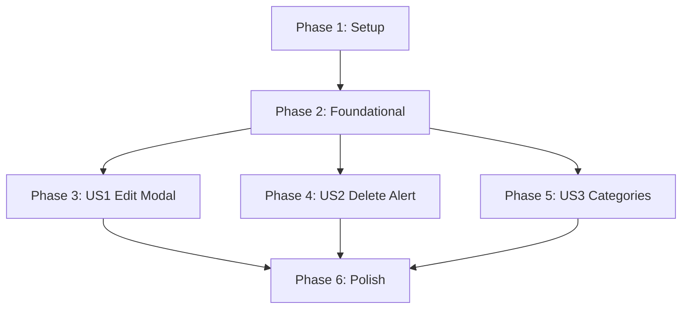

# Tasks: Ledger Detail Edit & Delete Modal (CRUD)

**Input**: Design documents from `/specs/012-ledger-details-crud/`

**Prerequisites**: [plan.md](file:///D:/Projects/Private/ai-ledger-automation/specs/012-ledger-details-crud/plan.md) (required), [spec.md](file:///D:/Projects/Private/ai-ledger-automation/specs/012-ledger-details-crud/spec.md) (required), [data-model.md](file:///D:/Projects/Private/ai-ledger-automation/specs/012-ledger-details-crud/data-model.md), [contracts/api_contract.md](file:///D:/Projects/Private/ai-ledger-automation/specs/012-ledger-details-crud/contracts/api_contract.md)

**Tests**: **[MANDATORY]** 사용자가 **TDD(테스트 주도 개발)** 모드를 지정하였으므로, 모든 신규 기능 및 API 수정 전에 실패하는 검증 테스트 코드를 먼저 선배치하여 작성하고 점진적으로 해결합니다.

---

## Phase 1: Setup (Shared Infrastructure)

**Purpose**: 프로젝트 구조 검증 및 모노레포 TDD 테스트 환경 동기화

- [X] T001 `backend/` 및 `frontend/` 모노레포 구조 및 12일차 가계부 목록 연동 연동 상태 재확인
- [X] T002 `backend/pyproject.toml`에 `pytest-django` 등 TDD 테스트 의존성이 유지 및 동기화된 상태인지 확인
- [X] T003 [P] `pre-commit` 훅 설정이 활성화되어 로컬 린터/포매터(ruff) 작동 확인

---

## Phase 2: Foundational (Blocking Prerequisites)

**Purpose**: 가계부 상세 수정/삭제 API 가동을 위한 DB 스키마 확장 및 기본 라우터 셋업

**⚠️ CRITICAL**: 이 단계가 완료되기 전에는 어떠한 사용자 스토리도 구현을 시작할 수 없습니다.

- [X] T004 `backend/src/apps/ledgers/models.py` 에 `category` 필드(`models.CharField(max_length=100, default="미분류", db_index=True)`) 추가 및 `makemigrations`/`migrate` 실행을 위한 준비
- [X] T005 [P] 백엔드 REST API 라우팅을 위한 `backend/src/apps/ledgers/urls.py`에 상세 PATCH/DELETE API 뷰 경로 `/api/v1/receipts/<uuid:pk>/` 선배치 및 매핑 준비
- [X] T006 [P] `frontend/src/services/ledgerService.js` 에 수동 정정(PATCH) 및 삭제(DELETE) fetch 헬퍼 함수 뼈대 선언

**Checkpoint**: Foundation ready - user story implementation can now begin.

---

## Phase 3: User Story 1 - 가계부 상세 레코드 수동 정정 모달 (Priority: P1) 🎯 MVP

**Goal**: 로그인된 유저가 가계부 카드 수정 클릭 시 모달이 뜨고 가맹점명, 일자, 금액 등을 수정 저장

**Independent Test**: 특정 가계부 행의 수정을 눌러 모달에 유효값 입력 및 저장 요청 시, PATCH API가 성공 처리되고 화면 리스트와 월 누적액이 300ms 이내에 즉시 갱신되는지 확인

### Tests for User Story 1 (MANDATORY - TDD) ⚠️

> **TDD 원칙: 아래 테스트 코드를 먼저 구현하고 실행하여 테스트가 실패(FAIL)하는 것을 먼저 확인하십시오.**

- [X] T007 [P] [US1] `backend/tests/ledgers/test_ledger_detail_views.py` 경로에 사용자 데이터 격리가 수호된 PATCH API 뷰의 유효성 검사 및 정정 완료를 검증하는 TDD 테스트 코드 작성
- [X] T008 [P] [US1] `frontend/tests/components/LedgerEditModal.spec.js` 경로에 수정 모달 활성화, 내부 폼 바인딩, 유효성 검사 경고 및 저장 요청을 검증하는 TDD 컴포넌트 테스트 코드 작성

### Implementation for User Story 1

- [X] T009 [US1] `backend/src/apps/ledgers/serializers.py` 의 `LedgerListSerializer`에 `category` 필드 직렬화 추가 및 유효성 검사 룰 작성
- [X] T010 [US1] `backend/src/apps/ledgers/views.py` 에 `ReceiptDetailView.patch` 구현 (사용자 데이터 격리 `Ledger.objects.filter(user=request.user)` 수호 및 atomic 트랜잭션 적용)
- [X] T011 [US1] `frontend/src/services/ledgerService.js` 에 JWT Bearer 토큰을 실어 `PATCH /api/v1/receipts/${id}/`를 호출하는 비동기 fetch 함수 구현
- [X] T012 [US1] `frontend/src/components/LedgerEditModal.vue` 경로에 Glassmorphism 스타일 모달 폼 디자인, 공백 입력 검사, 저장 시 로딩 비활성화 처리 구현
- [X] T013 [US1] `frontend/src/components/LedgerListItem.vue` 및 `DashboardView.vue`에 수정 버튼 연동, 클릭 시 수정 모달 바인딩 및 저장 완료 후 목록 데이터 즉시 갱신 로직 E2E 연결
- [X] T014 [US1] 백엔드 및 프론트엔드 유닛 테스트를 실행하여 TDD 테스트가 모두 성공(Pass)으로 전환됨을 증명

**Checkpoint**: At this point, User Story 1 should be fully functional and testable independently.

---

## Phase 4: User Story 2 - 가계부 레코드 수동 삭제 및 경고 다이얼로그 (Priority: P1)

**Goal**: 가계부 내역 영구 삭제 단추 제공 및 삭제 전 붉은색 경고 모달을 띄워 CASCADE 연쇄 삭제를 확정

**Independent Test**: 가계부 삭제 후 경고창에서 확정 시, DELETE API가 정상 처리되고 리스트에서 해당 카드가 즉각 제거되며 총 소비액이 차감 갱신되는지 확인

### Tests for User Story 2 (MANDATORY - TDD) ⚠️

> **TDD 원칙: 아래 테스트 코드를 먼저 구현하고 실행하여 테스트가 실패(FAIL)하는 것을 먼저 확인하십시오.**

- [X] T015 [P] [US2] `backend/tests/ledgers/test_ledger_detail_views.py` 에 타인 소유 데이터 삭제 차단 및 본인 데이터 삭제 시 LedgerItem이 CASCADE 연쇄 삭제됨을 검증하는 TDD 테스트 코드 작성
- [X] T016 [P] [US2] `frontend/tests/components/LedgerDeleteModal.spec.js` 경로에 삭제 경고 팝업 활성화, 취소 시 무반응, 확인 시 DELETE API 트리거를 검증하는 TDD 컴포넌트 테스트 코드 작성

### Implementation for User Story 2

- [X] T017 [US2] `backend/src/apps/ledgers/views.py` 에 `ReceiptDetailView.delete` 구현 (자식 items 데이터 CASCADE 원자적 연쇄 삭제 보장)
- [X] T018 [US2] `frontend/src/services/ledgerService.js` 에 JWT Bearer 토큰을 실어 `DELETE /api/v1/receipts/${id}/`를 호출하는 비동기 fetch 함수 구현
- [X] T019 [US2] `frontend/src/components/LedgerDeleteModal.vue` 경로에 삭제 경고 모달 다이얼로그(붉은색 테두리 및 확정 확인 텍스트 영역) 구현
- [X] T020 [US2] `frontend/src/components/LedgerListItem.vue` 및 `DashboardView.vue`에 삭제 확인 모달 연동, 성공 시 300ms 이내 렌더링 갱신 및 차감 계산 연계 완료
- [X] T021 [US2] 테스트 러너를 실행하여 삭제 CRUD 관련 TDD 테스트 케이스가 성공(Pass)으로 전환됨을 입증

**Checkpoint**: At this point, User Stories 1 and 2 should both work independently.

---

## Phase 5: User Story 3 - 지출 카테고리 할당 및 오분류 교정 (Priority: P2)

**Goal**: 수정 모달 내의 카테고리 선택 드롭다운 박스를 제공하고 오분류 카테고리를 교정

**Independent Test**: 수정 모달에서 카테고리를 다른 값(식비, 교통비 등)으로 지정하여 저장 시, API 상에 category 값이 전달되고 카드 레이아웃에 즉각 갱신되는지 확인

### Tests for User Story 3 (MANDATORY - TDD) ⚠️

> **TDD 원칙: 아래 테스트 코드를 먼저 구현하고 실행하여 테스트가 실패(FAIL)하는 것을 먼저 확인하십시오.**

- [X] T022 [P] [US3] `frontend/tests/components/LedgerEditModal.spec.js` 에 카테고리 선택 콤보박스 데이터 바인딩 및 저장 시 카테고리 값 전송을 검증하는 TDD 테스트 코드 추가

### Implementation for User Story 3

- [X] T023 [US3] `frontend/src/components/LedgerEditModal.vue` 내부 폼에 카테고리 선택용 드롭다운(식비, 교통비, 쇼핑, 주거/통신, 기타) 추가 및 바인딩
- [X] T024 [US3] `frontend/src/components/LedgerListItem.vue` 의 카드 레이아웃에 현재 가계부의 카테고리 태그(디자인 에스테틱에 맞는 세련된 뱃지 스타일) 렌더링 적용
- [X] T025 [US3] 프론트엔드 테스트를 재실행하여 카테고리 TDD 검증 케이스가 최종 성공(Pass)함을 확인

**Checkpoint**: All user stories should now be independently functional.

---

## Phase 6: Polish & Cross-Cutting Concerns

**Purpose**: 기능 조율, 다듬기, 성능 최적화 및 횡단 관심사 보완

- [X] T026 [P] 수동 정정 시 공급가액(`supply_value`)과 부가세(`vat_amount`)가 변경된 최종 금액(`total_amount`)에 따라 10% 비율로 자동 정합 보정되어 DB에 적재되는지 최종 확인
- [X] T027 [P] `specs/012-ledger-details-crud/quickstart.md` 가이드에 명시된 명령어로 데이터베이스 셋업 및 TDD 통합 테스트 멱등성 재실행 점검
- [X] T028 [P] `pre-commit run --all-files` 명령어를 실행하여 Ruff 린터 및 포매팅 사전 품질 검사를 100% 만족함을 보장

---

## Dependencies & Execution Order

### Phase Dependencies



### Within Each User Story
1. **TDD 테스트 작성 (MANDATORY)**: 테스트 대상 코드가 작성되기 전에 검증 테스트를 선작성하여 반드시 실패(FAIL)함을 사전에 입증합니다.
2. **백엔드 구현**: 마스터 데이터 수정/삭제 비즈니스 API 뷰를 구현합니다.
3. **프론트엔드 구현**: UI 마크업, 폼 유효성 검사, 모달 연동 및 데이터 갱신 바인딩을 구현합니다.
4. **테스트 통과 검증**: pytest 및 프론트엔드 테스트를 돌려 테스트가 성공(PASS)으로 전환되는지 확인합니다.

### Parallel Opportunities
* **T005** (백엔드 URL 설정) 및 **T006** (프론트엔드 서비스 선언)은 병렬 작업이 가능합니다.
* **T007** (백엔드 US1 테스트) 및 **T008** (프론트엔드 US1 테스트)은 병렬 작성이 가능합니다.
* **T015** (백엔드 US2 테스트) 및 **T016** (프론트엔드 US2 테스트)은 병렬 작성이 가능합니다.
* **Phase 2**가 완료되면, **Phase 3 (US1)**, **Phase 4 (US2)**, **Phase 5 (US3)**는 각각 별도의 Vue 모달 파일과 API 뷰 메소드를 편집하므로 독립적 개발 및 병렬 구현이 가능합니다.

---

## Parallel Example: User Story 1

```bash
# User Story 1 테스트 코드를 백엔드/프론트엔드에서 동시에 병렬 작성:
Task: "T007 [P] [US1] backend/tests/ledgers/test_ledger_detail_views.py TDD 테스트 구현"
Task: "T008 [P] [US1] frontend/tests/components/LedgerEditModal.spec.js TDD 테스트 구현"
```

---

## Implementation Strategy

### MVP First (User Story 1 Only)
1. **Phase 1 (Setup)** 및 **Phase 2 (Foundational)** 를 완수하여 연동 기반을 수립합니다.
2. **Phase 3 (User Story 1 - 수동 정정 모달)** 을 먼저 TDD 방식으로 완전히 완료합니다.
3. **STOP and VALIDATE**: 삭제나 카테고리가 안 되더라도, 가맹점명 및 결제 내역 수정 기능이 E2E로 잘 작동하는지 독립 검증합니다.
4. MVP가 완결되면, 삭제 경고 다이얼로그(US2)와 카테고리 오분류 교정(US3)을 얹는 형태로 점진적 릴리즈합니다.
