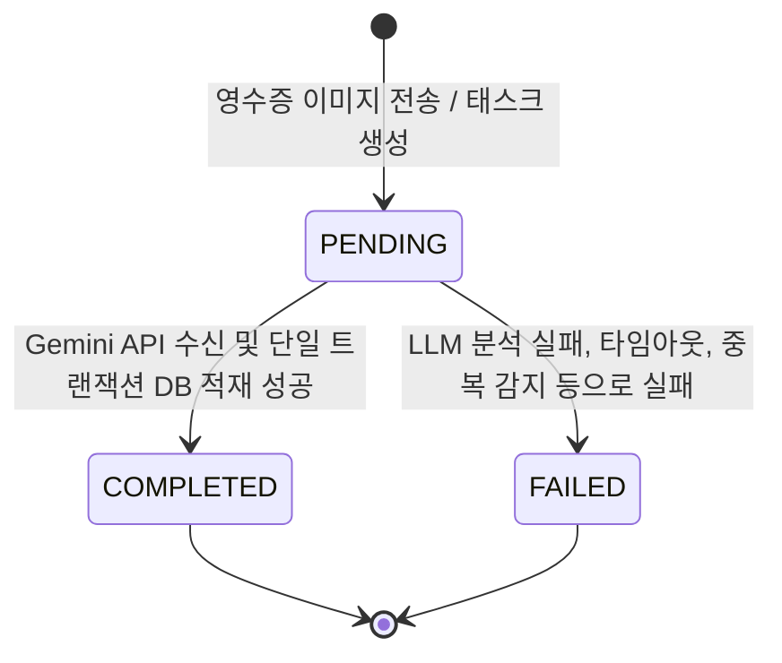

# Data Model: MVP Integration Test

본 문서는 MVP Integration Test 피처 구현에 사용되는 데이터베이스 스키마, 엔티티, 유효성 검사 규칙 및 상태 전이를 정의합니다.

## Entities

### 1. users (사용자)
가계부의 소유주를 식별하기 위한 회원 테이블입니다.
* `id`: UUID (Primary Key)
* `username`: VARCHAR(150) (Unique)
* `email`: VARCHAR(254) (Unique)
* `created_at`: TIMESTAMP WITH TIME ZONE

### 2. ledgers (가계부 마스터)
영수증 1장에서 도출된 대표 결제 마스터 정보입니다.
* `id`: UUIDv7 (Primary Key) - 시계열 최적화 인덱스 활용
* `user_id`: UUID (Foreign Key to `users`, ON DELETE CASCADE)
* `vendor_name`: VARCHAR(255) (가맹점명)
* `vendor_registration_number`: VARCHAR(10) (사업자등록번호, 하이픈 제외 10자리)
* `transaction_date`: TIMESTAMP WITH TIME ZONE (결제 일시)
* `total_amount`: DECIMAL(12, 2) (총 결제 금액, 음수 불가)
* `raw_llm_response`: JSONB (Gemini API로부터 받은 원본 JSON 데이터 저장)
* `status`: VARCHAR(20) (상태: `PENDING`, `COMPLETED`, `FAILED` - 3주차 비동기 호환을 위한 필드)
* `created_at`: TIMESTAMP WITH TIME ZONE
* `updated_at`: TIMESTAMP WITH TIME ZONE

**Constraints**:
* 복합 고유 제약조건 (Unique Constraint):
  `UNIQUE (user_id, vendor_registration_number, transaction_date, total_amount)`
  중복 결제 영수증의 무차별적인 복사 적재를 차단하기 위한 필수 원칙입니다.

### 3. ledger_items (가계부 상세품목)
가계부 마스터 레코드에 종속된 세부 내역 및 품목 리스트입니다.
* `id`: UUIDv7 (Primary Key)
* `ledger_id`: UUID (Foreign Key to `ledgers`, ON DELETE CASCADE)
* `item_name`: VARCHAR(255) (품목명)
* `unit_price`: DECIMAL(12, 2) (단가, 음수 불가)
* `quantity`: INTEGER (수량, 1 이상)
* `amount`: DECIMAL(12, 2) (합계 금액, 음수 불가)
* `created_at`: TIMESTAMP WITH TIME ZONE
* `updated_at`: TIMESTAMP WITH TIME ZONE

### 4. merchant_templates (가맹점 레이아웃 캐시)
사업자등록번호 기반의 정적 정규식 캐싱 규칙 테이블입니다.
* `id`: UUID (Primary Key)
* `vendor_registration_number`: VARCHAR(10) (사업자등록번호, UNIQUE)
* `vendor_name`: VARCHAR(255)
* `parsing_rules`: JSONB (항목별 파싱을 위한 정규식 패턴 정보 등)
* `is_verified`: BOOLEAN (수동 검증 승인 마크 - `true`일 때만 bypass 파서 가동 가능)
* `created_at`: TIMESTAMP WITH TIME ZONE
* `updated_at`: TIMESTAMP WITH TIME ZONE

### 5. failed_tasks (실패 로깅)
이미지 분석 실패, LLM 타임아웃 등 처리 장해 시 추적을 위한 로깅용 테이블입니다.
* `id`: UUID (Primary Key)
* `user_id`: UUID (Foreign Key to `users`, ON DELETE SET NULL, Optional)
* `error_message`: TEXT (오류 발생 원인)
* `raw_content`: JSONB (오류 발생 당시 입력 컨텍스트 또는 Gemini 오류 응답 저장)
* `created_at`: TIMESTAMP WITH TIME ZONE

---

## Validation Rules

1. **사업자등록번호 (vendor_registration_number)**:
   - 반드시 하이픈(-)을 제외한 **숫자 10자리** 형식이어야 합니다.
   - 유효성 검사 정규식: `^\d{10}$`
2. **금액 관련 필드 (`total_amount`, `unit_price`, `amount`)**:
   - 음수(-) 값을 가질 수 없으며, 소수점 이하 2자리까지 허용됩니다. (`DecimalField(max_digits=12, decimal_places=2)`)
3. **수량 (`quantity`)**:
   - 1 이상의 양의 정수이어야 합니다. (`MinValueValidator(1)`)
4. **결제 일시 (`transaction_date`)**:
   - 미래의 날짜/시간은 설정할 수 없습니다. (현재 시스템 시간 이하만 가능)

---

## State Transitions

본 MVP 2주차 단계에서는 영수증 사진 업로드 시 **동기식**으로 처리가 완료되므로 DB 적재와 함께 즉시 `status = 'COMPLETED'` 상태를 갖게 됩니다. 그러나 3주차 Celery 기반 비동기 파이프라인과의 하위 호환성을 위해 아래와 같은 전이 흐름을 염두에 둡니다.

