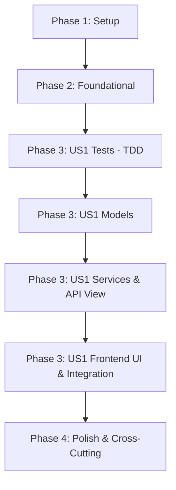

# Tasks: MVP Integration Test

**Input**: Design documents from `/specs/014-mvp-integration-test/`

**Prerequisites**: plan.md (required), spec.md (required for user stories), research.md, data-model.md, contracts/

**Tests**: TDD(테스트 주도 개발) 방식의 구현 요청에 따라, 테스트 코드 작성 및 검증 태스크가 필수적으로 포함되어 있습니다. 각 스토리 구현 전에 테스트 코드를 작성하고 동작을 보증합니다.

**Organization**: Tasks are grouped by user story to enable independent implementation and testing of each story.

## Format: `[ID] [P?] [Story] Description`

- **[P]**: Can run in parallel (different files, no dependencies)
- **[Story]**: Which user story this task belongs to (e.g., US1, US2, US3)
- Include exact file paths in descriptions

## Path Conventions

- **Web app**: `backend/src/`, `frontend/src/`

---

## Phase 1: Setup (Shared Infrastructure)

**Purpose**: 프로젝트 기본 구조 확인 및 TDD 개발 환경 점검

- [X] T001 `backend/` 및 `frontend/` 디렉토리 구조가 `plan.md`와 부합하는지 확인하고, TDD용 pytest 및 Vitest(혹은 Jest) 테스트 인프라 환경 점검
- [X] T002 백엔드 `backend/pyproject.toml` 및 `backend/uv.lock`에 Pillow, google-generativeai, pytest-django 의존성 패키지 셋업 확인 및 `uv sync` 실행
- [X] T003 [P] 프로젝트 루트의 `ruff` 린터/포맷터 및 `pre-commit` 훅 설정 확인 및 린팅 환경 점검

---

## Phase 2: Foundational (Blocking Prerequisites)

**Purpose**: 사용자 스토리 구현 전 완료되어야 하는 핵심 인프라 및 가상 데이터베이스 기동

**⚠️ CRITICAL**: 이 페이즈가 완료되기 전까지는 사용자 스토리 구현 작업을 시작할 수 없습니다.

- [X] T004 `docker-compose.db.yml`을 사용하여 로컬 PostgreSQL v18 데이터베이스 컨테이너를 기동하고 데이터베이스 접속 확인
- [X] T005 [P] `backend/src/apps/accounts/` 혹은 기본 인증 시스템에서 API 요청에 사용될 JWT Bearer 인증 데코레이터/미들웨어 뼈대 점검
- [X] T006 [P] `backend/src/config/urls.py`에 가계부 앱(`ledgers`) API 엔드포인트 라우팅 경로 매핑

**Checkpoint**: Foundational Phase 완료 - 이제 User Story 1에 대한 병렬 개발 및 테스트 작성을 진행할 수 있습니다.

---

## Phase 3: User Story 1 - E2E Receipt Upload & Synchronous Ingestion (Priority: P1) 🎯 MVP

**Goal**: Vue 3 화면에서 영수증을 업로드하고 10초 이내에 동기식으로 AI 가계부 처리가 완료되어 화면에 갱신 렌더링되도록 구현.

**Independent Test**: 웹 브라우저 UI에서 테스트용 영수증 이미지(JPEG)를 드롭존에 업로드한 후, 10초 이내에 업로드 성공 알림과 함께 대시보드 테이블에 결제 내역과 아코디언 상세품목이 정확하게 렌더링되는지 확인합니다. 백엔드는 `pytest` 통합 테스트를 통해 E2E 연동 정합성 및 ACID 트랜잭션 롤백, 중복 차단 검증을 수행합니다.

### Tests for User Story 1 (TDD - Required FIRST) ⚠️

> **NOTE: 다음의 테스트 코드를 먼저 작성하고, 실제 비즈니스 로직 및 뷰가 구현되기 전에 테스트가 정상적으로 실패(FAIL)하는지 확인해야 합니다.**

- [X] T007 [P] [US1] `backend/tests/apps/ledgers/test_models.py` 경로에 `ledgers` 및 `ledger_items` 트랜잭션 롤백 정합성과 복합 UNIQUE 제약조건 실패에 대한 단위 테스트 작성 (FAIL 확인)
- [X] T008 [P] [US1] `backend/tests/apps/ledgers/test_views.py` 경로에 영수증 파일 업로드 API 엔드포인트(`POST /api/v1/ledgers/upload/`) 호출 계약(Contract) 준수 여부, 중복 적재 차단(409), 트랜잭션 예외 롤백(422)에 대한 E2E 통합 테스트 작성 (FAIL 확인)
- [X] T009 [P] [US1] `frontend/tests/components/ReceiptDropzone.spec.js` 경로에 드롭존 영수증 파일 업로드 감지 및 HTML5 Canvas를 활용한 가로 1000px, Quality 0.8 JPEG 1차 압축 기능 검증용 프론트엔드 유닛 테스트 작성 (FAIL 확인)

### Implementation for User Story 1

- [X] T010 [P] [US1] `backend/src/apps/ledgers/models.py` 경로에 `ledgers` 마스터, `ledger_items` 상세품목, `failed_tasks` 실패 로깅, `merchant_templates` 캐시 테이블 ORM 모델 설계 및 UNIQUE 복합 제약조건 적용
- [X] T011 [US1] `backend/src/apps/ledgers/migrations/` 하위에 마이그레이션 파일을 생성하고 적용 (`uv run manage.py makemigrations` 및 `migrate`)한 후 T007 모델 단위 테스트가 통과(PASS)하는지 확인
- [X] T012 [P] [US1] `backend/src/utils/image_processor.py` 경로에 Pillow 모듈을 활용하여 Multipart로 업로드된 이미지 바이트 버퍼를 WebP 포맷(Quality 80)으로 2차 변환 및 압축하는 전처리 유틸리티 구현
- [X] T013 [P] [US1] `backend/src/utils/gemini_client.py` 경로에 Gemini-2.5-Flash API를 연동하고 JSON Schema를 규격화하여 정형 가계부 데이터(가맹점명, 사업자번호, 결제일시, 세부품목 배열)를 수신하는 AI 연동 유틸리티 구현
- [X] T014 [US1] `backend/src/utils/bypass_parser.py` 경로에 `merchant_templates`를 조회하여 `is_verified: true`인 정규식 규칙 존재 시 LLM을 바이패스(Bypass)하고, 규칙이 없으면 LLM 폴백 후 미검증 후보를 자동 제안 등록하는 비용 최적화 파이프라인 구현
- [X] T015 [US1] `backend/src/apps/ledgers/services.py` 경로에 `transaction.atomic()` 트랜잭션 블록 내에서 `ledgers` 및 `ledger_items` 레코드를 원자적으로 생성하고 중복 유입 예외 처리 및 실패 로깅을 수행하는 가계부 비즈니스 서비스 로직 구현
- [X] T016 [US1] `backend/src/apps/ledgers/serializers.py` 경로에 가계부 적재 완료 정보 및 상세 품목 리스트 변환을 위한 DRF 시리얼라이저 구현
- [X] T017 [US1] `backend/src/apps/ledgers/views.py` 및 `urls.py` 경로에 영수증 파일 업로드 API 뷰(`/api/v1/ledgers/upload/`) 구현 및 3주차 비동기 호환을 위한 `status: "COMPLETED"`, `job_id: null` 응답 매핑 연동 (T008 API/E2E 통합 테스트가 최종 PASS하는지 확인)
- [X] T018 [US1] `frontend/src/components/ReceiptDropzone.vue` 경로에 영수증 이미지 드래그앤드롭 및 스마트폰 카메라 촬영 연동 UI 구현, 이미지 감지 즉시 HTML5 Canvas API를 이용하여 1차 압축(가로 최대 1000px, Quality 0.8 JPEG)을 수행해 백엔드로 송신하는 클라이언트 로직 구현 (T009 프론트엔드 테스트가 최종 PASS하는지 확인)
- [X] T019 [US1] `frontend/src/components/LedgerDashboard.vue` 경로에 가계부 내역 테이블 렌더링 및 상세 품목 아코디언 토글 UI 구현
- [X] T020 [US1] `frontend/src/services/ledger.js` 경로에 Axios/Fetch 기반 API 호출 및 이미지 업로드 완료와 동시에 대시보드 뷰를 동기식으로 즉각 갱신하는 연동 기능 완성

**Checkpoint**: User Story 1에 대한 백엔드 및 프론트엔드 통합이 모두 완료되었으며, E2E 동작이 10초 이내에 오염 없이(ACID) 수행되고 중복 업로드가 차단되는지 독립적인 수동/자동 검증을 완료했습니다.

---

## Phase 4: Polish & Cross-Cutting Concerns

**Purpose**: 문서 다듬기, 코드 품질 정리 및 최종 로컬 E2E 종합 수동 검증

- [X] T021 [P] `docs/` 및 `quickstart.md`에 E2E 통합 테스트 실행 결과 기록 및 사용자 가이드 보완
- [X] T022 코드 리팩토링, 디버그용 콘솔 출력 및 로깅 코드 정리, `ruff` Linter/Formatter를 활용한 소스 코드 스타일 최종 점검 및 `pre-commit` 자동 통과 보장
- [X] T023 `quickstart.md` 가이드에 따라 처음부터 끝까지 전체 가계부 E2E 업로드 루프를 수동으로 가동하여 최종 10초 이내 화면 갱신 완료 상태를 재입증

---

## Dependencies & Execution Order

### Phase Dependencies



- **Setup (Phase 1)**: 다른 의존성이 없으며 즉시 실행 가능합니다.
- **Foundational (Phase 2)**: Setup이 완료되어야 기동이 가능하며, 데이터베이스 및 라우팅 설정이 완료되어야 하므로 모든 사용자 스토리 구현의 블로킹 전제조건입니다.
- **User Story 1 Tests (TDD)**: 모델 및 서비스 비즈니스 로직을 작성하기 전에 반드시 테스트 케이스 작성을 완료하고 실패(FAIL)하는 것을 먼저 검증해야 합니다.
- **User Story 1 Models & Migration**: 테스트 실패 검증 후 ORM 모델을 코딩하고 마그레이션을 적용합니다.
- **User Story 1 Services & API View**: 모델이 정상 반영된 후, Pillow 전처리, Gemini API 연동, bypass 파서 및 가계부 적재 비즈니스 서비스와 API 뷰 구현이 수행됩니다.
- **User Story 1 Frontend UI**: 백엔드 API가 완성(또는 Mocking 상태)되면 드롭존 Canvas 이미지 압축 전송, 대시보드 테이블, 아코디언 UI 및 API 연동 동기식 갱신 로직을 구현합니다.
- **Polish (Phase 4)**: 모든 기능 구현이 종료된 후, 코드 정리, 린터 점검 및 최종 E2E 가동을 검증합니다.

### Parallel Opportunities

- **Phase 1**의 T003(린팅 셋업)은 T001, T002와 병렬로 검토할 수 있습니다.
- **Phase 2**의 T005(JWT 뼈대), T006(API 라우팅)은 데이터베이스 인프라(T004) 구축과 병렬로 수행할 수 있습니다.
- **Phase 3 US1 Tests**의 T007(모델 테스트), T008(뷰/API 테스트), T009(프론트엔드 Canvas 압축 테스트)는 서로 다른 파일에 작성되므로 병렬 작성이 가능합니다.
- **Phase 3 US1 Implementation**에서 `backend/src/utils/` 하위에 배치되는 T012(Pillow WebP 변환 유틸)와 T013(Gemini API 연동 유틸)은 파일과 타겟 시스템이 달라 병렬 코딩이 가능합니다.

---

## Parallel Example: User Story 1

```bash
# User Story 1의 테스트 코드 작성을 병렬로 실행:
Task: "T007 [P] [US1] backend/tests/apps/ledgers/test_models.py 경로에 모델 단위 테스트 작성"
Task: "T008 [P] [US1] backend/tests/apps/ledgers/test_views.py 경로에 API/E2E 통합 테스트 작성"
Task: "T009 [P] [US1] frontend/tests/components/ReceiptDropzone.spec.js 경로에 Canvas 압축 프론트엔드 테스트 작성"

# User Story 1의 백엔드 핵심 유틸리티 모듈들을 병렬로 구현:
Task: "T012 [P] [US1] backend/src/utils/image_processor.py 경로에 WebP 2차 변환 유틸 구현"
Task: "T013 [P] [US1] backend/src/utils/gemini_client.py 경로에 Gemini AI 연동 유틸 구현"
```

---

## Implementation Strategy

### MVP First (User Story 1 Only)

본 2주차 피처는 단일 사용자 스토리(US1)가 프로젝트의 전체 E2E MVP 범위를 구성합니다.
1. **Phase 1 & Phase 2**를 신속히 완수하여 데이터베이스 기동 및 API 라우팅 뼈대를 완성합니다.
2. **Phase 3: US1 Tests**를 TDD 원칙에 입각하여 선행 코딩하고 실패(FAIL) 상태를 확인합니다.
3. 백엔드 모델, 마이그레이션, Pillow WebP, Gemini API, bypass 파서 및 트랜잭션 서비스를 차례대로 구현하며 백엔드 테스트를 통과(PASS)시킵니다.
4. 프론트엔드 드롭존 UI(Canvas 1차 압축 포함), 대시보드 아코디언 렌더링, API 10초 이내 동기 갱신 통합 연동을 완성하여 프론트엔드 테스트 및 수동 E2E 테스트를 통과시킵니다.
5. **Phase 4: Polish**에서 린팅/포매팅을 정리하고 최종 10초 이내 가동 E2E 시나리오를 증명함으로써 2주차 "동기식 MVP 완전체"를 성공적으로 인도합니다.
