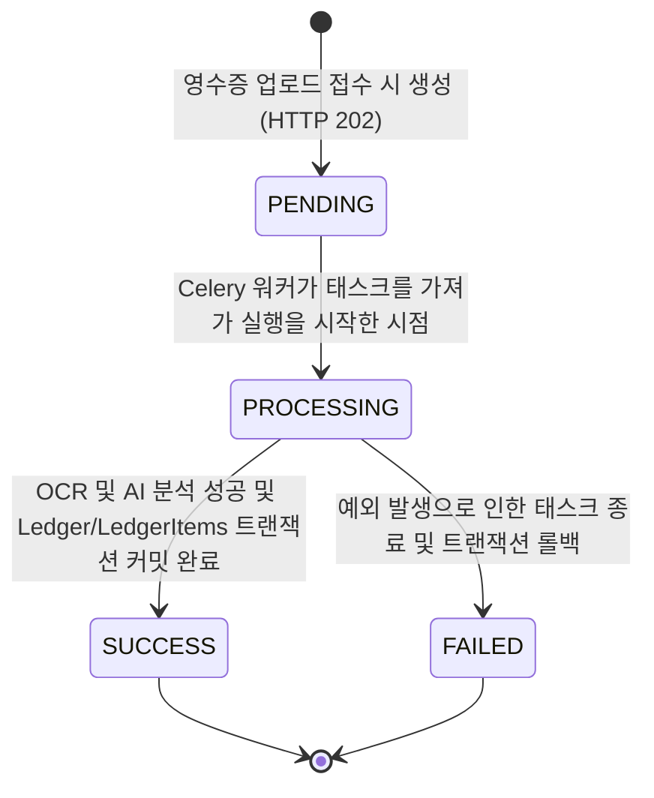

# Data Model: Async Job Management (LedgerJob)

본 문서에서는 비동기 영수증 추출 및 분석 프로세스의 상태를 격리하고 모니터링하기 위해 구축되는 `LedgerJob` 데이터 모델 설계 사양을 정의합니다.

## 1. LedgerJob 엔티티 (Entity Specification)

웹 서버에 영수증 파일이 업로드되는 즉시 생성되어 Celery 백그라운드 태스크의 생명주기를 영속화하고 추적하기 위한 핵심 엔티티입니다.

| 필드명 | 데이터 타입 | Nullable | 기본값 | 상세 설명 및 제약조건 |
| :--- | :--- | :--- | :--- | :--- |
| **id** | UUID (UUIDv7) | No | (Auto) | 개별 비동기 작업을 고유하게 식별하는 기본 키 (PK). 시계열 인덱싱 효율을 위해 UUIDv7 사용 권장. |
| **ledger** | ForeignKey (to Ledger) | Yes | Null | 분석 처리가 완수되어 최종 데이터베이스에 생성/저장된 가계부 영수증 인스턴스와의 레퍼런스 연계. |
| **status** | CharField (30) | No | 'PENDING' | 현재 작업의 진행 단계 상태. (`PENDING`, `PROCESSING`, `SUCCESS`, `FAILED` 중 하나만 허용) |
| **failure_reason** | TextField | Yes | Null | 작업 실패(`status='FAILED'`) 시 디버깅을 위해 워커 프로세스에서 던져진 예외 스택 및 에러 요약 메시지를 기록. |
| **created_at** | DateTimeField | No | (Auto) | 비동기 작업이 접수되어 데이터베이스에 최초 등록된 시각. |
| **updated_at** | DateTimeField | No | (Auto) | 작업 상태가 변경될 때마다 자동 갱신되는 시각. |

---

## 2. 상태 전이 및 생명주기 (State Transitions)

`LedgerJob`은 백그라운드 태스크 처리 흐름에 따라 아래 다이어그램과 같이 단방향으로 전이됩니다.

### 상태 전이 세부 규칙
1. **PENDING (대기 중)**:
   - 클라이언트가 웹 API로 영수증을 업로드하면, 즉시 `LedgerJob` 인스턴스가 생성되어 `PENDING` 상태로 디스크에 커밋된 후 작업 ID를 반환받습니다. 동시에 Celery 큐로 해당 작업 ID를 담은 메시지가 송신됩니다.
2. **PROCESSING (처리 중)**:
   - Celery 백그라운드 워커가 큐에서 메시지를 풀(Pull)하여 태스크 함수를 구동하는 시점에 `status`를 `PROCESSING`으로 즉시 변경 및 커밋합니다.
3. **SUCCESS (성공)**:
   - OCR 엔진 및 LLM 분석이 문제없이 수행되고, 메인 가계부 레코드(`Ledger`)와 품목 레코드(`LedgerItem`)들이 **단일 Django 트랜잭션 블록** 내에서 원자적으로 저장 완수된 경우, `ledger_id` 외래키를 주입하고 상태를 `SUCCESS`로 변경합니다.
4. **FAILED (실패)**:
   - 외부 API 응답 실패, 네트워크 타임아웃, 비즈니스 검증 실패 등 예외가 감지되는 즉시, 작업 중이던 데이터베이스는 롤백 처리되며, `status`를 `FAILED`로 마킹하고 `failure_reason`에 구체적인 예외 사유를 채워 커밋합니다.

---

## 3. 데이터 제약 및 인덱스 (Constraints & Indexing)

* **상태 필드 제약 (Choices Constraint)**:
  - Django Model Layer에서 Choice 필드를 활용해 4개 상태 값 이외의 임의 문자열 주입을 원천 차단합니다.
* **외래키 삭제 제약 (on_delete)**:
  - `ledger` 필드는 `on_delete=models.SET_NULL`을 적용하여, 해당 작업 이력과 관계없이 가계부 메인 레코드가 별도로 삭제되더라도 작업 히스토리 로그가 유지되도록 설계합니다.
* **인덱스 (Indexes)**:
  - `status` 및 `created_at` 필드에 대한 복합 인덱스(`[status, created_at]`)를 추가하여, 관리자가 대시보드나 조회 뷰에서 미결제/지연 작업이나 최신 처리 실패 내역을 최단 시간 내에 필터링 검색할 수 있도록 보장합니다.
