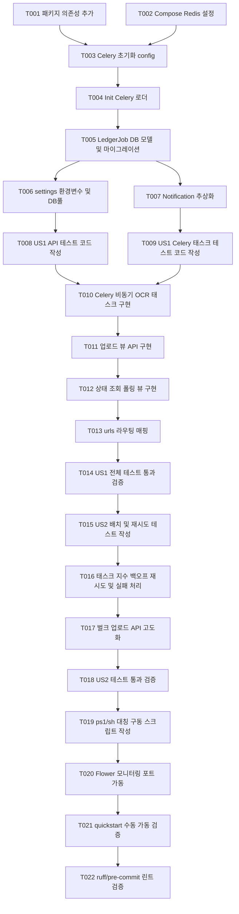

# Tasks: Redis In-Memory Store Infrastructure Setup & Celery Worker Role Separation

**Input**: Design documents from `/specs/015-redis-celery-integration/`

**Prerequisites**: [plan.md](file:///D:/Projects/Private/ai-ledger-automation/specs/015-redis-celery-integration/plan.md) (required), [spec.md](file:///D:/Projects/Private/ai-ledger-automation/specs/015-redis-celery-integration/spec.md) (required for user stories), [research.md](file:///D:/Projects/Private/ai-ledger-automation/specs/015-redis-celery-integration/research.md), [data-model.md](file:///D:/Projects/Private/ai-ledger-automation/specs/015-redis-celery-integration/data-model.md), [contracts/jobs-api.md](file:///D:/Projects/Private/ai-ledger-automation/specs/015-redis-celery-integration/contracts/jobs-api.md)

**Tests**: TDD(테스트 주도 개발) 방식의 구현 요청에 따라 각 사용자 스토리 페이즈 최상단에 테스트 태스크를 포함하였으며, 기획 구현에 앞서 테스트가 실패(Red)하는지 먼저 확인한 뒤 실제 코딩(Green)을 수행하는 흐름으로 전개합니다.

**Organization**: 각 작업은 사용자 스토리별로 그룹화 및 순차 분리되어 있으며, 독자적인 구현 및 E2E 기능 단위의 통합 테스트 검증을 완수할 수 있도록 설계되었습니다.

---

## Phase 1: Setup (Shared Infrastructure)

**Purpose**: 프로젝트 비동기 연동을 위한 인프라 초기화 및 라이브러리 가용성 셋업

- [X] T001 `backend/pyproject.toml` 및 `backend/uv.lock` 파일에 Celery와 redis-py 의존성을 선언적 추가하고 `uv sync`를 호출하여 패키지를 가상 환경에 동기화
- [X] T002 [P] `docker-compose.yml` 파일에 Redis(메시지 브로커, 6379 포트) 컨테이너 및 Flower(대시보드, 5555 포트) 컨테이너 사양 기술 추가
- [X] T003 [P] `backend/src/config/celery.py` 파일 생성 및 Celery 인스턴스 초기화, 자동 검색(autodiscover_tasks) 및 시리얼라이저 포맷 설정 추가
- [X] T004 `backend/src/config/__init__.py` 파일 수정하여 Django 시작 시 config/celery.py 내의 celery_app이 메모리에 자동 로드되도록 바인딩

---

## Phase 2: Foundational (Blocking Prerequisites)

**Purpose**: 본격적인 비동기 태스크 개발 전에 준비 완료되어야 하는 핵심 영속성 및 제약 라벨 셋업

**⚠️ CRITICAL**: 이 페이즈의 모든 공통 인프라 태스크가 완수되기 전에는 어떠한 사용자 스토리도 구현을 시작할 수 없습니다.

- [X] T005 `backend/src/apps/ledgers/models.py` 파일 내에 비동기 작업 추적을 위한 `LedgerJob` 모델(UUIDv7 PK, status choices, failure_reason, ledger FK 연계)을 정의하고 마이그레이션 파일 생성 및 적용 (`uv run src/manage.py makemigrations && uv run src/manage.py migrate`)
- [X] T006 [P] `backend/src/config/settings.py` 파일 내에 Celery 브로커 URL(`CELERY_BROKER_URL`), 결과 백엔드(`CELERY_RESULT_BACKEND`) 설정 주입 및 헌법 준수를 위한 DB 커넥션 풀 가이드라인(Gunicorn workers=2, Celery concurrency=2) 세팅 반영
- [X] T007 [P] `backend/src/apps/tasks/client.py` 파일 생성 및 향후 SSE/WebSocket 확장을 유연하게 받아줄 수 있는 상태 알림 인터페이스 `NotificationClient` 추상 정의 구현

**Checkpoint**: Foundational 인프라 빌드 완료 - 이제 각 사용자 스토리를 TDD 흐름에 맞춰 병렬/순차 가동할 준비가 되었습니다.

---

## Phase 3: User Story 1 - Receipt Upload Asynchronous Extract & Polling (Priority: P1) 🎯 MVP

**Goal**: 영수증 업로드 시 긴 처리를 백그라운드로 격리하고, 클라이언트에 즉시 202 Accepted 작업 ID를 반환하며 폴링 API를 제공함.

**Independent Test**: 영수증 이미지 1장을 API를 통해 업로드했을 때 5xx 에러나 지연 대기 없이 2초 이내에 202 Accepted 및 신규 작업 UUID를 응답받고, 이후 폴링 엔드포인트를 통해 작업 상태 변화를 감지할 수 있는지 E2E 검증.

### US1 TDD Tests (테스트 코드 먼저 작성 및 실패 확인 필수)

- [X] T008 [P] [US1] `backend/tests/apps/ledgers/test_async_jobs.py` 파일에 영수증 업로드 시 즉시 202 Accepted 및 작업 ID가 반환되며, 해당 ID로 작업 조회가 성공하는지 검증하는 API 통합 테스트 코드 작성 및 실패(Red) 확인
- [X] T009 [P] [US1] `backend/tests/apps/tasks/test_celery_tasks.py` 파일에 `extract_receipt_text_task`가 동작할 때 작업 상태가 PENDING -> PROCESSING -> SUCCESS로 전이되며 Ledger/LedgerItem 트랜잭션이 성공 완수되는지 확인하는 Celery 가상 워커 유닛 테스트 코드 작성 및 실패(Red) 확인

### US1 Implementation

- [X] T010 [US1] `backend/src/apps/tasks/tasks.py` 파일 내에 비동기 OCR 및 LLM 텍스트 분석 처리를 수행하는 `extract_receipt_text_task` Celery 태스크 구현 (작업 완료 후 단일 DB 트랜잭션 `transaction.atomic()` 보장)
- [X] T011 [US1] `backend/src/apps/ledgers/views.py` 파일 내에 업로드 요청 수신 즉시 디스크 임시 파일 작성 후 Celery 태스크를 디스패치하고 `LedgerJob`을 PENDING으로 저장해 202를 반환하는 `ReceiptUploadView` 구현
- [X] T012 [US1] `backend/src/apps/ledgers/views.py` 파일 내에 작업 ID 수신 즉시 현재 `LedgerJob`의 상태 및 성공 시 연계된 `ledger_id`를 리턴하는 `ReceiptJobStatusView` 구현
- [X] T013 [US1] `backend/src/apps/ledgers/urls.py` 파일 내에 위 뷰들을 호출할 수 있도록 API 라우팅 정보 추가 및 맵핑 완료
- [X] T014 [US1] `backend/tests/apps/ledgers/test_async_jobs.py` 및 `test_celery_tasks.py` 테스트 코드를 다시 가동하여 모든 테스트가 통과(Green)하는지 입증

**Checkpoint**: User Story 1의 모든 비동기 접수 및 조회 흐름이 독립적으로 동작하고 E2E 테스트를 통해 무결성이 기계적으로 보장됨을 확인.

---

## Phase 4: User Story 2 - System Stability under Batch Upload (Priority: P2)

**Goal**: 10개 이상의 다량 영수증 일괄 업로드 상황에서 웹 서버가 병목 없이 100% 비동기 작업 큐로 안전하게 이관되며, 일시적 장애 시 재시도와 롤백 격리 기능 완수.

**Independent Test**: 다중 파일 업로드 API 호출 시, 서버가 504 Gateway Timeout 없이 전체 태스크를 큐에 적재하여 리턴하고, 백그라운드에서 지수 백오프로 재시도 동작이 정확히 수행되는지 확인.

### US2 TDD Tests (테스트 코드 먼저 작성 및 실패 확인 필수)

- [X] T015 [P] [US2] `backend/tests/apps/ledgers/test_batch_upload.py` 파일에 10개 이상의 영수증을 동시 업로드할 때 타임아웃 없이 신속히 접수되는지 검증하고, 태스크 예외 발생 시 최대 3회 지수 백오프 재시도가 수행되는지 모킹 검증하는 테스트 코드 작성 및 실패(Red) 확인

### US2 Implementation

- [X] T016 [US2] `backend/src/apps/tasks/tasks.py` 파일 내에 `extract_receipt_text_task` 실패 시 재시도(`max_retries=3`, `default_retry_delay=2` 지수 백오프 인자) 매개변수 추가 및 최종 실패 시 `failure_reason` 적재 후 트랜잭션 롤백 보장 로직 보강
- [X] T017 [US2] `backend/src/apps/ledgers/views.py` 파일 내에 다중 영수증을 효율적으로 일괄 업로드 및 큐에 디스패치할 수 있는 벌크 업로드 엔드포인트 세부 비즈니스 로직 고도화
- [X] T018 [US2] `backend/tests/apps/ledgers/test_batch_upload.py` 테스트 코드를 실행하여 일괄 업로드 및 재시도 통합 시나리오 테스트가 성공(Green)하는지 검증

**Checkpoint**: 대량 업로드 스트레스 및 태스크 장애 격리 복구 기능 E2E 테스트 통과 완료.

---

## Phase 5: Polish & Cross-Cutting Concerns

**Purpose**: 크로스 플랫폼 대칭 로컬 기동 스크립트 작성 및 최종 전체 린트/테스트 가드 확인

- [X] T019 [P] `scripts/start-async-dev.ps1` 및 `scripts/start-async-dev.sh` 경로에 Redis, Django API 서버, Celery Worker, Flower 대시보드를 통합 기동/중지시키는 대칭형 스크립트를 작성하여 크로스 플랫폼 가동성 확보
- [X] T020 [P] `docker-compose.yml` 및 로컬 환경에서 Flower 대시보드가 정상 구동되고 모니터링 메트릭 및 작업 취소 기능이 포트 5555에서 활성화되는지 연동 확인
- [X] T021 `quickstart.md`에 명시된 명령을 통해 통합 수동 가동 테스트를 완수하고 정합성을 검증
- [X] T022 [P] 백엔드 폴더 하위에서 `uv run ruff check` 및 `uv run ruff format` 명령을 수행하여 코드 린트 결함을 100% 제거하고 커밋 전 pre-commit 가드를 완전 통과하는지 확인

---

## Dependencies & Execution Order

### 병렬 처리 가능 작업 구간 (Parallel Opportunities)
- **Phase 1**: `T002` (Compose 설정)와 `T003` (Celery 설정)은 서로 다른 파일을 다루므로 병렬 처리가 가능합니다.
- **Phase 2**: `T006` (settings 변경)과 `T007` (알림 추상 클래스 작성)은 병렬 진행이 가능합니다.
- **Phase 3 (US1 Tests)**: `T008` (API 테스트 코드)과 `T009` (Celery 태스크 유닛 테스트 코드)는 병렬로 작성할 수 있습니다.
- **Phase 5 (Polish)**: `T019` (구동 스크립트 작성)과 `T020` (Flower 연동 점검)은 병렬 처리가 가능합니다.

---

## Implementation Strategy

### TDD & MVP First (User Story 1 Focus)
1. **Phase 1 & Phase 2** 완료를 통해 Celery와 DB 마이그레이션 기본 인프라 기반을 견고하게 갖춥니다.
2. **Phase 3 (US1)** 로 진입하여 TDD 지침에 따라 테스트 케이스(`T008`, `T009`)를 선제 구현하여 테스트가 정상 실패(Red)하는지 먼저 입증합니다.
3. 이후 실제 비동기 태스크, 업로드 및 폴링 엔드포인트를 차례대로 구동하여 모든 테스트를 성공(Green)으로 전환시킵니다.
4. **MVP 검증**: 이 시점에서 Flower 대시보드 없이도 영수증 1장 업로드 및 백그라운드 상태 추적 연산이 완전히 개별적으로 기계 작동하는지 증명합니다.
5. 검증 완료 후, **Phase 4 (US2)** 배치 검증 및 재시도 처리와 **Phase 5 (Polish)** 횡단 최적화를 순차 적용하여 완성도를 점진 인도합니다.
