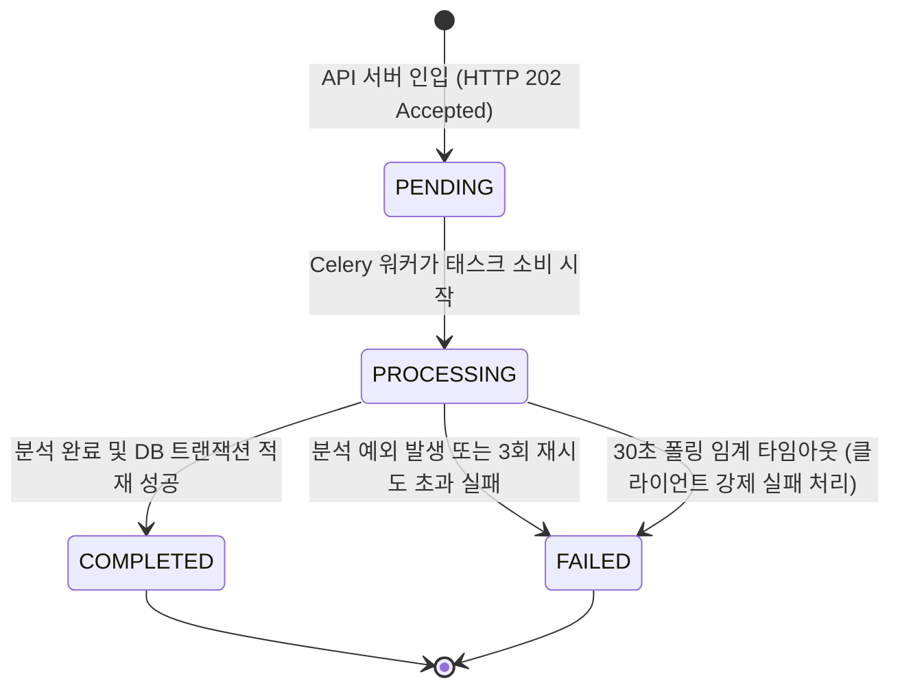

# Data Model: AsyncTask 엔티티 명세

비동기 작업 큐 시스템의 진행 상태를 트래킹하고 프론트엔드의 폴링 상태 조회에 응답하기 위해 `AsyncTask` 모델을 신설합니다.

## 1. 데이터 모델 정의 (AsyncTask)

### Attributes & Fields

| 필드명 | 데이터 타입 | 설명 | 제약 조건 |
| :--- | :--- | :--- | :--- |
| **job_id** | UUIDv7 | 비동기 작업의 고유 식별자 (Primary Key) | PK, Non-nullable |
| **user** | ForeignKey | 작업을 요청한 사용자 식별 정보 | FK (users.id), ON DELETE CASCADE |
| **status** | CharField | 비동기 작업의 현재 상태 | max_length=20, Choices 지정 |
| **error_message** | TextField | 작업 실패 시 기록되는 에러 사유 및 스택트레이스 | Nullable |
| **result_metadata** | JSONField | 분석 완료 후 생성된 가계부 ID 등의 메타데이터 백업 | Nullable |
| **created_at** | DateTimeField | 작업 생성 및 인입 일시 | auto_now_add=True |
| **updated_at** | DateTimeField | 작업 상태 최종 변경 일시 | auto_now=True |

---

## 2. 상태 전이 모델 (State Transitions)

비동기 작업은 생성 시점부터 완료/실패 시점까지 단방향 라이프사이클을 가집니다.

### 상태 전이 유효성 검사 규칙
1. `PENDING` 상태는 오직 `PROCESSING`으로만 전이될 수 있습니다.
2. `PROCESSING` 상태는 `COMPLETED` 또는 `FAILED`로 전이될 수 있으며, 최종 도달 상태가 되면 더 이상 상태 변경이 불가능합니다.
3. 작업 완료(`COMPLETED`) 시 `result_metadata` 필드에 생성된 가계부 ID(`ledger_id`) 정보가 반드시 포함되어야 합니다.
4. 작업 실패(`FAILED`) 시 `error_message` 필드에 예외 사유가 기록되어야 합니다.
