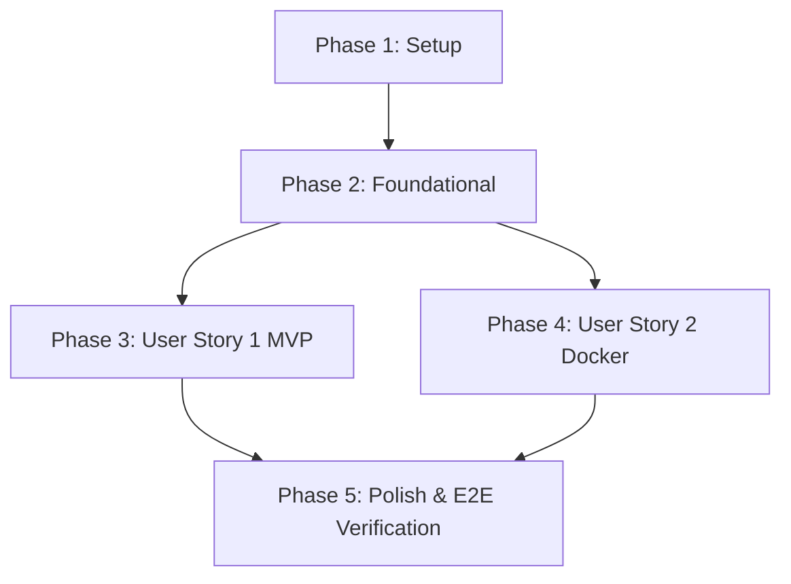

# Tasks: Celery 비동기 작업 큐 및 Docker 통합 개발 환경 구축

**Input**: Design documents from `/specs/016-setup-celery-queue/`

**Prerequisites**: [plan.md](file:///D:/Projects/Private/ai-ledger-automation/specs/016-setup-celery-queue/plan.md) (required), [spec.md](file:///D:/Projects/Private/ai-ledger-automation/specs/016-setup-celery-queue/spec.md) (required for user stories), [research.md](file:///D:/Projects/Private/ai-ledger-automation/specs/016-setup-celery-queue/research.md), [data-model.md](file:///D:/Projects/Private/ai-ledger-automation/specs/016-setup-celery-queue/data-model.md), [contracts/task-api.md](file:///D:/Projects/Private/ai-ledger-automation/specs/016-setup-celery-queue/contracts/task-api.md)

**Tests**: TDD(테스트 주도 개발) 방식의 지침이 인자로 주어졌으므로, 사용자 스토리 구현 이전에 테스트 코딩 태스크를 우선 수행하도록 태스크 목록에 강제 반영합니다.

**Organization**: 각 사용자 스토리별로 독립적으로 개발하고 검증할 수 있도록 스토리 단위로 태스크를 격리 그룹화하였습니다.

## Format: `[ID] [P?] [Story] Description`

- **[P]**: 다른 파일에 종속적이지 않아 병렬(Parallel) 처리가 가능한 작업
- **[Story]**: 매핑되는 사용자 스토리 번호 (예: US1, US2)
- 상세 설명에 구체적인 소스 파일 경로를 상시 명시

---

## Phase 1: Setup (Shared Infrastructure)

**Purpose**: 프로젝트 비동기 연동을 위한 Celery 및 공유 설정 초기화

- [X] T001 backend/pyproject.toml 및 frontend/package.json 의존성 구성 확인 및 uv sync/npm install 수행
- [X] T002 backend/config/celery.py 및 backend/config/__init__.py 파일에 Celery 앱 기동 및 초기 바인딩 셋업

---

## Phase 2: Foundational (Blocking Prerequisites)

**Purpose**: 사용자 스토리의 기반이 되는 데이터베이스 모델링 및 인프라 통제 구현

**⚠️ CRITICAL**: 이 페이즈의 모든 태스크가 완료되기 전까지는 개별 사용자 스토리 구현을 진행할 수 없습니다.

- [X] T003 backend/api/models.py 경로에 AsyncTask 엔티티 정의 및 Django DB 마이그레이션 생성/적용
- [X] T004 backend/config/settings.py 경로에 PostgreSQL 커넥션 풀 크기 제약(최대 5개) 및 CONN_MAX_AGE 튜닝 적용
- [X] T005 backend/config/settings.py 경로에 Celery 브로커 URL 및 Redis 결과 백엔드 연동 환경변수 바인딩

**Checkpoint**: 비동기 데이터 기초 인프라 및 DB 풀 제약 완료 - 이 시점부터 각 사용자 스토리 태스크를 병렬로 진행할 수 있습니다.

---

## Phase 3: User Story 1 - 비동기 영수증 업로드 및 상태 조회 (Priority: P1) 🎯 MVP

**Goal**: 무거운 영수증 처리를 비동기로 수행하고, 즉시 HTTP 202 Accepted를 받으며, 2초 간격(최대 30초)으로 폴링해 상태 완료를 렌더링하는 UX를 제공합니다.

**Independent Test**: 백엔드 파일 업로드 API 기동 후 POST 요청 즉시 job_id와 202 코드가 도출되는지 검증하고, GET `/api/tasks/<job_id>/` 상태 숏 폴링을 돌려 Completed/Failed 전이가 유효한지 검증 테스트를 돌려 확인합니다.

### Tests for User Story 1 (TDD) ⚠️

> **NOTE: 비즈니스 로직 구현 이전에 아래 테스트를 먼저 작성하고 실행하여 실패(Fail)하는 것을 확인해야 합니다.**

- [X] T006 [P] [US1] backend/api/tests/test_upload_contract.py 경로에 파일 업로드 API의 HTTP 202 Accepted 및 job_id 응답 계약 테스트 작성
- [X] T007 [P] [US1] backend/api/tests/test_task_status_contract.py 경로에 작업 상태 조회 API의 4가지 상태값 전이 계약 테스트 작성

### Implementation for User Story 1

- [X] T008 [US1] backend/api/tasks.py 경로에 Pillow 리사이징 및 LLM Structured Outputs 연동, transaction.atomic() DB 적재 및 최대 3회 지수 백오프 자동 재시도 Celery 비동기 태스크 로직 구현
- [X] T009 [US1] backend/api/views.py 경로에 영수증 파일 업로드 수신 즉시 AsyncTask PENDING 기록 후 Celery 태스크를 발행하고 HTTP 202를 응답하는 API View 구현 (T006 테스트 성공 통과 타겟)
- [X] T010 [US1] backend/api/views.py 경로에 job_id 기준 AsyncTask의 상태 및 최종 생성된 ledger_id 데이터를 리턴하는 작업 조회 API View 구현 (T007 테스트 성공 통과 타겟)
- [X] T011 [US1] frontend/src/services/taskService.js 경로에 2초 간격 숏 폴링 및 최대 30초 대기 후 타임아웃 예외를 트리거하는 프론트엔드 API 클라이언트 모듈 구현
- [X] T012 [US1] frontend/src/components/UploadModal.vue 및 frontend/src/views/Dashboard.vue 경로에 업로드 시 대기 스피너 화면 렌더링 및 완료 감지 시 가계부 대시보드 리스트 자동 갱신 트리거 연동

**Checkpoint**: 이 시점에서 이메일/푸시 알림 없이도 웹 업로드 비동기 및 폴링 E2E 흐름(US1)이 독립적으로 완전 기능 작동 및 검증 완료됩니다.

---

## Phase 4: User Story 2 - 전체 개발 스택 Dockerize 및 원클릭 기동 (Priority: P2)

**Goal**: DB, Redis, API, Celery 워커, Frontend 전체 스택을 단일 docker-compose로 실행하며, 소스 변경 시 실시간 반영되는 핫 리로딩 통합 환경을 가집니다.

**Independent Test**: docker-compose up 실행 후 프론트엔드 HMR 갱신(1.5초 이내) 및 백엔드 runserver 리로드 로그를 관찰하여 호스트 OS의 변경 내용이 전파되는지 수동 및 자동 스크립트로 검증합니다.

### Tests for User Story 2 (TDD) ⚠️

- [X] T013 [P] [US2] scripts/test_hot_reload.ps1 및 scripts/test_hot_reload.sh 경로에 로컬 소스 파일 수정 시 컨테이너 내부 핫 리로딩 및 개발서버 재시동 이벤트를 감지·검증하는 테스트 자동화 스크립트 작성

### Implementation for User Story 2

- [X] T014 [US2] backend/Dockerfile.dev 경로에 Django 및 Celery 비동기 워커가 공용할 개발용 파이썬 가상환경 격리 Dockerfile 작성
- [X] T015 [US2] frontend/Dockerfile.dev 경로에 Vue/Vite dev server 구동용 프론트엔드 개발용 Dockerfile 작성
- [X] T016 [US2] frontend/vite.config.js 경로에 Windows-Docker 마운트 파일 변경 유실 방지를 위한 server.watch usePolling 설정 바인딩
- [X] T017 [US2] docker-compose.yml 경로에 Postgres, Redis, api_server, async_worker, frontend_dev를 바인딩하고 로컬 소스 볼륨 마운트(`volumes`)와 Celery 순정 prefork 가동 커맨드를 설정하여 핫 리로딩 개발 스택을 통합 구축 (T013 테스트 성공 통과 타겟)

**Checkpoint**: 이 시점에서 전체 로컬 개발 스택이 볼륨 바인드 핫 리로딩 구조로 단일 docker-compose up 명령어를 통해 무결하게 작동 및 검증 완료됩니다.

---

## Phase 5: Polish & Cross-Cutting Concerns

**Purpose**: 전체적인 마무리 조율 및 횡단 관심사 테스트 완수

- [X] T018 specs/016-setup-celery-queue/quickstart.md 가이드라인에 명시된 통합 빌드 기동 명령 및 핫 리로딩 작동성 E2E 수동 검증
- [X] T019 [P] uv run ruff check 및 uv run ruff format 도구를 실행하여 백엔드 파이썬 코드 전체의 린팅/포매팅 정합성 체크
- [X] T020 [P] uv run pytest 실행을 통해 신규 구현된 계약 및 비동기 작업 유틸리티 전체 백엔드 테스트 스위트 통과 여부 최종 검증

---

## Dependencies & Execution Order

### Phase Dependencies



- **Setup (Phase 1)**: 모든 작업의 기본 전제조건으로 가장 먼저 완료되어야 합니다.
- **Foundational (Phase 2)**: 비동기 및 DB 커넥션 풀 등의 코어 인프라를 마련하며, Phase 3 및 Phase 4의 **블록(Block) 선행 작업**입니다.
- **User Stories (Phase 3 & 4)**: Foundational 인프라 완료 후 병렬로 개발을 개시할 수 있습니다.
- **Polish (Phase 5)**: 모든 사용자 스토리가 독립적으로 검증 완료된 이후, 최종 통합 확인 및 코드 품질 게이트 패스를 위해 최종 실행됩니다.

---

## Parallel Example: User Story 1

```powershell
# User Story 1에 종속된 두 개의 계약 테스트(TDD)를 로컬에서 병렬로 작성 및 실행
# (서로 수정하는 파일과 도메인이 달라 충돌 없음)
Task: "backend/api/tests/test_upload_contract.py 경로에 파일 업로드 API의 HTTP 202 Accepted 및 job_id 응답 계약 테스트 작성"
Task: "backend/api/tests/test_task_status_contract.py 경로에 작업 상태 조회 API의 4가지 상태값 전이 계약 테스트 작성"
```

---

## Implementation Strategy

### MVP First (User Story 1 Focus)
1. **Setup & Foundational (T001~T005)** 완료를 통해 비동기 기초 및 데이터 제약 인프라를 다집니다.
2. **User Story 1 (T006~T012)** 태스크를 수행하여 비동기 업로드 접수와 2초 간격 숏 폴링 E2E 구현을 완료합니다.
3. **독립 검증**: 로컬 환경에서 업로드 접수 후 상태 변화가 Completed로 정상 종료되고 가계부 리스트 대시보드에 실시간 투영되는지 US1 범위만 독립 검증하고 검토를 받습니다. (이때 Dockerize는 로컬 프로세스 기동으로 우회하여 1차 인도 가능)

### Incremental Delivery (US2 Dockerize)
4. US1 MVP 범위가 검증 통과되면, **User Story 2 (T013~T017)** Dockerize 및 볼륨 마운트 작업을 순차 수행하여 전체 격리 컨테이너와 Vite usePolling 설정을 통합 개발 환경으로 안착시키고 점진적 인도를 완성합니다.
5. 최종 **Polish (T018~T020)** 가이드를 따라 Ruff Linter 및 E2E 테스트 검증을 마치고 마스터에 병합합니다.
