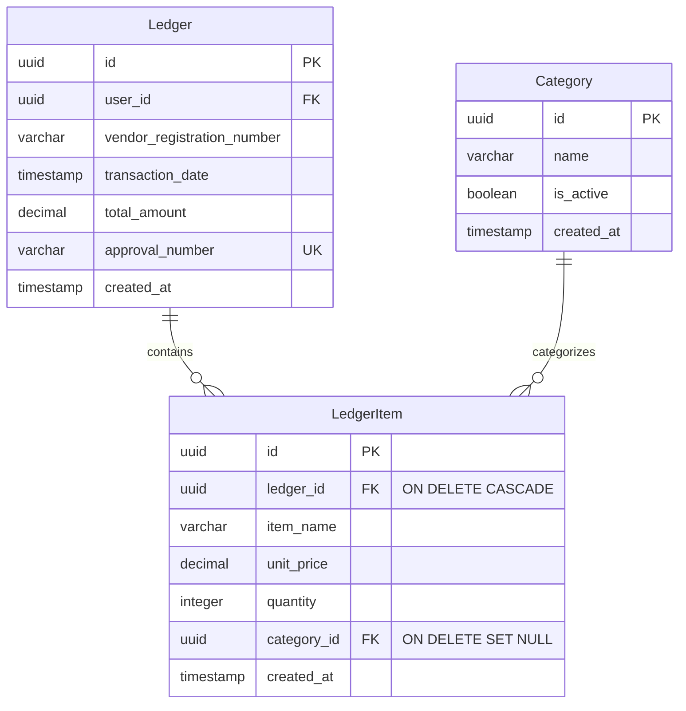
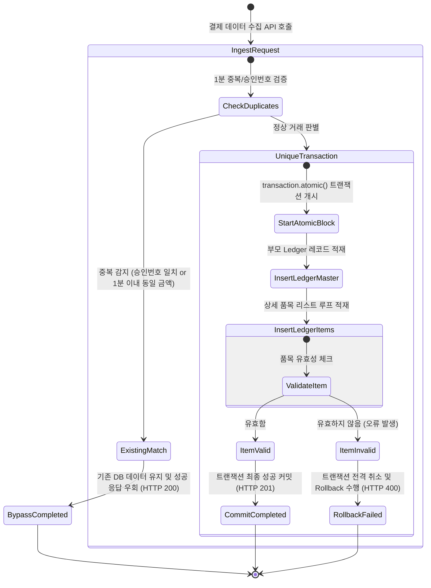

# Data Model: Database Integrity & Payment Duplicate Prevention & Category UI Fix

## 1. 데이터베이스 스키마 및 엔티티 정의 (Entities & Relationships)

가계부 원자성 결제 데이터 및 카테고리 매핑을 구현하기 위한 핵심 PostgreSQL RDBMS 엔티티 및 속성입니다.

### 1.1 Category (카테고리 엔티티)
- **id** (`UUIDv7`, Primary Key): 카테고리 고유 식별자
- **name** (`varchar(50)`, Required): 카테고리명 (예: 식비, 교통비, 주거비 등. 유실/미지정 예외 대처용으로 '미분류' 레코드 필수 적재)
- **is_active** (`boolean`, Default: true): 카테고리 활성화/사용 가능 여부
- **created_at** (`timestamp`, Required): 레코드 생성 시각

### 1.2 Ledger (결제 마스터 엔티티)
- **id** (`UUIDv7`, Primary Key): 결제 마스터 고유 식별자
- **user_id** (`UUID`, Required): 소유자 사용자 고유 식별자
- **vendor_registration_number** (`varchar(10)`, Required): 가맹점 사업자등록번호
- **transaction_date** (`timestamp`, Required): 실제 거래 발생 일시
- **total_amount** (`decimal(12, 2)`, Required): 결제 총액 (소수점 이하 2자리 허용)
- **approval_number** (`varchar(20)`, Nullable): 신용카드/현금영수증 등의 승인번호 (Optional)
- **created_at** (`timestamp`, Required): 레코드 최초 적재 시각
- **고유 제약조건 (Constraints)**:
  - `UNIQUE (user_id, vendor_registration_number, transaction_date, total_amount)` 복합 고유 제약조건을 DB 수준에서 선언하여 중복 결제의 생성 시도를 방지합니다.

### 1.3 LedgerItem (결제 상세 품목 엔티티)
- **id** (`UUIDv7`, Primary Key): 상세 품목 고유 식별자
- **ledger_id** (`UUIDv7`, Foreign Key, Required): 부모 `Ledger` 엔티티 참조 (`ON DELETE CASCADE` 연동)
- **item_name** (`varchar(100)`, Required): 품목명
- **unit_price** (`decimal(12, 2)`, Required): 단가
- **quantity** (`integer`, Required): 구매 수량 (1 이상 양수만 허용)
- **category_id** (`UUIDv7`, Foreign Key, Nullable): 매핑된 카테고리 엔티티 참조 (`ON DELETE SET NULL` 연동)
- **created_at** (`timestamp`, Required): 레코드 최초 적재 시각

---

## 2. 데이터 유효성 검사 규칙 (Validation Rules)

- **원자성 트랜잭션 검증:**
  - `Ledger` 생성 및 `LedgerItem` 배열 루프 삽입은 Django `transaction.atomic()` 데코레이터 또는 컨텍스트 매니저 내부에서 강제 수행됩니다.
  - 임의의 `LedgerItem` 유효성 검사 실패 시(예: `quantity <= 0` 이거나 `item_name` 누락 등), 해당 DB 세션에서 기록 중이던 부모 `Ledger` 레코드는 완전히 Rollback 처리되어 원자성이 보장됩니다.
- **중복 인입 우회 검증:**
  - 데이터 적재 API에 요청이 도달하면 복합 유니크 제약조건을 기반으로 데이터베이스에 쿼리 조회를 선행하거나 `IntegrityError`를 포착합니다.
  - 중복 결제 데이터 유입 시, DB 에러를 억제(ignore)하고 기존 등록된 레코드 정보를 HTTP 200 성공 상태와 함께 리턴합니다.
- **1분 중복 탐지 임계 조건:**
  - 새로운 결제 정보 인입 시, 동일한 사용자(`user_id`), 동일한 가맹점(`vendor_registration_number`), 동일한 금액(`total_amount`)인 기존 결제 리스트를 조회합니다.
  - 1) 결제 승인번호(`approval_number`)가 다르면: **개별 정상 결제**로 즉시 허용 및 적재.
  - 2) 승인번호가 없거나 기존 건과 일치할 시: 거래 시각(`transaction_date`) 차이가 **60초 이내**이면 **중복 결제**로 간주하여 우회 무시 처리.
  - 3) 거래 시각 차이가 **60초 초과**이면: 사용자의 연속 결제인 **개별 정상 결제**로 판단하여 신규 적재.

---

## 3. 결제 데이터 적재 상태 전이 (State Transitions)

