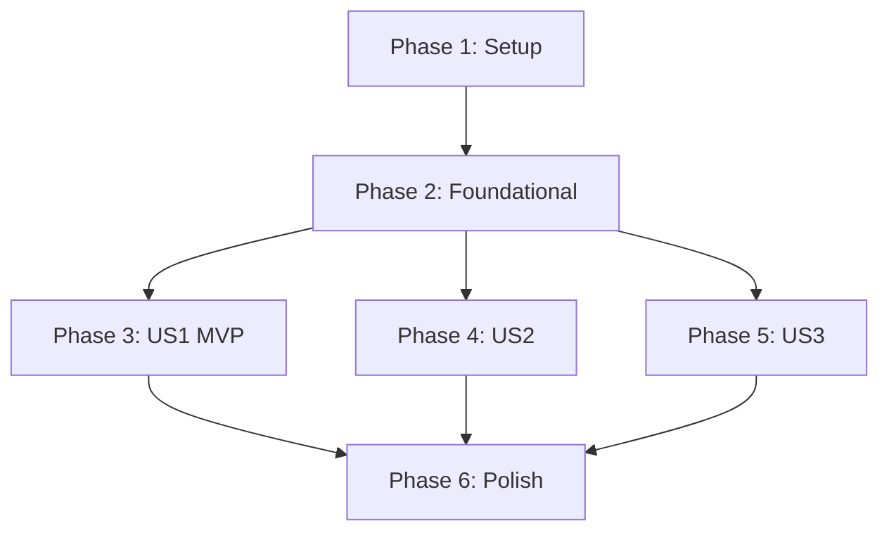

# Tasks: Database Integrity & Payment Duplicate Prevention & Category UI Fix

**Input**: Design documents from `/specs/017-db-integrity-payment-fix/`

**Prerequisites**: plan.md (required), spec.md (required for user stories), research.md, data-model.md, contracts/

**Tests**: TDD (Test-Driven Development) mode is ENABLED. Implementation of test tasks must precede core code implementation and fail before being resolved.

**Organization**: Tasks are grouped by user story to enable independent implementation and testing of each story.

## Format: `[ID] [P?] [Story] Description`

- **[P]**: Can run in parallel (different files, no dependencies)
- **[Story]**: Which user story this task belongs to (e.g., US1, US2, US3)
- Include exact file paths in descriptions

---

## Phase 1: Setup (Shared Infrastructure)

**Purpose**: Project initialization and basic structure

- [X] T001 `backend/` 및 `frontend/` 하위에 신규 소스 및 테스트 파일 생성을 위한 기본 폴더 구조를 준비합니다.
- [X] T002 `backend/pyproject.toml` 파일에 테스트에 필요한 종속성(pytest-django 등)을 확인 및 보강하고 `uv sync`를 실행해 가상 환경을 동기화합니다.
- [X] T003 [P] 프로젝트 루트에서 `pre-commit install`을 실행하여 로컬 Git 커밋 전 Ruff 린터 및 포맷터 자동 검증 가드를 활성화합니다.

---

## Phase 2: Foundational (Blocking Prerequisites)

**Purpose**: Core infrastructure that MUST be complete before ANY user story can be implemented

**⚠️ CRITICAL**: No user story work can begin until this phase is complete

- [X] T004 `backend/src/ledgers/models.py` 내의 `Ledger` 모델에 복합 고유 제약조건 `UNIQUE (user_id, vendor_registration_number, transaction_date, total_amount)`를 적용하고 `uv run python manage.py makemigrations ledgers` 및 `uv run python manage.py migrate` 명령으로 스키마 마이그레이션을 적용합니다.
- [X] T005 [P] `backend/src/ledgers/exceptions.py` 경로를 생성하여 트랜잭션 실패 및 중복 결제 예외 처리 가이드라인에 부합하는 공통 에러 예외 클래스들과 유효성 검사 예외 포맷터 모듈을 작성합니다.

**Checkpoint**: Foundation ready - user story implementation can now begin in parallel

---

## Phase 3: User Story 1 - 원자적 결제 데이터 적재 및 중복 유입 방지 (Priority: P1) 🎯 MVP

**Goal**: 메인 가계부 레코드(Ledger)와 하위 품목 리스트(LedgerItem)의 원자성(Rollback)을 보장하고, 중복 결제 인입 시 무시 및 바이패스 처리합니다.

**Independent Test**: `backend/tests/integration/test_ledger_transaction.py` 통합 테스트를 단독 기동하여 테스트 케이스가 성공적으로 실행되는지 검증합니다.

### Tests for User Story 1 (TDD - Test First) ⚠️

> **NOTE: Write these tests FIRST, ensure they FAIL before implementation**

- [X] T006 [P] [US1] `backend/tests/integration/test_ledger_transaction.py` 경로에 마스터 적재 실패 시 품목 리스트까지 롤백되는 케이스 및 복합 제약조건 충돌 시 HTTP 200(Bypass)으로 우회 처리됨을 검증하는 실패할 통합 테스트(TDD)를 선제적으로 작성합니다.

### Implementation for User Story 1

- [X] T007 [US1] `backend/src/ledgers/services.py` 경로에 `transaction.atomic()` 컨텍스트 매니저를 엄밀히 통제하여 Ledger와 LedgerItem 리스트를 단일 세션으로 묶어 전체 성공 혹은 예외 시 전격 롤백 처리하는 가계부 적재 서비스를 구현합니다.
- [X] T008 [US1] `backend/src/ledgers/views.py` 경로에 중복 결제 데이터 유입 시 DB 제약조건 충돌 예외를 포착하여 기존 데이터를 보존하면서 HTTP 200 성공 응답을 전송하고, 적재 실패 시 400 Bad Request를 반환하는 인입 API View를 보완합니다.
- [X] T009 [US1] `backend/tests/integration/test_ledger_transaction.py` 통합 테스트를 가동하여 구현 완료된 트랜잭션 원자성 및 중복 바이패스 로직이 TDD 테스트를 100% 만족하며 통과함을 입증합니다.

**Checkpoint**: At this point, User Story 1 should be fully functional and testable independently

---

## Phase 4: User Story 2 - 동일 상품 연속 결제 오탐지 방지 (Priority: P2)

**Goal**: 결제 승인번호 대조 및 1분(60초) 임계 시간 대조 알고리즘을 추가하여 오탐지 없는 연속 결제를 허용합니다.

**Independent Test**: `backend/tests/unit/test_duplicate_check.py` 유닛 테스트를 실행하여 각 시나리오별 판정 결과를 확인합니다.

### Tests for User Story 2 (TDD - Test First) ⚠️

- [X] T010 [P] [US2] `backend/tests/unit/test_duplicate_check.py` 경로에 승인번호가 다른 경우의 개별 정상 처리 및 승인번호가 동일하거나 무효할 때 1분(60초) 이내의 인입 건에 대한 중복 탐지 유닛 테스트(TDD)를 먼저 작성하고 실패함을 확인합니다.

### Implementation for User Story 2

- [X] T011 [US2] `backend/src/ledgers/services.py` 경로의 중복 판별 알고리즘 모듈에 카드 승인번호 유효성 대조 및 거래 시간 격차(60초 이내 중복 vs 60초 초과 정상 연속 거래)를 연동 계산하여 최종 중복 여부를 감지하는 체크 로직을 구현 및 연동합니다.
- [X] T012 [US2] `backend/tests/unit/test_duplicate_check.py` 유닛 테스트를 구동하여 구현된 60초 임계창 중복 방어 알고리즘 TDD 테스트 케이스가 모두 정상 통과하는지 검증합니다.

**Checkpoint**: At this point, User Stories 1 AND 2 should both work independently

---

## Phase 5: User Story 3 - 수정 내역 모달(FE-05-B) 내 카테고리 셀렉트박스 데이터 매핑 누수 버그 해결 (Priority: P3)

**Goal**: 수정 내역 모달 활성화 시 카테고리 ID가 정상 바인딩되도록 누수 버그를 수정하고, 기존 지정이 유실되었거나 유효하지 않은 경우 '미분류'로 매핑 노출합니다.

**Independent Test**: frontend 로컬 개발 서버를 기동하고 수정 모달 FE-05-B를 열어 기존 카테고리 매핑 및 '미분류' 예외 처리 렌더링을 시각적으로 최종 검증합니다.

### Implementation for User Story 3

- [X] T013 [P] [US3] `frontend/src/components/LedgerEditModal.vue` 내 거래 데이터 바인딩 로직을 보완하여, 카테고리가 지정되지 않았거나 이미 삭제된 카테고리일 때 셀렉트박스 기본값이 '미분류'로 자동 바인딩되도록 초기화 Null 방어 가드를 적용합니다.
- [X] T014 [US3] `frontend/src/components/LedgerEditModal.vue` 내 수정 폼 데이터 제출(Submit) 핸들러를 수정하여, 업데이트 요청 시 카테고리 ID 필드가 폼 상태에서 누수되어 누락되는 버그를 제거하고 정상 전송되도록 보정합니다.

**Checkpoint**: All user stories should now be independently functional

---

## Phase 6: Polish & Cross-Cutting Concerns

**Purpose**: Improvements that affect multiple user stories

- [X] T015 [P] `backend/` 디렉토리 하위의 모든 파이썬 파일에 대해 `uv run ruff check --fix` 및 `uv run ruff format`을 실행하여 린트 상태를 전결 보정합니다.
- [X] T016 `specs/017-db-integrity-payment-fix/quickstart.md`에 기술된 빌드, DB 셋업, 백엔드 테스트 및 프론트엔드 로컬 가동 검증 과정을 순차 실행하여 전 구간 기능 정상 가동을 선언합니다.

---

## Dependencies & Execution Order

### Phase Dependencies



- **Setup (Phase 1)**: 즉시 시작 가능.
- **Foundational (Phase 2)**: Phase 1이 완료된 후 수행 가능. **모든 사용자 스토리(US1, US2, US3)를 블로킹합니다.**
- **User Stories (Phase 3~5)**: Foundational phase 완료 후 시작 가능. US1, US2, US3은 서로 독립적인 파일 영역을 가지므로 이론상 **병렬 실행(Parallel)**이 가능합니다. (TDD 테스트 작성을 최우선 수행)
- **Polish (Phase 6)**: 개발된 모든 기능의 검증이 완료된 뒤 최종 수행.

### Within Each User Story

- 테스트 코드를 먼저 작성하여 실패하는지(Red) 확인합니다.
- 서비스 및 DB 롤백 메커니즘을 먼저 수정(Backend)한 뒤 API 뷰(Endpoint)를 연동합니다.
- 최종적으로 테스트를 실행해 성공 상태(Green)를 입증합니다.

---

## Parallel Example: User Story 1 & 2

```bash
# Developer A (User Story 1 - DB Integrity & Bypass)
# 1. TDD 테스트 작성 수행
uv run pytest backend/tests/integration/test_ledger_transaction.py # RED 확인
# 2. 서비스 레이어 atomic 트랜잭션 및 뷰 로직 완성
# 3. 테스트 재가동
uv run pytest backend/tests/integration/test_ledger_transaction.py # GREEN 확인

# Developer B (User Story 2 - Duplicate Check Algorithm)
# 1. TDD 테스트 작성 수행
uv run pytest backend/tests/unit/test_duplicate_check.py # RED 확인
# 2. 서비스 레이어 대조 로직 완성
# 3. 테스트 재가동
uv run pytest backend/tests/unit/test_duplicate_check.py # GREEN 확인
```

---

## Implementation Strategy

### MVP First (User Story 1 Only)

1. **Setup & Foundational 완료**: 복합 고유 제약 데이터베이스 셋업 완료.
2. **User Story 1 구현 및 검증**: 원자적 트랜잭션 및 단순 중복 무시 API 성공 검증.
3. **중단 및 확인**: US1이 독립적으로 정상 기동하는 최소 실행 가능 제품(MVP) 상태를 확인합니다.

### Incremental Delivery

- US1 MVP 완료 후, 동일 상품 연속 결제 정밀 중복 방지 알고리즘(US2)을 백엔드에 점진적 결합하여 단위 테스트 정합성을 수립합니다.
- 마지막으로 프론트엔드의 카테고리 매핑 수정 모달 UI 수정본(US3)을 얹어 사용자의 통합 E2E 여정 정합성을 최종 달성합니다.
