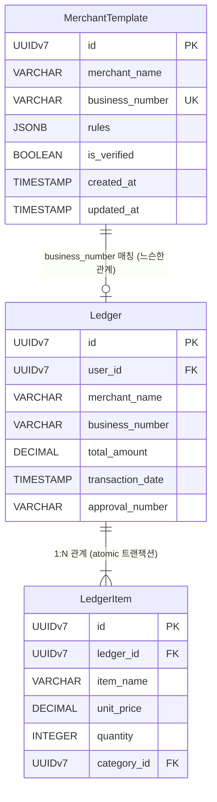
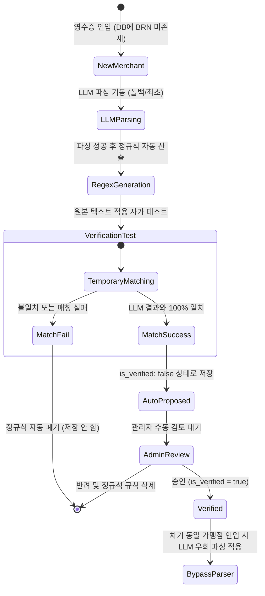

# Data Model Design: Cost Control Engine Core Implementation

## Entity Specification

### 1. MerchantTemplate (가맹점 템플릿)
가맹점을 식별하기 위한 고유한 사업자등록번호와 정적 파싱을 위한 정규식 추출 규칙, 검증 상태를 보존하는 캐시 엔티티입니다.

* **Attributes**:
  * `id`: `UUIDv7` (Primary Key, 시계열 결합 고유 식별자)
  * `merchant_name`: `VARCHAR(100)` (가맹점 상호명, 디버깅 및 관리 목적)
  * `business_number`: `VARCHAR(10)` (10자리 사업자등록번호, UNIQUE INDEX, 숫자만 포함)
  * `rules`: `JSONB` (정적 정규식 추출 규칙 세트)
    * `total_amount_regex`: `VARCHAR(255)` (총액 추출 정규식)
    * `transaction_date_regex`: `VARCHAR(255)` (거래 일시 추출 정규식)
    * `items_regex`: `VARCHAR(255)` (세부 품목 추출 정규식)
  * `is_verified`: `BOOLEAN` (관리자 검증 승인 마크, 기본값: `false`)
  * `created_at`: `TIMESTAMP` (생성 시각)
  * `updated_at`: `TIMESTAMP` (수정 시각)

* **Validation Rules**:
  * `business_number`: 10자리 문자열이어야 하며 오직 숫자(`^[0-9]{10}$`)로만 구성되어야 합니다. 저장 전 하이픈이나 공백은 자동으로 제거(Normalizing)됩니다.
  * `rules`: `is_verified`가 `true`로 갱신되기 위해서는 `rules` 내의 `total_amount_regex`와 `transaction_date_regex` 필드가 비어있지 않아야(Not Null) 하며 유효한 정규식 포맷이어야 합니다.

---

## Entity Relationships

* **관계 정의**:
  * `MerchantTemplate`과 `Ledger`(결제 마스터) 간의 직접적인 외래키(FK) 제약조건은 설정하지 않습니다. 영수증 텍스트 파싱 및 템플릿 매치 시 사업자등록번호(`business_number`) 문자열 매칭을 통해 논리적으로 조회하고 매핑합니다.
  * `Ledger`와 `LedgerItem`은 헌법 제I조(원자성)에 의거하여 단일 `transaction.atomic()` 트랜잭션 블록 내에서 1:N 관계로 영속화됩니다.

---

## State Transitions (상태 전이)

자동 제안 및 승인 파이프라인의 생명주기를 아래와 같이 통제합니다.

* **생명주기 상세**:
  1. **임시 등록 상태 (`is_verified: false`)**: 자가 학습을 통해 임시 정규식 매칭 테스트가 통과된 신규 가맹점 템플릿은 기본적으로 검증 안 됨 상태로 영속화되며, 이 상태에서는 우회 파서가 기동되지 않고 계속 LLM으로 흘러갑니다.
  2. **승인 상태 (`is_verified: true`)**: 어드민에서 관리자가 규칙을 수정 및 최종 승인하는 즉시 우회(Bypass) 파서 적용 대상에 포함되어 LLM API 호출을 건너뛰게 됩니다.
