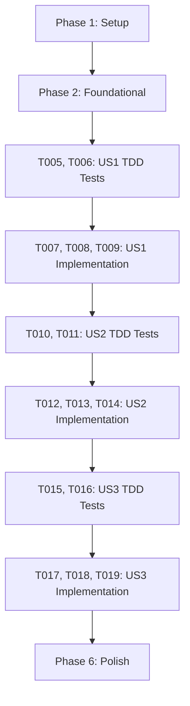

# Tasks: Cost Control Engine Core Implementation

**Input**: Design documents from `/specs/018-cost-control-engine/`

**Prerequisites**: plan.md (required), spec.md (required for user stories), research.md, data-model.md, contracts/

**Tests**: TDD 방식이 요청됨에 따라 모든 사용자 스토리 구현 페이즈 최상단에 실패하는 단위/통합 테스트 코드 작성 태스크를 필수로 명시하였습니다.

**Organization**: 각 사용자 스토리 완료가 독립적으로 배포 및 테스트 가능하도록 스토리를 기준으로 태스크를 그룹화했습니다.

## Format: `[ID] [P?] [Story] Description`

- **[P]**: 병렬 처리 가능 (대상 파일이 서로 다르고 의존 관계가 없음)
- **[Story]**: 매핑되는 사용자 스토리 라벨 (예: US1, US2, US3)
- 상세 설명에 구체적인 대상 파일 경로 기재 필수

---

## Phase 1: Setup (Shared Infrastructure)

**Purpose**: 프로젝트 구조 파악 및 기본 작업 환경 준비

- [X] T001 backend/src/ledgers/ 및 backend/tests/ 경로의 기본 디렉토리 구조 및 파일 배치 여부 확인
- [X] T002 [P] 프로젝트 루트의 pyproject.toml 및 uv.lock 설정을 확인하고 uv sync를 통해 의존성 동기화 상태 확인

---

## Phase 2: Foundational (Blocking Prerequisites)

**Purpose**: 본격적인 사용자 스토리 개발 전 완결되어야 하는 데이터베이스 모델 인프라 구축

**⚠️ CRITICAL**: 본 단계가 완료되지 않으면 하위의 어떤 사용자 스토리 작업도 시작할 수 없습니다.

- [X] T003 backend/src/ledgers/models.py 경로의 MerchantTemplate 모델에 is_verified 컬럼(Boolean, 기본값 False)을 추가 설계
- [X] T004 backend/src/ledgers/migrations/ 디렉토리 하위에 DB 스키마 갱신 마이그레이션 파일을 자동 생성하고 로컬 PostgreSQL에 적용

**Checkpoint**: Foundation ready - 이제 사용자 스토리 구현 및 TDD 테스트 코딩을 병렬로 착수할 수 있습니다.

---

## Phase 3: User Story 1 - 검증된 가맹점 템플릿에 대한 LLM 우회(Bypass) 파싱 (Priority: P1) 🎯 MVP

**Goal**: 검증 완료(`is_verified: true`) 상태인 기존 가맹점 결제 데이터 유입 시, LLM API 호출을 건너뛰고 정적 정규식 파서 모듈만을 활용해 가계부를 영속화합니다.

**Independent Test**: `is_verified: true`이고 정규식 규칙이 담긴 `MerchantTemplate`이 존재할 때, 해당 10자리 사업자등록번호가 유입되면 LLM 호출 없이 정적 파서로 가계부(Ledger)와 품목(LedgerItem)이 100ms 이내에 즉시 동기 완료(201) 적재되는지 검증합니다.

### Tests for User Story 1 (TDD 필수) ⚠️

> **NOTE: 구현 전에 아래 테스트 코드를 먼저 작성하여 실행 시 실패(Red)함을 반드시 확인하십시오.**

- [X] T005 [P] [US1] backend/tests/integration/test_cost_control_parser.py 경로에 is_verified: true 시 LLM API 호출 횟수 0회 검증 및 가계부 동기 적재 성공을 확인하는 통합 테스트 구현
- [X] T006 [P] [US1] backend/tests/unit/test_regex_parser.py 경로에 정적 정규식 규칙으로 결제 텍스트에서 금액/날짜/품목을 추출하는 순수 유틸리티 단위 테스트 구현

### Implementation for User Story 1

- [X] T007 [P] [US1] backend/src/ledgers/services.py 경로에 정적 정규식 매칭을 통해 필드 정보를 추출하는 RegexParser 파서 클래스 구현
- [X] T008 [US1] backend/src/ledgers/services.py 경로에 사업자번호 정규화, MerchantTemplate 조회, is_verified 판단 및 우회 파싱 로직을 통제하는 CostControlParser 코어 구현 (T007에 의존)
- [X] T009 [US1] backend/src/ledgers/views.py 경로에 업로드 시 우회 파싱 성공 여부에 따라 즉시 가계부 완성 레코드를 동기 응답(201) 처리하는 뷰 API 로직 연동

**Checkpoint**: 본 단계 완료 시, 이미 등록된 가맹점에 대해서는 유료 LLM 호출 없이 무비용 정적 파싱이 즉시 독립적으로 구동 가능합니다.

---

## Phase 4: User Story 2 - 우회 파싱 실패 시 LLM 폴백(Fallback) 기본 안전장치 (Priority: P2)

**Goal**: 정적 우회 파싱 도중 영수증 포맷 불일치 등으로 실패하는 예외 상황 발생 시, Celery 비동기 큐를 기동하여 즉각 LLM API 파서로 폴백하여 영수증 분석을 유연하게 끝마칩니다.

**Independent Test**: `is_verified: true` 가맹점이지만 레이아웃 텍스트가 조작되어 정적 파싱에 실패할 경우, 즉시 `202 Accepted` 응답을 획득하고 Celery 비동기 워커를 통해 LLM 폴백 파서가 정상 구동되어 가계부 적재가 최종 완결되는지 검증합니다.

### Tests for User Story 2 (TDD 필수) ⚠️

> **NOTE: 구현 전에 아래 테스트 코드를 먼저 작성하여 실행 시 실패(Red)함을 반드시 확인하십시오.**

- [X] T010 [P] [US2] backend/tests/integration/test_cost_control_parser.py 경로에 정적 파싱 에러 발생 시 즉각 LLM API 파서로의 비동기 폴백 및 작업 상태 변화를 조회하는 통합 테스트 구현
- [X] T011 [P] [US2] backend/tests/integration/test_cost_control_parser.py 경로에 LLM 폴백 파싱마저 최종 실패 시 transaction.atomic 트랜잭션 전체가 안전하게 롤백되는지 검증하는 트랜잭션 정합성 테스트 구현

### Implementation for User Story 2

- [X] T012 [US2] backend/src/ledgers/tasks.py 경로에 비동기로 LLM API를 호출하여 영수증 파싱 및 atomic 트랜잭션 적재를 보장하는 process_llm_fallback_task Celery 비동기 태스크 구현
- [X] T013 [US2] backend/src/ledgers/services.py 경로에 CostControlParser 내에서 정적 파싱 예외 포착 시 즉시 Celery 태스크를 발행하고 작업 ID(job_id)를 반환하는 예외 처리 연동 구현 (T012에 의존)
- [X] T014 [US2] backend/src/ledgers/views.py 경로에 202 Accepted 작업 예약 응답 처리 및 작업 상태 조회를 수행하는 API 뷰 엔드포인트 구현 (T013에 의존)

**Checkpoint**: 본 단계 완료 시, 정규식의 취약점을 LLM 비동기 폴백으로 메꿔주는 견고한 하이브리드 비용 통제 파이프라인 안전망이 완벽히 기동됩니다.

---

## Phase 5: User Story 3 - 신규 가맹점 규칙 산출 및 자가 학습 등록 파이프라인 (Priority: P3)

**Goal**: 데이터베이스에 가맹점 템플릿이 존재하지 않아 LLM 파싱을 수행한 경우, 파싱 성공 데이터와 원본 텍스트를 대조해 정규식을 자동 도출하고 임시 테스트 정합성 통과 시 `is_verified: false` 상태로 자동 제안합니다.

**Independent Test**: 새로운 가맹점 영수증 유입 후 LLM 파싱이 완료되었을 때, 자동 도출된 정규식을 영수증 원본에 임시 매칭 테스트하여 동일 결과 도출 시 `MerchantTemplate`에 `is_verified: false`인 신규 캐시 레코드가 자동 삽입되는지 검증합니다.

### Tests for User Story 3 (TDD 필수) ⚠️

> **NOTE: 구현 전에 아래 테스트 코드를 먼저 작성하여 실행 시 실패(Red)함을 반드시 확인하십시오.**

- [X] T015 [P] [US3] backend/tests/integration/test_cost_control_parser.py 경로에 신규 가맹점의 LLM 분석 성공 시 정규식 규칙이 자동 도출되고 is_verified: false 상태의 캐시 템플릿이 신규 생성되는지 검증하는 자가 학습 검증 통합 테스트 구현
- [X] T016 [P] [US3] backend/tests/integration/test_cost_control_parser.py 경로에 자동 생성된 정규식이 영수증 원본 매칭 테스트에서 불일치하거나 매칭 실패 시, 해당 템플릿이 영속화되지 않고 정상 자동 폐기 처리되는지 검증하는 예외 케이스 테스트 구현

### Implementation for User Story 3

- [X] T017 [P] [US3] backend/src/ledgers/services.py 경로에 LLM 파싱 텍스트 키-값 구조와 영수증 원본 텍스트의 레이아웃 패턴을 결합 분석하여 최적의 정규식을 도출하는 RegexGenerator 자율 규칙 생성기 클래스 구현
- [X] T018 [US3] backend/src/ledgers/tasks.py 경로에 Celery 태스크 분석 완료 시점에 RegexGenerator를 호출하여 정합성 테스트 통과 시 is_verified: false 상태로 템플릿 제안서를 데이터베이스에 적재하는 자가 학습 파이프라인 연동 구현 (T017에 의존)
- [X] T019 [US3] backend/src/admin/views.py 경로에 관리자가 제안된 정규식 규칙을 검증 및 승인하여 is_verified: true로 갱신하는 어드민 전용 API 엔드포인트 구현

**Checkpoint**: 본 단계 완료 시, 수동 등록 없이도 실제 가계부 유입 건을 기반으로 스스로 템플릿 정규식을 진화시키고 제안하는 진화형 루프가 활성화됩니다.

---

## Phase 6: Polish & Cross-Cutting Concerns

**Purpose**: 성능 병목 튜닝, 설명서 보완 및 E2E 최종 조율

- [X] T020 [P] backend/ 디렉토리 내 추가되거나 갱신된 백엔드 로직에 대한 최종 ruff 린팅 및 포매팅 준수 여부 확인
- [X] T021 10만 건 이상의 가상 더미 데이터 적재 환경에서 EXPLAIN ANALYZE 쿼리 실행을 통해 가맹점 템플릿(BRN 검색 및 Unique Constraint) 데이터베이스 인덱스 튜닝 성능 확인
- [X] T022 [P] specs/018-cost-control-engine/quickstart.md 가이드 문서에 따라 로컬 Docker RDBMS 및 Celery 환경에서 최종 E2E 시나리오 테스트 기계적 통과 확인

---

## Dependencies & Execution Order

### Phase Dependencies



* **Setup (Phase 1)**: 가장 먼저 실행되어 가상 환경 정합성을 확보합니다.
* **Foundational (Phase 2)**: 템플릿 모델 설계 및 마이그레이션이 완료될 때까지 하위 사용자 스토리 작업을 완벽하게 블로킹합니다.
* **User Stories (Phase 3 ~ 5)**:
  * 비즈니스 우선순위에 따라 순차 실행합니다: US1 (우회 파싱 MVP) → US2 (비동기 폴백) → US3 (자가 학습 파이프라인).
  * 각 사용자 스토리 구현 전, 해당 스토리에 특화된 **TDD 테스트 작성 태스크가 1순위로 실행되어 Red 상태를 기록**해야 합니다.
  * 스토리 구현은 모델/유틸 -> 서비스 로직 -> 뷰 API 순으로 작성되어 종속성을 해소합니다.

### Parallel Opportunities

* **Phase 1 및 Phase 2**: `[P]` 표시가 붙은 린터 확인 및 초기화 작업은 병렬 처리가 가능합니다.
* **TDD 테스트 코드 작성**: 스토리 시작 시 통합 테스트(Integration) 작성과 단위 테스트(Unit) 작성을 다른 개발자가 나누어 병렬로 작성할 수 있습니다.
* **자가 학습 독립 모듈**: `RegexGenerator` 알고리즘 코딩(`T017`)은 Celery 및 API 인프라 작업에 전혀 의존하지 않으므로, 백그라운드 인프라 작업과 완전히 병행하여 병렬 개발이 가능합니다.

---

## Parallel Example: User Story 1

```bash
# User Story 1 착수 시 병렬로 테스트 작성 가동:
Task 1: "T005 [P] [US1] backend/tests/integration/test_cost_control_parser.py 경로에... 통합 테스트 구현"
Task 2: "T006 [P] [US1] backend/tests/unit/test_regex_parser.py 경로에... 단위 테스트 구현"

# User Story 1 구현 시 정적 정규식 모듈과 뼈대 엔진 병행 가동:
Task 3: "T007 [P] [US1] backend/src/ledgers/services.py 경로에 정적 정규식 RegexParser 구현"
Task 4: "T008 [US1] backend/src/ledgers/services.py 경로에 CostControlParser 코어 구현"
```

---

## Implementation Strategy

### MVP First (User Story 1 Only)

1. **Phase 1 (Setup) 및 Phase 2 (Foundational)** 적용하여 `MerchantTemplate` DB 구조 및 마이그레이션 적용.
2. **Phase 3 (User Story 1)** TDD 기반으로 테스트 먼저 작성 후, 정적 정규식 파서와 우회 엔진을 구현해 100ms 이내의 LLM 우회 동기 파싱 성공 확인.
3. **독립 검증**: 등록 가맹점 제출 시 LLM 로그 전무 상태로 가계부가 정확하게 영속화되는지 수동 및 자동 통합 테스트 독립 검증 완료.

### Incremental Delivery

* **Foundation Ready**: 스키마 구성 완료.
* **MVP 배포 (US1 완료)**: 등록된 가맹점에 한하여 API 응답 지연을 획기적으로 낮추고 비용을 차단하는 최소 가치 전달.
* **비동기 안전망 추가 (US2 완료)**: 임의 레이아웃 변경 영수증에 대한 실패 방지 Celery LLM 폴백 활성화로 무결성 보장.
* **자율 진화 가동 (US3 완료)**: 실제 적재 데이터 기반 자동 템플릿 수집 루프를 활성화하여 유지보수 자동화 단계 도달.
