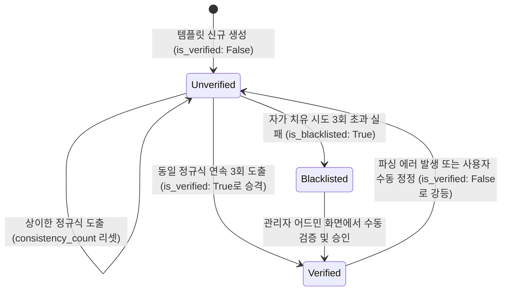

# Data Model: Template Promotion & Self-Healing

본 피처를 구현하기 위해 확장되거나 새롭게 생성되는 데이터베이스 모델 설계 사양입니다.

## Entity Schema & Attributes

### 1. `MerchantTemplate` (기존 모델 확장)

가맹점 레이아웃 정규식 규칙 및 바이패스 상태를 추적하는 엔티티입니다.

| 필드명 | 데이터 타입 | 제약 조건 | 설명 |
| :--- | :--- | :--- | :--- |
| **`id`** | UUID | Primary Key | 템플릿 고유 식별자 (Native UUIDv7 권장) |
| **`vendor_registration_number`** | VARCHAR(10) | Unique | 가맹점 사업자등록번호 (10자리 숫자 문자열) |
| **`regex_pattern`** | JSONB | Nullable | 파싱 매핑 규칙 (정규식 패턴 및 타겟 키 JSON) |
| **`is_verified`** | BOOLEAN | Default: False | 우회(Bypass) 파서 적용 여부를 결정하는 마스터 검증 플래그 |
| **`consistency_count`** | INTEGER | Default: 0, Not Null | 동일한 정규식 패턴이 연속 도출된 일관성 카운터 |
| **`self_healing_attempts`** | INTEGER | Default: 0, Not Null | 자가 치유 시도 카운터 (무한 루프 방지용) |
| **`is_blacklisted`** | BOOLEAN | Default: False | 자가 치유 한도 초과 및 오작동률 과다로 인한 영구 차단 여부 |
| **`last_healing_at`** | TIMESTAMPTZ | Nullable | 마지막 자가 치유(정규식 재생성)가 수행된 시각 |

---

### 2. `TemplateExecutionHistory` (신규 로깅 모델)

템플릿별 파싱 실행 이력과 오류 및 사용자 수동 정정 차이(Diff) 데이터를 보존하는 로그 엔티티입니다.

| 필드명 | 데이터 타입 | 제약 조건 | 설명 |
| :--- | :--- | :--- | :--- |
| **`id`** | UUID | Primary Key | 실행 이력 고유 식별자 (Native UUIDv7) |
| **`template`** | ForeignKey | Nullable, ON DELETE SET NULL | 대상 `MerchantTemplate` 모델 관계 |
| **`ledger`** | ForeignKey | Nullable, ON DELETE SET NULL | 생성 및 수정된 대상 가계부 원장(`Ledger`) 모델 관계 |
| **`execution_time`** | TIMESTAMPTZ | Default: NOW(), Not Null | 파싱 및 트랜잭션 적재 시각 |
| **`parsing_mode`** | VARCHAR(10) | Not Null | 실행 모드 (`"LLM"` 또는 `"BYPASS"`) |
| **`is_success`** | BOOLEAN | Default: True, Not Null | 파싱 및 적재 처리 최종 성공 여부 |
| **`user_corrected`** | BOOLEAN | Default: False, Not Null | 사용자에 의한 최종 가계부 내역 수동 정정 발생 여부 |
| **`corrected_diff`** | JSONB | Nullable | 사용자가 정정한 내역의 변경 전후 차이 데이터 포맷 예시: `[{"field": "total_amount", "before": 12000, "after": 120000}]` |
| **`error_message`** | TEXT | Nullable | 파싱 실패 시 예외 원인 로그 및 에러 메시지 |

---

## State Transition (상태 전이 모델)

템플릿의 검증 상태(`is_verified`)는 다음 생명주기 규칙에 따라 상태 전이가 수행됩니다.

### 상태 전이 트리거 규칙

1. **승격 (Promotion):**
   * `is_verified`가 `False`이고 `is_blacklisted`가 `False`인 상태에서 영수증 유입 시:
   * 추출된 정규식이 기존 캐시된 규칙과 일치하면 `consistency_count`를 1 증가시킵니다.
   * `consistency_count`가 3에 도달하면 즉시 `is_verified`를 `True`로 변경하고 카운터를 0으로 초기화합니다.
2. **강등 (Demotion):**
   * `is_verified`가 `True`인 상태에서 파싱 동작 중 `ValueError`, `SchemaValidationError` 등의 에러가 감지되거나, 가계부 원장 업데이트 API를 통해 사용자의 수동 정정 이벤트(`user_corrected: true`)가 들어오는 즉시:
   * `is_verified`를 `False`로 강등 처리하고 바이패스 인덱스 필터링에서 배제합니다.
3. **차단 (Blacklisted):**
   * 자가 치유 시도 횟수(`self_healing_attempts`)가 3에 도달했음에도 동일 템플릿에서 에러/사용자 정정이 재유입되는 경우, `is_blacklisted`를 `True`로 전환하여 자율 갱신 및 우회 루프를 영구 차단합니다.
