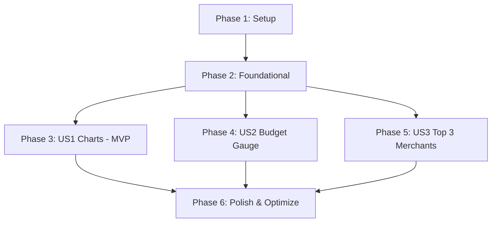

# Tasks: 소비 시각화 차트 및 예산 게이지 (가계부 UI 고도화 1단계)

**Input**: Design documents from `/specs/020-visualize-spending/`

**Prerequisites**: plan.md (required), spec.md (required for user stories), research.md, data-model.md, contracts/

**Tests**: TDD 방식이 요청되었으므로 각 사용자 스토리의 구현 이전에 테스트 코드 선작성 및 최초 실패 검증(TDD) 태스크를 필수 배치합니다.

**Organization**: 각 태스크는 사용자 스토리별로 완결성 있게 격리 및 그룹화되어 있어 독립적인 점진적 릴리즈와 테스트가 가능합니다.

---

## Phase 1: Setup (Shared Infrastructure)

**Purpose**: 프로젝트 기초 개발 인프라 준비 및 패키지 추가

- [ ] T001 프론트엔드 package.json 파일에 chart.js 및 vue-chartjs 라이브러리 의존성 추가 설치
- [ ] T002 백엔드 uv.lock 및 pyproject.toml 의존성 패키지 정합성 점검 및 uv sync 동기화 실행
- [ ] T003 [P] uv run ruff check를 통한 기본 정적 분석 가드 작동 상태 확인

---

## Phase 2: Foundational (Blocking Prerequisites)

**Purpose**: 본격적인 대시보드 시각화 구현 전에 완료되어야 하는 데이터베이스 모델 및 시리얼라이저 인프라 구축

**⚠️ CRITICAL**: 본 페이즈가 완료되어 DB에 MonthlyBudget이 이식되기 전까지는 어떠한 사용자 스토리도 실행할 수 없습니다.

- [ ] T004 backend/ledgers/models.py 경로에 MonthlyBudget 데이터 모델 설계 및 UNIQUE (user, budget_month) 제약조건 추가
- [ ] T005 [P] MonthlyBudget 모델에 대한 마이그레이션 파일 생성 및 migrate 적용 (makemigrations & migrate)
- [ ] T006 [P] backend/ledgers/serializers.py 경로에 MonthlyBudgetSerializer 및 DTO 바인딩 로직 구현

**Checkpoint**: 예산 테이블 인프라 완료 - 각 사용자 스토리별 병렬 TDD 구현 준비 완료

---

## Phase 3: User Story 1 - 소비 시각화 차트 확인 (Priority: P1) 🎯 MVP

**Goal**: 당월 카테고리 소비 분포(원형 차트) 및 최근 N개월 소비 추이(막대 차트, 3/6/12개월 필터 지원)를 대시보드에 시각화 렌더링

**Independent Test**: 가계부 데이터를 적재한 후 대시보드(/dashboard) 진입 시 원형/막대 차트가 정상 노출되며, 마우스 오버 툴팁과 기간 필터링 전환 시 차트가 비동기 갱신되는지 확인

### Tests for User Story 1 (TDD Mandatory) ⚠️

> **NOTE: 이 테스트 코드를 먼저 구현하고, 테스트가 실패(Red)하는 것을 확인한 뒤 구현에 착수하십시오.**

- [ ] T007 [P] [US1] backend/tests/test_dashboard_api.py 경로에 /api/ledgers/dashboard/ 엔드포인트 GET 통계 DTO 반환 TDD 테스트 코드 작성
- [ ] T008 [P] [US1] frontend/tests/unit/components/charts.spec.js 경로에 PieChart 및 BarChart 컴포넌트 Mock 데이터 렌더링 TDD 단위 테스트 코드 작성

### Implementation for User Story 1

- [ ] T009 [US1] backend/ledgers/views.py 경로에 /api/ledgers/dashboard/ API 뷰 구현 (당월 실시간 집계 및 쿼리 파라미터 months 기간 필터 지원)
- [ ] T010 [US1] backend/ledgers/urls.py 경로에 대시보드 통계 API 라우팅 등록
- [ ] T011 [P] [US1] frontend/src/services/dashboardService.js 경로에 대시보드 API 연동 비동기 모듈 구현
- [ ] T012 [P] [US1] frontend/src/components/PieChart.vue 경로에 Chart.js 기반 카테고리 소비 분포 원형 차트 구현
- [ ] T013 [P] [US1] frontend/src/components/BarChart.vue 경로에 Chart.js 기반 월 지출 추이 막대 차트 구현
- [ ] T014 [US1] frontend/src/pages/Dashboard.vue 경로에 차트 컴포넌트들을 반응형 2열 분할 그리드 내에 마운트 및 데이터 바인딩

**Checkpoint**: MVP 달성 - 대시보드 진입 시 소비 차트 시각화가 완전히 기능하고 독립 검증 가능함

---

## Phase 4: User Story 2 - 월 예산 대비 남은 예산 게이지 및 실시간 수정 (Priority: P2)

**Goal**: 당월 예산 소진 속도에 맞춰 임계치 색상(초록/노랑/빨강)이 변화하는 게이지바 제공 및 대시보드 내 즉각적인 예산 편집 UI 반영

**Independent Test**: 예산 게이지의 편집 모달/폼을 열어 예산을 수정했을 때, /api/budgets/ API를 거쳐 DB에 실시간 저장되고 화면 새로고침 없이 남은 예산 게이지가 리바인딩되어 변경 노출되는지 확인

### Tests for User Story 2 (TDD Mandatory) ⚠️

> **NOTE: 이 테스트 코드를 먼저 구현하고, 테스트가 실패(Red)하는 것을 확인한 뒤 구현에 착수하십시오.**

- [ ] T015 [P] [US2] backend/tests/test_dashboard_api.py 경로에 /api/budgets/ API의 예산 생성/수정(Upsert) 및 조회에 대한 TDD 테스트 코드 작성

### Implementation for User Story 2

- [ ] T016 [US2] backend/ledgers/views.py 경로에 /api/budgets/ 예산 관리 API 뷰 구현 (UNIQUE 중복 예외 방어 및 Decimal 유효성 검사 처리)
- [ ] T017 [US2] backend/ledgers/urls.py 경로에 예산 API 라우팅 등록
- [ ] T018 [P] [US2] frontend/src/services/budgetService.js 경로에 예산 API 호출 모듈 구현
- [ ] T019 [P] [US2] frontend/src/components/BudgetGauge.vue 경로에 남은 예산 게이지바 및 인라인 편집 아이콘/모달 구현 (안전/주의/경고 시각화 규칙 반영)
- [ ] T020 [US2] frontend/src/pages/Dashboard.vue 경로에 예산 게이지바 컴포넌트 마운트 및 예산 변경에 따른 실시간 리액티브 갱신 바인딩

**Checkpoint**: 예산 게이지 및 인라인 편집 기능 완료 - 차트와 예산 정보가 실시간 연동됨

---

## Phase 5: User Story 3 - 이번 달 지출 TOP 3 가맹점 요약 (Priority: P3)

**Goal**: 당월 결제 데이터 중 지출 총 합산액 기준 상위 3개 가맹점의 상호명 및 누적 지출 금액 요약 카드 제공

**Independent Test**: 등록된 가계부 내역 중 지출 규모가 가장 큰 TOP 3 가맹점 카드가 순위별로 표시되고, 가맹점 데이터가 3개 미만인 경우 레이아웃 무너짐 없이 올바르게 예외 노출되는지 검증

### Tests for User Story 3 (TDD Mandatory) ⚠️

> **NOTE: 이 테스트 코드를 먼저 구현하고, 테스트가 실패(Red)하는 것을 확인한 뒤 구현에 착수하십시오.**

- [ ] T021 [P] [US3] backend/tests/test_dashboard_api.py 경로에 가맹점 지출 집계 로직 및 3순위 정렬 무결성에 대한 TDD 테스트 코드 작성

### Implementation for User Story 3

- [ ] T022 [US3] backend/ledgers/views.py 경로에 가맹점 총액 합산 및 상위 3곳 필터링 ORM 집계 쿼리 최적화 구현 (가맹점명 없는 건 제외 처리)
- [ ] T023 [P] [US3] frontend/src/components/TopMerchants.vue 경로에 TOP 3 가맹점 요약 카드 컴포넌트 구현 (반응형 3열 그리드 적용)
- [ ] T024 [US3] frontend/src/pages/Dashboard.vue 경로에 TOP 3 가맹점 요약 카드 마운트 및 API 바인딩

**Checkpoint**: 모든 기획 요구사항 충족 완료 - 차트, 예산, TOP 3 가맹점 요약이 완전하게 통합 구동됨

---

## Phase 6: Polish & Cross-Cutting Concerns

**Purpose**: 성능 최적화, 린팅 스타일 정제 및 최종 E2E 가동 검증

- [ ] T025 [P] 대시보드 통계 API(/api/ledgers/dashboard/) 쿼리에 EXPLAIN ANALYZE 분석을 실행하고 인덱스 최적화를 통해 100ms 이내 응답을 보장하는지 확인
- [ ] T026 모바일 단말기 및 웹 뷰포트 반응형 화면 상태 검증 및 레이아웃 밀림 수정
- [ ] T027 [P] uv run ruff check 및 uv run ruff format을 가동하여 스타일 및 정적 품질 검증 통과 보장
- [ ] T028 [P] specs/020-visualize-spending/quickstart.md 안내서를 따라 가동 시나리오를 전수 E2E 검증하고 마무리

---

## Dependencies & Execution Order

### Phase Dependencies

* **Setup (Phase 1)**: 대칭 의존성 설치 진행. 블로킹 없음.
* **Foundational (Phase 2)**: 예산 모델링(DB) 및 마이그레이션이 완료되어야 하므로 **모든 User Story의 구현을 블로킹**합니다.
* **User Stories (Phase 3 ~ 5)**: Foundational이 끝난 후 병렬로 개발을 진행하거나 우선순위(US1 → US2 → US3)에 따라 순차 진행할 수 있습니다.
* **Polish (Phase 6)**: 모든 사용자 스토리가 성공 마운트된 이후 최종 가동 최적화를 수행합니다.

### Parallel Opportunities

* **TDD Test & Model**: `T007` (API 테스트)와 `T008` (차트 단위 테스트)는 서로 파일이 다르고 종속성이 없으므로 병렬 작성 가능합니다.
* **Frontend Components**: 차트 컴포넌트(`T012`, `T013`)와 예산 게이지(`T019`), TOP 3 카드(`T023`)는 완전히 다른 단독 파일로 설계되어 충돌 없이 병렬 개발이 가능합니다.

---

## Implementation Strategy

### MVP First (소비 시각화 차트 최우선)
1. **Phase 1 & 2 완료**: 기본 의존성 추가 및 `MonthlyBudget` 데이터 모델 마이그레이션을 적용합니다.
2. **Phase 3 (US1) 완료**: TDD 테스트 작성 후 백엔드 통계 DTO API를 구성하고, 프론트엔드에 `PieChart`, `BarChart`를 마운트합니다.
3. **1차 독립성 검증**: 타 쟁점에 구애받지 않고 대시보드의 두 차트 시각화 동작에 대해서만 먼저 E2E 검증을 마쳐 성공적인 MVP 릴리즈를 입증합니다.
4. **점진적 릴리즈**: 이후 US2 예산 게이지와 US3 가맹점 카드를 순차적으로 릴리즈 및 E2E 테스트를 반복 적용하여 소프트웨어를 점진적으로 증분합니다.
