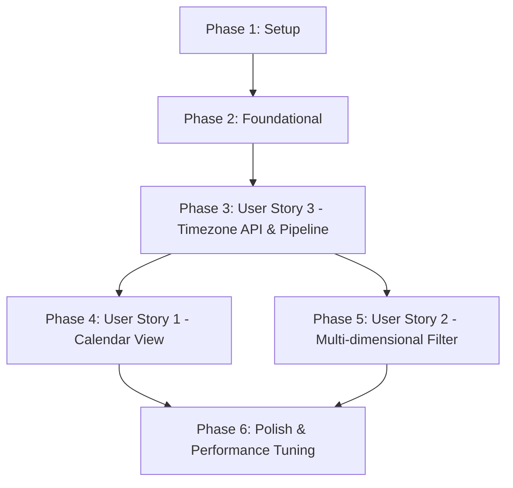

# Tasks: 가계부 UI 고도화 2단계 및 사용자 타임존 설정 변경 기능

**Input**: Design documents from `/specs/021-ledger-calendar-timezone/`

**Prerequisites**: plan.md (required), spec.md (required for user stories), research.md, data-model.md, contracts/

**Tests**: TDD 개발 요구사항에 맞추어 모든 사용자 스토리의 구현 이전에 테스트 코딩 태스크(django.test.TestCase 및 unittest.TestCase 하이브리드 전략 준수)가 필수로 포함되어 있습니다.

**Organization**: 각 태스크들은 독립적인 개발과 테스트가 가능하도록 사용자 스토리(US)별로 그룹화 및 조직화되어 있습니다.

## Format: `[ID] [P?] [Story] Description`

- **[P]**: 다른 태스크에 종속적이지 않고 서로 다른 파일을 수정하여 병렬 처리가 가능한 경우
- **[Story]**: 매핑되는 사용자 스토리 라벨 (예: [US1], [US2], [US3])
- 모든 태스크는 구체적인 작업 명령 및 목표 파일 경로를 포함합니다.

---

## Phase 1: Setup (Shared Infrastructure)

**Purpose**: 프로젝트 구조 초기화 및 공유 설정 확인

- [ ] T001 `specs/021-ledger-calendar-timezone/checklists/requirements.md` 경로의 품질 검증 체크리스트가 완료 상태인지 최종 확인
- [ ] T002 `D:/Projects/Private/ai-ledger-automation/` 루트 디렉토리의 package.json 및 pyproject.toml 의존성 설정과 가상환경 동기화 상태 검토

---

## Phase 2: Foundational (Blocking Prerequisites)

**Purpose**: 사용자 스토리 개발을 시작하기 전 완결되어야 하는 공통 데이터베이스 모델 확장 및 인프라 구성

- [ ] T003 `backend/accounts/models.py` 경로에 사용자 타임존 설정을 보존할 `timezone` CharField 속성 및 마이그레이션 코드 추가
- [ ] T004 `backend/accounts/middleware.py` 경로에 요청 사용자 프로필의 `timezone` 값을 감지하여 Django 스레드 로컬에 동적으로 활성화하는 `TimezoneMiddleware` 미들웨어 클래스 구현
- [ ] T005 `backend/ledgers/filters.py` 경로에 django-filter 라이브러리를 사용해 복합 다차원 쿼리 조회를 처리할 `LedgerFilter` 구조 설계 및 생성

**Checkpoint**: Foundational 인프라 준비 완료 - 사용자 스토리 독립 테스트 및 병렬 구현 시작 가능

---

## Phase 3: User Story 3 - 사용자 타임존 설정 변경 및 결제일 시간 정합성 연동 (Priority: P1) 🎯 MVP

**Goal**: 사용자가 설정 탭에서 고유 타임존을 변경 저장하고, 백엔드는 해당 오프셋 기준으로 API 응답을 시간대 변환하며 신규 영수증 적재 시 UTC 타임스탬프로 보정 저장함.

**Independent Test**: `PATCH /api/v1/accounts/timezone/` API 호출 성공 후, 새로운 영수증 이미지를 업로드했을 때, 사용자의 활성 타임존 오프셋 기준으로 시간 정합성이 보정되어 데이터베이스에 UTC 타임스탬프로 원자적 적재됨을 검증함.

### Tests for User Story 3 (TDD Required)

- [ ] T006 [P] [US3] `backend/accounts/tests/test_timezone_api.py` 경로에 `django.test.TestCase` 및 `setUpTestData`를 활용해 타임존 변경 API 계약 준수 및 무효 타임존 예외 처리(400 Bad Request)를 테스트하는 코드 작성
- [ ] T007 [P] [US3] `backend/ledgers/tests/test_timezone_pipeline.py` 경로에 `django.test.TestCase`를 활용해 신규 가계부 거래 적재 시 사용자 타임존 오프셋 기준으로 시간대가 정밀 보정되는 E2E 파이프라인 통합 테스트 작성
- [ ] T008 [P] [US3] `backend/accounts/tests/test_timezone_validation.py` 경로에 `unittest.TestCase`를 상속하여 장고 부트스트랩을 우회하는 IANA 타임존 명칭 유효성 검사 로직 단독 단위 테스트 작성

### Implementation for User Story 3

- [ ] T009 [US3] `backend/accounts/utils.py` 경로에 `zoneinfo` 라이브러리를 활용해 전달받은 타임존 문자열이 유효한 IANA 타임존 포맷인지 판단하는 유효성 검사 로직 구현
- [ ] T010 [US3] `backend/accounts/views.py` 경로에 `PATCH /api/v1/accounts/timezone/` 엔드포인트를 구현하여 타임존 유효성 검증 후 DB에 영속화하는 API 뷰 코딩 (T006 테스트 통과 확인)
- [ ] T011 [US3] `backend/ledgers/services.py` 경로에 영수증 결제 데이터 적재 비동기 서비스 메서드에 `UserAccount.timezone` 정보를 로드하여 시간대 정합성을 정규화 및 반영하는 파이프라인 로직 구현 (T007 테스트 통과 확인)
- [ ] T012 [US3] `frontend/src/services/accountService.js` 경로에 사용자 타임존 설정을 백엔드와 송수신하는 PATCH API 비동기 네트워크 통신 모듈 구현
- [ ] T013 [US3] `frontend/src/pages/Settings.vue` 경로에 환경설정 탭 UI 내 IANA 표준 타임존 목록 드롭다운 컴포넌트 추가 및 갱신 API 연동 바인딩

**Checkpoint**: 사용자 타임존 동적 변경 및 시간 정합성 연동 파이프라인 완결

---

## Phase 4: User Story 1 - 일자별 지출 내역 조회를 위한 캘린더 뷰 모드 제공 (Priority: P1)

**Goal**: 일자별 지출 총액 및 건수를 달력 칸 내에 시각화하여 보여주는 Vanilla CSS Grid 기반 월별 캘린더 화면 제공.

**Independent Test**: `GET /api/v1/ledgers/calendar/` API 호출 시 당월 일자별 합산 금액 DTO가 정상 수신됨을 확인하고, 캘린더 뷰 전환 버튼 클릭 시 당월 날짜별 총 지출이 화면에 즉시 격자 렌더링되는지 검증함.

### Tests for User Story 1 (TDD Required)

- [ ] T014 [P] [US1] `backend/ledgers/tests/test_calendar_api.py` 경로에 `django.test.TestCase` 및 `setUpTestData`를 활용해 월별 지출 합산 및 건수 요약 집계 데이터가 사용자 타임존 로컬 일자 기준으로 그룹핑되어 반환되는지 검증하는 API 테스트 작성

### Implementation for User Story 1

- [ ] T015 [US1] `backend/ledgers/views.py` 경로에 `GET /api/v1/ledgers/calendar/` API 엔드포인트를 추가하고, 데이터베이스에서 사용자의 로컬 일자별로 합계(`Sum`) 및 건수(`Count`)를 집계하여 DTO 맵 구조로 응답하는 뷰 구현 (T014 테스트 통과 확인)
- [ ] T016 [US1] `frontend/src/services/ledgerService.js` 경로에 월별 캘린더 지출 요약 API를 호출하여 프론트엔드로 전달하는 비동기 함수 모듈 구현
- [ ] T017 [US1] `frontend/src/components/CalendarView.vue` 경로에 Tailwind CSS `grid-cols-7`을 활용한 Vanilla CSS Grid 방식의 월별 달력 컴포넌트를 설계하여 일자별 합산 금액 및 건수 뱃지를 바인딩 표시하도록 코딩
- [ ] T018 [US1] `frontend/src/pages/Dashboard.vue` 경로에 캘린더 뷰 토글 버튼을 추가하고 목록 뷰와의 실시간 전환 모드 및 월별 날짜 클릭 시의 상세 내역 팝업 연동 구현

**Checkpoint**: Vanilla 캘린더 뷰 컴포넌트 및 API 데이터 바인딩 완결

---

## Phase 5: User Story 2 - 다차원 검색 및 필터링 패널 연동 (Priority: P1)

**Goal**: 상호명, 카테고리(다중 선택), 기간, 금액 대역을 입력받는 복합 필터 패널을 구현하고 목록 뷰 및 캘린더 뷰의 데이터를 실시간 필터링함.

**Independent Test**: 필터 패널에서 복수 카테고리 및 금액 범위를 지정해 검색했을 때, 목록 뷰와 캘린더 뷰에 표시되는 데이터가 해당 검색 조건에 부합하는 내역만으로 500ms 이내에 즉시 동적 갱신되는지 E2E 검증함.

### Tests for User Story 2 (TDD Required)

- [ ] T019 [P] [US2] `backend/ledgers/tests/test_filter_api.py` 경로에 `django.test.TestCase` 및 `setUpTestData`를 활용해 상호명 부분일치, 복수 카테고리(OR 조건), 기간 및 금액 범위 쿼리 파라미터 필터링 정합성을 대조 검증하는 API 통합 테스트 작성

### Implementation for User Story 2

- [ ] T020 [US2] `backend/ledgers/views.py` 경로에 `LedgerFilterSet`을 바인딩하고 `select_related` 및 복합 검색 필터 파라미터를 연동하여 ORM 수준에서 필터링 조회 쿼리를 수행하도록 API 뷰 코딩 (T019 테스트 통과 확인)
- [ ] T021 [US2] `frontend/src/components/FilterPanel.vue` 경로에 상호명 입력, 카테고리 복수 체크박스 칩 선택, 기간(시작/종료) 달력, 최소/최대 금액 범위를 처리하는 다차원 검색 필터 UI 컴포넌트 마크업 및 로직 구현
- [ ] T022 [US2] `frontend/src/pages/Dashboard.vue` 경로에 `FilterPanel`을 삽입하고, 사용자가 입력한 필터 반응형 상태(Reactive State) 정보를 목록 API 및 캘린더 API 호출의 쿼리 매개변수로 즉시 전달해 화면 데이터를 실시간 리프레시하도록 코딩

**Checkpoint**: 다차원 복합 검색 필터 패널 및 목록/캘린더 뷰 E2E 연동 완료

---

## Phase 6: Polish & Cross-Cutting Concerns

**Purpose**: 데이터베이스 성능 튜닝 인덱스 반영 및 시스템 전반의 린팅/포매팅 및 통합 정합성 확인

- [ ] T023 [P] `backend/ledgers/migrations/` 경로에 PostgreSQL v18에 맞춰 `(user_id, transaction_datetime DESC)` 시계열 복합 인덱스 및 `vendor_name` 삼중합(Trigram) GIN 인덱스를 생성하는 데이터베이스 마이그레이션 파일 작성 및 DB 반영
- [ ] T024 `uv run pre-commit run --all-files` 훅 가드를 터미널에서 구동하여 Ruff 포매팅 및 Linter 스타일 검사를 워크스페이스 전역에서 전원 통과시킴
- [ ] T025 `uv run pytest` 테스트 러너를 실행하여 작성된 모든 하이브리드 테스트(T006, T007, T008, T014, T019 등) 및 기존 가계부 테스트 스위트가 오류 없이 100% 통과함을 기계적으로 입증함

---

## Dependencies & Execution Order

### Phase Dependencies

* **선행 인프라 (Phase 1 & 2)**: 전체 사용자 스토리 구현의 전제조건이므로 최우선 실행 완료되어야 합니다.
* **스토리 선행순위**: 시간대 설정 변경 API 및 파이프라인 연동(Phase 3)이 성공적으로 동작하여 백엔드에서 사용자별 타임존 시계열 데이터가 리턴되어야 캘린더 뷰(Phase 4)와 다차원 복합 쿼리(Phase 5)에서 시간대 깨짐 버그 없이 연동 가능하므로, **Phase 3를 가장 먼저 완결**해야 합니다.
* **병렬 개발 기회**:
  * Phase 3의 완료 이후, 캘린더 뷰 모드 구축(Phase 4)과 다차원 복합 필터 패널 연동(Phase 5)은 서로 다른 소스 코드 컴포넌트 파일들을 수정하므로 **병렬적으로 독립 구현 및 테스트**가 가능합니다.
  * 각 사용자 스토리 내에서 `[P]` 마커가 붙은 테스트 구현 태스크들(예: T006, T007, T008 등)은 서로 연관 관계가 없으므로 병렬로 작성할 수 있습니다.

---

## Implementation Strategy

### MVP First (User Story 3 & Base Infrastructure)
1. **Phase 1 & 2**를 수행하여 데이터 모델 마이그레이션 기반 및 미들웨어를 구축합니다.
2. **Phase 3 (User Story 3)**를 개발하고, 타임존 API 변경 및 결제일 시간대 보정 파이프라인을 집중 검증합니다.
3. 타임존 셋업이 로컬에서 정상 저장되고, 저장된 거래 데이터 시각이 오프셋 기준으로 조회되는 시점에서 **1차 MVP 검증 및 병목 테스트**를 수행합니다.

### Incremental Delivery (점진적 인도 전략)
1. **1단계**: Setup + Foundational + User Story 3 완성 ➔ 시간대 안전 파이프라인 확보
2. **2단계**: User Story 1 추가 ➔ 목록 뷰 외에 월별 캘린더 형식으로 일자별 지출 흐름을 시각적으로 보는 기능 인도
3. **3단계**: User Story 2 추가 ➔ 상호/카테고리/기간/금액 대역 복합 필터를 적용하여 캘린더와 목록 뷰를 실시간 탐색하는 정밀 검색 기능 완성 및 최종 릴리즈
