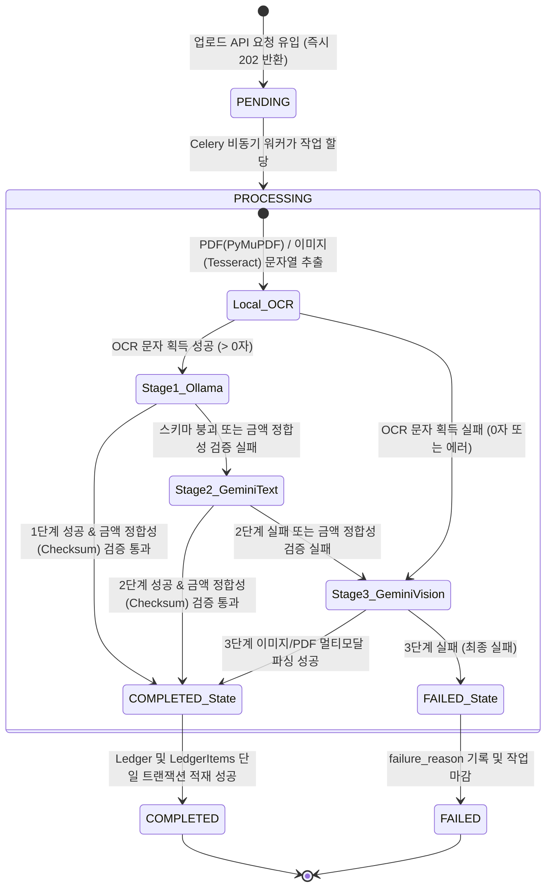

# Data Model: Receipt Hybrid Parsing Pipeline & Legacy Cleanup

**Feature Branch**: `022-receipt-hybrid-pipeline`

본 문서는 3단계 하이브리드 파이프라인에서 처리되는 데이터 규격(Pydantic DTO)과 백엔드 데이터 모델 간의 매핑 구조 및 상태 전이 규칙을 정의합니다.

---

## 1. 데이터 전송 객체 (Pydantic DTO)

기존 `ReceiptSchema` 구조는 단일 계약(Contract)을 유지하기 위해 호환성을 유지하되, 내부 LLM 프롬프트 지침에서 레거시 정규식 제안(`proposed_date_pattern`, `proposed_amount_pattern`) 생성을 제거하고 빈 값으로 통제합니다.

### 1.1 `ReceiptItemSchema`
영수증 상세 품목 정보를 담는 DTO입니다.
* `item_name` (str): 품목명
* `unit_price` (float): 단가
* `quantity` (int): 수량 (1 이상)
* `total_price` (float): 품목 합계 (`unit_price * quantity`와 일치해야 함)

### 1.2 `ReceiptSchema`
파이프라인 단계별(1, 2, 3단계) 추출 결과를 단일화하여 장고 트랜잭션 서비스로 넘기는 마스터 DTO입니다.
* `vendor_name` (str): 가맹점명
* `vendor_registration_number` (str): 10자리 사업자등록번호 (숫자만, 부재 시 "0000000000")
* `transaction_date` (str): 결제 로컬 시각 (YYYY-MM-DDTHH:MM:SS)
* `total_amount` (float): 총 결제 금액
* `category` (str): 지출 카테고리 (식비, 생활용품, 쇼핑, 교통, 문화/여가, 주거/통신, 의료/건강, 교육, 기타 중 1선택)
* `items` (list[ReceiptItemSchema]): 상세 품목 목록
* `proposed_date_pattern` (str, optional): 기본값 `""` (레거시 하위 호환성 전용)
* `proposed_amount_pattern` (str, optional): 기본값 `""` (레거시 하위 호환성 전용)

---

## 2. 작업 상태 전이 (ReceiptUploadJob Lifecycle)

`ReceiptUploadJob`은 영수증 업로드 및 파싱 비동기 작업의 라이프사이클을 추적합니다. 3단계 하이브리드 파이프라인 기동에 따른 상태 변화 흐름은 다음과 같습니다:

---

## 3. 영속화 데이터 모델 및 레거시 스키마 보존 규칙

### 3.1 `Ledger` & `LedgerItem` (활성)
* 강력한 ACID 트랜잭션 하에 `transaction.atomic()` 세션 내에서 동시에 저장되어야 합니다.
* 중복 가계부 레코드 생성 차단을 위해 `UniqueConstraint(user, vendor_registration_number, transaction_date, total_amount)`가 데이터베이스 레이어에서 완벽히 수호됩니다.

### 3.2 `MerchantTemplate` & `TemplateExecutionHistory` (비활성화/Deprecated)
* **스키마 상태**: DB 스키마 및 마이그레이션 이력은 100% 보존합니다.
* **비즈니스 상태**: 3단계 하이브리드 파이프라인에서 정적 정규식 기반 바이패스 및 캐시 자동 학습 로직을 차단하므로, 새 레코드가 생성되거나 조회되지 않는 정적 동결(Read-only/Deprecated) 상태로 전이합니다.
