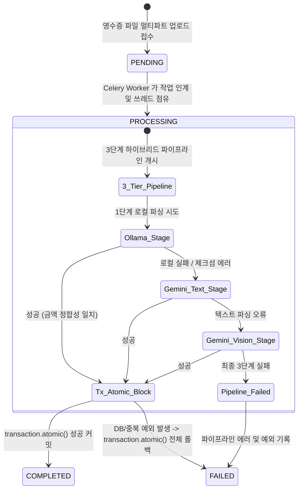

# Data Model and State Transitions: Receipt Async Load Testing

본 문서는 비동기 영수증 인입 및 부하 테스트 과정에서 정합성을 수호하기 위한 핵심 엔티티와 그 관계, 그리고 데이터베이스 및 애플리케이션 제약조건을 명시합니다.

---

## 1. 주요 엔티티 명세 (Key Entities)

### 1.1 ReceiptTask (비동기 영수증 처리 작업)
비동기 큐(Celery)에서 진행되는 영수증의 파싱 및 DB 적재 프로세스의 수명주기와 진행 정보를 관리하는 엔티티입니다.

* **속성 (Attributes)**:
  * `id`: UUID (Native UUIDv7 시계열 인덱싱 최적화) - 기본키
  * `user_id`: ForeignKey (to User) - 영수증을 업로드한 사용자 식별자
  * `file_name`: String - 업로드된 영수증의 원본 파일명
  * `file_path`: String - 스토리지 내 저장 경로 (WebP 변환 완료된 영수증 이미지 등)
  * `status`: Enum (PENDING, PROCESSING, COMPLETED, FAILED) - 작업 진행 상태
  * `parser_stage`: Enum (OLLAMA, GEMINI_TEXT, GEMINI_VISION, NONE) - 성공적으로 완료된 파이프라인 단계
  * `error_message`: Text (Nullable) - 작업 실패 시 기록되는 디버깅용 예외 로그
  * `ledger_id`: ForeignKey (to Ledger, Nullable, Set Null) - 성공적으로 생성/매핑된 가계부 마스터 레코드
  * `created_at`: DateTime - 작업 최초 인입 시간
  * `updated_at`: DateTime - 상태 변경 시간
* **유효성 규칙 (Rules)**:
  * 상태(`status`)가 `FAILED`인 경우, `error_message`가 반드시 공백이 아닌 문자열로 채워져야 합니다.
  * 상태(`status`)가 `COMPLETED`인 경우, `ledger_id` 필드가 연결되어 유효한 가계부 내역을 참조하고 있어야 합니다.

### 1.2 Ledger (가계부 마스터 원장)
영수증 파싱 결과로부터 추출되어 생성되는 가계부 내역의 마스터 레코드입니다.

* **속성 (Attributes)**:
  * `id`: UUID (Native UUIDv7) - 기본키
  * `user_id`: ForeignKey (to User) - 가계부 소유주 식별자
  * `vendor_name`: String - 가맹점/발행처 상호명
  * `vendor_registration_number`: String (Nullable) - 사업자 등록번호
  * `transaction_date`: DateTime (Timezone-aware) - 결제 승인 일시 (User.timezone 기준 UTC 정규화 반영)
  * `total_amount`: Decimal (Precision: 12, Scale: 2) - 총 결제 금액
  * `approval_number`: String (Nullable) - 결제 카드 승인번호 (중복 방어 핵심 필드)
  * `created_at`: DateTime
* **유효성 및 고유 제약 규칙 (Database Constraints)**:
  * 데이터베이스 수준 제약: `UNIQUE (user_id, vendor_registration_number, transaction_date, total_amount)` 복합 고유키로 동일 거래 내역의 중복 적재 차단.
  * 애플리케이션 수준 제약 (60초 임계창 알고리즘): 동일한 가맹점(`vendor_name`), 동일한 금액(`total_amount`), 그리고 60초 임계 시각 윈도우 내에 존재하는 승인번호(`approval_number`)가 동일하거나 비어있는 결제 내역이 이미 DB에 영속화되어 있는 경우 중복 건으로 판단하여 FAILED 실패 반환 및 적재 차단.

### 1.3 LedgerItem (가계부 상세 품목 내역)
마스터 가계부 레코드에 포함된 개별 세부 소비 품목 리스트입니다.

* **속성 (Attributes)**:
  * `id`: UUID (Native UUIDv7) - 기본키
  * `ledger_id`: ForeignKey (to Ledger, Cascade On Delete) - 마스터 원장 식별자
  * `item_name`: String - 품목명 (예: "콜라", "A4 용지")
  * `quantity`: Integer (Default: 1) - 수량
  * `unit_price`: Decimal (Precision: 10, Scale: 2) - 단가
  * `category`: String - 품목 카테고리 (기본값: '미분류')
  * `created_at`: DateTime
* **유효성 규칙 (Rules)**:
  * 파싱되어 유입된 `category` 값이 없거나, 시스템이 정의한 카테고리 사전에 존재하지 않는 값인 경우, 데이터베이스 적재 직전 '미분류'로 자동 강제 매핑 및 보정되어 영속화됩니다.

---

## 2. 상태 전이 및 트랜잭션 경계 (State Transitions & Transaction Boundaries)

### 2.1 트랜잭션의 원자성(Atomicity) 경계
* `Tx_Atomic_Block` 단계는 Django ORM의 `transaction.atomic()` 데코레이터 또는 컨텍스트 매니저로 완벽히 둘러싸여 진행됩니다.
* 단 하나의 트랜잭션 내에서 다음 작업이 순차 진행됩니다:
  1. `Ledger` 마스터 레코드 유효성 검사 및 중복 제거(60초 임계창 대조) 수행.
  2. `Ledger` 마스터 레코드 DB Insert.
  3. `LedgerItem` 배열 내의 모든 항목을 루프 돌며 카테고리 유효성 보정 후 DB Bulk Insert.
  4. `ReceiptTask`의 `status`를 `COMPLETED`로 변경하고, 생성된 `ledger_id`를 업데이트.
* **롤백 시나리오**: 1~4번 중 단 하나의 작업이라도 에러(예: RDBMS 고유키 중복 예외, DB 커넥션 타임아웃, 카테고리 필드 오염 등)를 발생시키면, 데이터베이스는 즉시 `ROLLBACK` 처리되어 생성 중이던 `Ledger` 및 `LedgerItem` 조각들을 완벽하게 파괴하고 Dirty State가 남는 현상을 방지합니다. 이후 `ReceiptTask` 테이블의 상태를 단독 트랜잭션으로 `status=FAILED` 및 `error_message=에러내용`으로 업데이트합니다.
