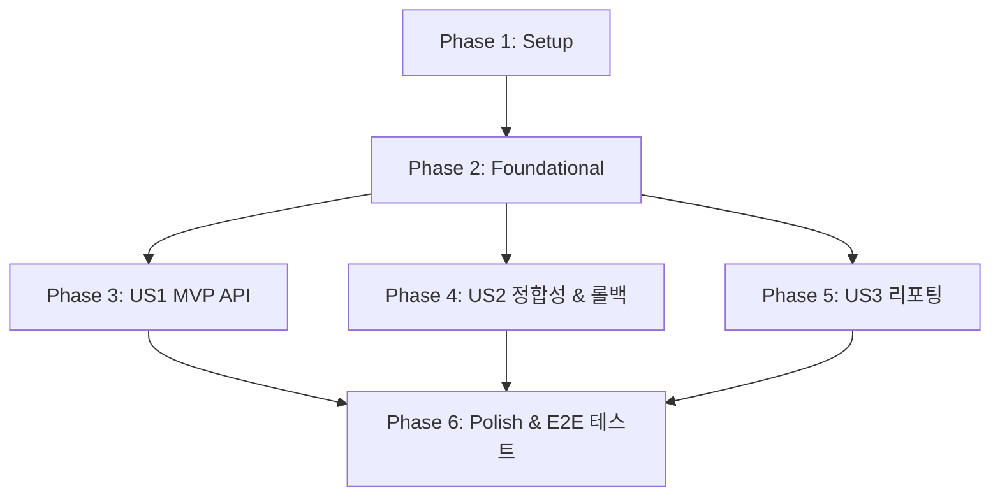

# Tasks: Receipt Async Load Testing

**Input**: Design documents from `/specs/023-receipt-async-load-test/`

**Prerequisites**: plan.md, spec.md, research.md, data-model.md, contracts/upload-api.md, quickstart.md

**Tests**: 본 피처의 핵심 가치인 '트랜잭션 정합성 및 부하 검증'을 증명하기 위해 테스트 코딩 태스크를 각 사용자 스토리의 구현 이전에 필수적으로 구성 및 배치합니다.

**Organization**: 각 태스크는 독립적 검증이 가능한 소프트웨어 증분을 달성하기 위해 사용자 스토리별로 철저히 조직화되었습니다.

---

## Phase 1: Setup (Shared Infrastructure)

**Purpose**: 프로젝트 구성 설정 튜닝 및 부하 테스트 데이터셋 환경 셋업

- [ ] T001 `backend/backend/settings.py` 및 `backend/backend/celery.py`에 DB 커넥션 풀 제약(api-server 최대 5개, celery 워커 최대 3개) 및 Celery 워커 프리페치/동시성 관련 아키텍처 튜닝 설정 검증
- [ ] T002 [P] `backend/tests/ledgers/` 경로 하위에 부하 테스트용 모의 영수증 이미지 데이터셋(정상 영수증 45개, 중복/손상 영수증 5개) 배치 구성

---

## Phase 2: Foundational (Blocking Prerequisites)

**Purpose**: 사용자 스토리 개발 전 완결되어야 하는 비동기 작업 추적 데이터 레이어 구축

**⚠️ CRITICAL**: 본 단계의 데이터 모델 및 마이그레이션이 완료되기 전까지는 어떠한 사용자 스토리도 구현을 시작할 수 없습니다.

- [ ] T003 `backend/ledgers/models.py` 경로에 비동기 영수증 작업 진행 상태를 추적할 `ReceiptTask` 데이터 모델(id UUIDv7, status Enum, parser_stage Enum, error_message, ledger_id 매핑 등) 정의
- [ ] T004 `backend/ledgers/migrations/` 하위에 `ReceiptTask` 테이블 생성을 위한 데이터베이스 마이그레이션을 생성하고 반영 (`uv run python manage.py migrate`)
- [ ] T005 [P] `backend/ledgers/tasks.py` 경로 내에 Celery 비동기 3단계 파이프라인 기동 및 Ollama base64 디코딩 접두사 충돌 방어 예외 처리가 가미된 태스크 기본 뼈대 함수 구현

**Checkpoint**: Foundational 인프라 구축 완료. 이제 각 사용자 스토리 구현과 병렬 테스트 실행이 가능합니다.

---

## Phase 3: User Story 1 - 영수증 50종 일시 업로드 및 비동기 처리 (Priority: P1) 🎯 MVP

**Goal**: 대량의 영수증을 한 번에 전송해도 서버 타임아웃 없이 즉시 접수(202 Accepted)하고 Celery 비동기 큐에 작업을 적재

**Independent Test**: 50개의 이미지 파일 업로드 요청 시 5초 이내에 HTTP 202 응답과 함께 발급된 `task_id` 목록이 유효하게 반환되는지 확인

### Tests for User Story 1

> **NOTE: 본 테스트를 먼저 작성하고 실행하여 실패(Red) 상태가 됨을 먼저 입증하십시오.**

- [ ] T006 [P] [US1] `backend/tests/ledgers/test_load_testing.py` 경로에 다중 파일(50개) 벌크 업로드 API 요청 전송 및 202 Accepted 응답/태스크 목록 수신을 검증하는 US1 단위 통합 테스트 구현

### Implementation for User Story 1

- [ ] T007 [US1] `backend/ledgers/views.py` 경로에 최대 50개 파일 multipart 수집 한계를 제어하고 즉각적인 ReceiptTask 생성 및 Celery 비동기 작업 디스패치를 수행하는 `POST /api/ledgers/receipts/bulk-upload/` 뷰 로직 구현
- [ ] T008 [US1] `backend/backend/urls.py` 경로 내에 벌크 업로드 엔드포인트 URL 라우팅 추가

**Checkpoint**: User Story 1이 완전하게 작동하여 50종 영수증의 API 타임아웃 없는 비동기 수집이 E2E 검증 완료됩니다.

---

## Phase 4: User Story 2 - 비동기 처리 중 데이터 정합성 보장 및 중복 생성 방지 (Priority: P2)

**Goal**: 병렬 DB 쓰기 환경 속에서도 60초 임계 시각 시간 윈도우 기반 중복 결제 방어 및 개별 파일 파싱 오류 시 완벽한 atomic 트랜잭션 롤백 수호

**Independent Test**: 중복 영수증 유입 시 1건만 최종 데이터베이스에 적재되고, 실패 건은 DB 찌꺼기(LedgerItem 고아) 없이 완전 롤백되는지 증명

### Tests for User Story 2

> **NOTE: 본 테스트를 먼저 작성하여 기존의 다중 동시성 누수가 실패함(Red)을 확인하십시오.**

- [ ] T009 [P] [US2] `backend/tests/ledgers/test_load_testing.py` 경로에 중복 업로드 윈도우 방어 알고리즘 검증 및 고의 에러 유발 영수증 유입 시 Ledger/LedgerItem 테이블의 100% 롤백 무결성을 검증하는 US2 단위 통합 테스트 구현

### Implementation for User Story 2

- [ ] T010 [US2] `backend/ledgers/services.py` 경로에 영수증 적재 비즈니스 로직에 `transaction.atomic()`을 명시적으로 적용하고, DB 고유키 위반 에러 및 60초 카드 승인 임계창 연속 결제 방어 조건 정밀 매칭 알고리즘 고도화
- [ ] T011 [US2] `backend/ledgers/tasks.py` 경로 내의 Celery 예외 핸들링 블록에 파이프라인 전체 실패 감지 시 `ReceiptTask` 상태를 FAILED로 마크하고 에러 원인을 `error_message`에 누수 없이 기록하도록 통제

**Checkpoint**: User Story 2가 완결되어 물리적 병렬 부하 환경에서도 DB의 트랜잭션 원자성과 중복 차단 무결성이 100% 입증됩니다.

---

## Phase 5: User Story 3 - 부하 테스트 실행 결과 리포팅 및 모니터링 (Priority: P3)

**Goal**: 50종 부하 테스트 완결 후, 전체 처리 성능 지표 및 하이브리드 파이프라인 단계별 성공율 집계 메트릭 자동 출력

**Independent Test**: 부하 테스트 실행 종료 직후, 집계 모듈을 기동하여 실행 성능 통계 리포트 텍스트가 정상 출력되는지 검증

### Tests for User Story 3

- [ ] T012 [P] [US3] `backend/tests/ledgers/test_load_testing.py` 경로에 부하 테스트 종합 종료 시 메트릭 수집 및 리포트 집계 로직의 작동 무결성을 증명하는 US3 단위 테스트 구현

### Implementation for User Story 3

- [ ] T013 [US3] `backend/ledgers/services.py` 또는 테스트 헬퍼 내에 `ReceiptTask` 목록의 생성/갱신 시간을 대조해 총 병렬 소요 시간을 계산하고 3-Tier 단계별 매칭율 통계를 표 및 텍스트 형태로 stdout 출력하는 리포터 모듈 구현

**Checkpoint**: User Story 3이 완료되어 부하 테스트 이후 시스템 튜닝 성과를 가시성 있게 한눈에 모니터링할 수 있습니다.

---

## Phase 6: Polish & Cross-Cutting Concerns

**Purpose**: 크로스 플랫폼 대칭 실행 툴링 배포 및 종합 부하 테스트 실행 정합성 최종 패스

- [ ] T014 [P] `scripts/run_load_test.ps1` 및 `scripts/run_load_test.sh` 경로 하위에 Windows와 Linux 환경 모두에서 멱등하게 50종 영수증 부하 테스트 및 DB 튜닝 가동 상태를 원버튼 E2E 가동시키는 이중 대칭형 실행 스크립트 작성
- [ ] T015 [P] `docs/receipt-async-load-test-report.md` 경로에 50종 부하 테스트의 최종 모니터링 가이드라인 및 발견된 데이터베이스 병목 한계 성능 분석 보고 문서 작성
- [ ] T016 `backend/tests/ledgers/test_load_testing.py` 통합 부하 테스트를 실제로 기동하여 50종 벌크 처리(정상 45건 성공 적재, 중복/에러 5건 차단 및 100% 롤백 완료) E2E 시나리오를 100% 통과(Pass)시킴

---

## Dependencies & Execution Order

### Phase Dependencies



* **Setup (Phase 1)**: 즉시 시작 가능.
* **Foundational (Phase 2)**: Setup 완료 후 실행 가능하며, 모든 사용자 스토리 페이즈를 **블로킹(Blocking)**함.
* **User Stories (Phase 3 ~ 5)**: Foundational 단계의 데이터 모델이 완성된 후, US1, US2, US3은 서로 다른 파일 영역을 다루므로 병렬 개발 및 개별 테스트 작성이 즉시 가능함.
* **Polish (Phase 6)**: 모든 사용자 스토리가 독립 작동 검증을 통과한 후 통합 실행 및 횡단 실행 스크립트를 작성하여 전체 무결성 완수.

---

## Parallel Example: User Story 1

```bash
# 1. US1, US2, US3의 테스트 스텁을 병렬로 동시 작성 가능 (T006, T009, T012)
Task: "T006 [P] [US1] backend/tests/ledgers/test_load_testing.py 내 API 업로드 단위 테스트 구현"
Task: "T009 [P] [US2] backend/tests/ledgers/test_load_testing.py 내 트랜잭션 롤백 단위 테스트 구현"

# 2. Setup 단계의 인프라 튜닝 및 Mock 데이터셋 배치 병렬 처리 가능 (T001, T002)
Task: "T001 settings.py 내 커넥션 제한 점검"
Task: "T002 test_load_testing.py 용 mock 이미지셋 구성"
```

---

## Implementation Strategy

### MVP First (User Story 1 Only)
1. **Phase 1 (Setup)** 완결.
2. **Phase 2 (Foundational)** 완결 (ReceiptTask 데이터 모델 구축).
3. **Phase 3 (User Story 1)** 완결 (API 50종 일시 업로드 및 202 즉각 접수 보장).
4. **MVP 검증**: `test_load_testing.py`에서 US1 테스트만 단독 구동하여 5초 이내 접수 완료 상태를 1차 승인.

### Incremental Delivery
1. API 서버 수집 인프라 인도 (US1) -> 202 접수 및 비동기 Celery 태스크 상태 영속화.
2. 트랜잭션 수호 및 중복 결제 방어 엔진 인도 (US2) -> 병렬 쓰기 환경에서 60초 임계창 카드 승인 대조 중복 방어 정합성 및 atomic 롤백 무결성 안착.
3. 성능 리포팅 모듈 탑재 및 대칭 툴링 스크립트 릴리즈 (US3, Polish) -> 부하 테스트 원버튼 자동 가동 및 실행 결과 종합 시각화.
