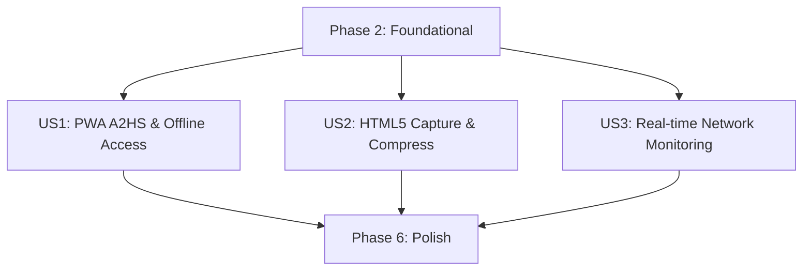

# Tasks: PWA Manifest/Service Worker Cache & Mobile Camera Integration

본 문서는 `024-pwa-camera-integration` 피처 브랜치의 TDD(테스트 주도 개발) 기반 구현을 위해 세분화된 태스크 실행 가이드라인입니다.

---

## Phase 1: Setup (Shared Infrastructure)

**Purpose**: PWA 자산 및 모바일 카메라 연동에 필요한 프론트엔드 폴더 구조 구성 및 빌드 환경 준비

- [ ] T001 PWA 정적 자산 폴더 `frontend/public/` 및 로고 아이콘 디렉토리 `frontend/public/icons/` 구조 확인 및 생성
- [ ] T002 린팅 도구 `eslint` 및 포매터 `prettier`가 PWA 설정 파일(`manifest.webmanifest`, `sw.js`) 및 테스트 파일을 예외 없이 포맷팅할 수 있도록 설정 검증

---

## Phase 2: Foundational (Blocking Prerequisites)

**Purpose**: 정적 자산 캐싱 서비스 워커 및 매니페스트 설정을 구성하는 핵심 인프라 마련

**⚠️ CRITICAL**: 이 페이즈의 기반 작업이 성공적으로 완료 및 빌드 확인되기 전에는 사용자 스토리 구현에 진입할 수 없습니다.

- [ ] T003 `frontend/public/manifest.webmanifest` 경로에 PWA 구동용 표준 웹 앱 매니페스트 속성(이름, standalone 모드, 테마 컬러, 아이콘 리스트) 정의 및 생성
- [ ] T004 `frontend/public/sw.js` 경로에 서비스 워커의 기본 라이프사이클 이벤트(`install`, `activate`, `fetch`) 바인딩 뼈대 구현
- [ ] T005 [P] `frontend/src/registerServiceWorker.js` 경로에 브라우저의 서비스 워커 지원 여부를 판별하여 `sw.js`를 등록 및 예외 처리하는 활성화 헬퍼 구현
- [ ] T006 [P] `frontend/src/main.js` 파일에 `registerServiceWorker.js`를 연동 마운트하여 앱 부트스트랩 시점에 SW가 정상 구동되도록 제어
- [ ] T007 `frontend/vite.config.js` 내에 빌드 시 매니페스트 서빙 설정 및 개발용 로컬 HTTPS SSL(basic-ssl) 임시 개발 바인딩 설정 구성

**Checkpoint**: PWA 설치 명세 및 서비스 워커 가동 뼈대가 준비되어 독립적인 사용자 스토리 렌더링으로 진행할 준비가 완료되었습니다.

---

## Phase 3: User Story 1 - 홈 화면에 가계부 앱 추가 (A2HS) 및 오프라인 접속 (Priority: P1) 🎯 MVP

**Goal**: PWA 정적 자산 캐싱을 통한 오프라인 구동 환경 구축 및 iOS Safari 전용 수동 설치 툴팁 제공

**Independent Test**: 기기 비행기 모드 실행 상태에서, 홈 화면 설치 아이콘 터치 시 3초 이내에 기본 가계부 UI 프레임워크가 렌더링되며, iOS 환경 접속 시 하단 설치 가이드가 노출되는지 확인.

### Tests for User Story 1 (TDD 필수 작성) ⚠️

> **NOTE: 구현에 앞서 테스트 코드를 먼저 작성하고, 실패 상태임을 먼저 검증해야 합니다.**

- [ ] T008 [P] [US1] `frontend/tests/unit/iOSInstallTooltip.spec.js` 경로에 iOS 환경 식별 조건 만족 시 설치 권장 안내 툴팁이 정상 마운트 및 노출되는지 검증하는 단위 테스트 작성
- [ ] T009 [P] [US1] `frontend/tests/unit/serviceWorkerCache.spec.js` 경로에 서비스 워커 가로채기(fetch) 동작 시 정적 리소스(js, css) 캐시스토어 바인딩 응답 무결성을 검증하는 mock 테스트 작성

### Implementation for User Story 1

- [ ] T010 [US1] `frontend/src/components/iOSInstallTooltip.vue` 경로에 HSL 테마와 모서리 둥글기(`rounded-2xl`) 규격을 만족하며 iOS 기기 환경 및 standalone 미구동 상태를 판별해 툴팁을 표시하는 UI 컴포넌트 구현
- [ ] T011 [US1] `frontend/src/components/NavBar.vue` 컴포넌트 상단에 `iOSInstallTooltip.vue`를 이식하고 모바일 뷰 여백(`mt-4`)을 조율하여 마운트 제어 연동
- [ ] T012 [US1] `frontend/public/sw.js` 내에 오프라인 상태 대응을 위한 Stale-While-Revalidate 캐싱 라우팅 알고리즘 구현 (HTML, CSS, JS, 공통 자산 한정)

**Checkpoint**: 이 시점에서 오프라인 환경 하의 기본 UI 기동 및 iOS 전용 설치 유도가 정상 동작하며, 모바일 설치성 가치가 확보됩니다.

---

## Phase 4: User Story 2 - HTML5 Capture API 기반 모바일 영수증 촬영 및 업로드 (Priority: P1)

**Goal**: 모바일 네이티브 카메라 촬영 기능 활성화 및 10MB 이상 원본 이미지의 Canvas 압축 전송 처리

**Independent Test**: 가계부 촬영 단추 입력 시 네이티브 카메라 뷰가 기동되며, 촬영 완료된 이미지 버퍼가 1.5MB 이하로 다운사이징되어 미리보기 썸네일로 화면에 표시되고 REST API로 안전하게 전달되는지 확인.

### Tests for User Story 2 (TDD 필수 작성) ⚠️

- [ ] T013 [P] [US2] `frontend/tests/unit/imageCompressor.spec.js` 경로에 대용량(10MB) 이미지 데이터 인입 시 Canvas 리사이징 모듈에 의해 긴 축이 1920px 크기로 변환되고 1.5MB 이하의 JPEG Blob으로 압축 처리됨을 증명하는 TDD 테스트 작성
- [ ] T014 [P] [US2] `frontend/tests/unit/ReceiptCapture.spec.js` 경로에 카메라 권한 접근 거부 시 일반 갤러리/파일 파일 첨부로 Fallback 모듈이 안전하게 유연 전이됨을 입증하는 테스트 작성

### Implementation for User Story 2

- [ ] T015 [US2] `frontend/src/utils/imageCompressor.js` 경로에 Canvas 엘리먼트에 원본 비율로 드로잉하여 이미지 해상도 조정(최대 1920px) 및 `canvas.toBlob` 80% 화질의 JPEG 변환을 지원하는 순수 자바스크립트 압축 유틸리티 구현
- [ ] T016 [US2] 가계부 신규 작성 모달(`frontend/src/components/LedgerEditModal.vue` 등)에 `<input type="file" accept="image/*" capture="environment">` 카메라 전용 업로드 엘리먼트 구현 및 권한 거부 상황 대비 갤러리 업로드 Fallback 안내 문구 이식
- [ ] T017 [US2] 촬영 완료된 영수증 정보의 `rawFile`에서 미리보기 임시 Blob 주소(`URL.createObjectURL`)를 추출해 바인딩하고 가중치 상태를 표시하는 임시 업로드 이미지 썸네일 미리보기 UI 이식
- [ ] T018 [US2] `frontend/src/services/api.js` (또는 가계부 전송 모듈) 내부에 압축 완료된 `compressedBlob` 바이너리를 FormData의 `file` 필드로 포장하여 백엔드 `/api/ledgers/upload/` API 서버에 전달하는 전송 연동 구축

**Checkpoint**: 모바일 후면 카메라 영수증 촬영 가시화 및 대용량 원본 파일의 메모리 세션 압축 전송이 안전하게 통합됩니다.

---

## Phase 5: User Story 3 - Service Worker의 네트워크 상태 감지 및 사용자 피드백 제공 (Priority: P2)

**Goal**: 인터넷 연결 유실 및 복구 상태의 실시간 브라우저 감지 및 알림 피드백 노출

**Independent Test**: 브라우저 오프라인 토글 시 "오프라인 상태입니다" 경고 배너가 나타나고, 복구 시 상태가 온전하게 동기화 복구됨을 확인.

### Tests for User Story 3 (TDD 필수 작성) ⚠️

- [ ] T019 [P] [US3] `frontend/tests/unit/networkStatus.spec.js` 경로에 브라우저 전역 `online`/`offline` 모니터링 이벤트 핸들러가 가동되었을 때 반응형 상태 구조(`isOnline`)에 정합성 있게 매핑 동기화되는지 확인하는 테스트 작성

### Implementation for User Story 3

- [ ] T020 [US3] `frontend/src/utils/networkMonitor.js` 경로에 전역 `window.addEventListener('offline' / 'online')`를 구독하여 네트워크 변경 상태를 프론트엔드가 관측 가능한 상태로 래핑하여 발행하는 모니터러 모듈 구현
- [ ] T021 [US3] `frontend/src/components/NetworkStatusToast.vue` 경로에 HSL 포인트 컬러 및 스무스한 페이드인 전환 애니메이션이 설계에 맞게 접목된 네트워크 변동 경고용 플로팅 토스트 컴포넌트 구현
- [ ] T022 [US3] 최상위 컨테이너 `frontend/src/App.vue`에 `NetworkStatusToast` 컴포넌트를 이식하여 전역 사용자 화면에 네트워크 실시간 흐름 피드백 제공 연동

**Checkpoint**: 오프라인 상태 전환 경고가 화면에 제공되며 모든 개별 사용자 스토리 요건이 완료됩니다.

---

## Phase 6: Polish & Cross-Cutting Concerns

**Purpose**: PWA 오프라인 렌더링 향상 및 카메라 디바이스 UX 예외 처리 최적화

- [ ] T023 [P] PWA 오프라인 캐시 히트율 향상을 위한 빌드 리소스 해싱 누락 여부 점검 및 최적화
- [ ] T024 [P] 카메라 권한 거부 상황에서 파일 갤러리 업로드 복구 시의 UX 가이드라인 기반 경고 모달 얼라인 확인
- [ ] T025 `frontend/public/sw.js` 캐시 무효화 및 새 버전 배포 감지 시 사용자에게 릴리즈 제안 모달을 표출하는 버전 관리 정책 검증

---

## Dependencies & Execution Order

### Phase Dependencies
1. **Setup (Phase 1)**: 프로젝트의 기본 구조를 다지는 준비 단계로 즉시 실행 가능합니다.
2. **Foundational (Phase 2)**: Setup 단계 완료 후 순차 구동되며, Manifest 및 서비스 워커 기동이 완료될 때까지 **모든 사용자 스토리를 블로킹**합니다.
3. **User Stories (Phase 3 ~ 5)**: Foundational 단계가 완료되면 진행할 수 있습니다. 각 사용자 스토리는 상호 의존성을 최소화하여 독립적인 개발과 테스트가 가능합니다.
4. **Polish (Phase 6)**: 모든 사용자 스토리가 완료되고 작동 검증이 끝난 후 최종 다듬기를 진행합니다.

### User Story Dependencies



### Within Each User Story
- **TDD 원칙 적용**: 각 스토리 페이즈에 명시된 TDD 테스트 작성 태스크(`[USx]` 마크된 테스트 태스크)를 구현부보다 **무조건 먼저** 작성하여 실행 결과가 실패(Fail)함을 보장한 뒤, 실제 컴포넌트와 비즈니스 로직 소스 코드를 생성해야 합니다.
- **순서**: 테스트 케이스 설계 ➔ 모델/유틸 구조 코딩 ➔ 서비스 로직 및 API 연동 코딩 ➔ 컴포넌트 UI 이식 및 수용 확인.

### Parallel Opportunities
- Phase 1의 린터 검증 작업은 병렬 가능합니다.
- Phase 2의 SW 구성 등록(`T005`, `T006`) 작업은 병렬 진행이 가능합니다.
- **TDD 병렬성**: 각 사용자 스토리 내부의 `[P]` 마크된 단위 테스트 작성 및 Canvas 압축 모듈 테스트는 독립적인 파일 경로이므로 다른 작업자나 병렬 프로세스로 동시 설계가 가능합니다.

---

## Parallel Example: User Story 2

```bash
# User Story 2의 독립 단위 테스트들을 병렬 기동:
Task: "T013 [P] [US2] frontend/tests/unit/imageCompressor.spec.js 이미지 압축 유틸리티 TDD 테스트 작성"
Task: "T014 [P] [US2] frontend/tests/unit/ReceiptCapture.spec.js 카메라 권한 거부 Fallback 단위 테스트 작성"

# 테스트 실패 상태 확보 후, 유틸 압축 기능과 화면 HTML 캡처 마크업을 동시 작업:
Task: "T015 [US2] frontend/src/utils/imageCompressor.js Canvas 압축 유틸리티 구현"
Task: "T016 [US2] LedgerEditModal 내 capture="environment" 카메라 업로드 엘리먼트 구현"
```

---

## Implementation Strategy

### MVP First (User Story 1 & 2 Focus)
1. **Phase 1 & 2 완료**: 정적 매니페스트 및 서비스 워커 가동 완료.
2. **Phase 3 (User Story 1 - MVP) 최우선 구현**: 오프라인 대시보드 구조 및 iOS 툴팁 마운트.
3. **Phase 4 (User Story 2) 구현**: 모바일 후면 카메라 촬영 및 1.5MB 용량 Canvas 압축 전송 E2E 무결성 완수.
4. **MVP 검증**: 기기 오프라인 기동 ➔ 온라인 복구 ➔ 카메라 영수증 촬영 및 최적화 전송 테스트 성공 시 1차 릴리즈.

### Incremental Delivery
- **릴리즈 1 (MVP)**: 오프라인 캐싱, iOS 툴팁 유도, 실물 모바일 기기 카메라 촬영 및 리사이징 업로드.
- **릴리즈 2 (네트워크 모니터링)**: 실시간 기기 네트워크 유실 감지 및 HSL 경고 배너 표출.
- **릴리즈 3 (배포 버전 관리)**: 서버 상의 자산 버전 업데이트 자동 감지 및 새로고침 제안 UI 도입.
