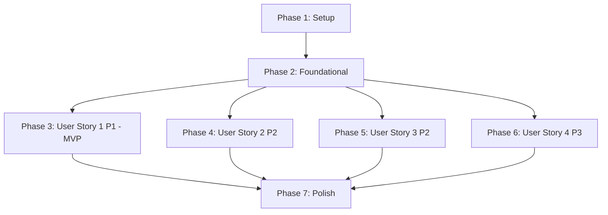

# Tasks: VAPID V2 웹 푸시 발송 큐 파이프라인

**Input**: Design documents from `/specs/026-vapid-push-queue/`

**Prerequisites**: plan.md (required), spec.md (required for user stories), research.md, data-model.md, contracts/

**Tests**: TDD(테스트 주도 개발) 방식의 구현을 위해 각 사용자 스토리 페이즈마다 테스트 태스크를 필수로 포함합니다. 프로젝트 헌법 제VIII조(하이브리드 테스트 전략)에 의거하여, DB 결합 백엔드 테스트는 `django.test.TestCase`를 상속받아 `setUpTestData(cls)`를 사용하고, DB 조회가 없는 순수 유틸리티 테스트는 `unittest.TestCase`를 상속하여 장고 부트스트랩을 우회하도록 구성합니다.

**Organization**: 태스크들은 독립적인 개발과 테스트가 가능하도록 사용자 스토리별로 그룹화 및 조직화되어 있습니다.

## Format: `[ID] [P?] [Story] Description`

- **[P]**: 병렬 처리 가능 (수정하는 파일이 다르고, 다른 미완성 태스크에 의존하지 않는 경우)
- **[Story]**: 해당 태스크가 속한 사용자 스토리 라벨 (예: US1, US2, US3, US4)
- 작업 설명 내에 명확한 소스 파일 경로를 명시합니다.

---

## Phase 1: Setup (Shared Infrastructure)

**Purpose**: 프로젝트 초기화 및 공유 기본 인프라 구성

- [ ] T001 backend/pyproject.toml 경로에 pywebpush, py-vapid, httpx[http2] 패키지 의존성을 추가하고 `uv sync`를 실행하여 가상환경 동기화
- [ ] T002 [P] backend/.env.example 경로에 VAPID 키 쌍(공개키/비밀키/이메일) 및 GOOGLE_APPLICATION_CREDENTIALS_JSON 등 신규 환경 변수 템플릿 추가
- [ ] T003 [P] backend/src/apps/notifications/ 디렉토리에 신규 Django 앱 폴더 구조 생성 및 __init__.py, apps.py 기본 설정 구성
- [ ] T004 [P] backend/src/config/settings/base.py 경로에 apps.notifications 앱 등록 및 VAPID 관련 설정 환경 변수 바인딩 추가
- [ ] T005 backend/src/config/urls.py 경로에 /api/v1/notifications/ 라우팅 추가 및 backend/src/apps/notifications/urls.py 생성
- [ ] T006 [P] docker-compose.yml 경로에 notifications 전용 큐와 분리 기동을 위한 notification_worker 서비스 정의 추가

---

## Phase 2: Foundational (Blocking Prerequisites)

**Purpose**: 사용자 스토리 개발을 위해 반드시 완료되어야 하는 핵심 DB 스키마 및 공통 인프라 마련

**⚠️ CRITICAL**: 이 페이즈의 모든 태스크가 완료되기 전에는 어떠한 사용자 스토리 구현도 시작할 수 없습니다.

- [ ] T007 backend/src/apps/accounts/models.py 경로의 UserPushSubscription 모델에 is_active, device_hint 필드를 추가하는 마이그레이션 파일 작성 및 생성
- [ ] T008 backend/src/apps/notifications/models.py 경로에 NotificationTask(UUIDv7 PK, idempotency_key 고유 제약 포함) 및 NotificationLog(30일 감사용) 모델 구현
- [ ] T009 backend/src/apps/notifications/migrations/0001_initial.py 마이그레이션 생성 및 backend/src/ manage.py migrate 명령으로 데이터베이스 스키마 적용
- [ ] T010 [P] backend/src/apps/notifications/sender.py 경로에 VAPID 서명 및 외부 푸시 서비스 발송 처리를 위한 pywebpush 연동 래퍼의 추상 인터페이스 및 기본 뼈대 구현
- [ ] T011 [P] backend/src/apps/notifications/services.py 경로에 Redis 분산 락 및 DB 60초 윈도우 조회를 포함한 멱등성 큐 적재 서비스(enqueue_* 함수) 인터페이스 기본 설계 구성
- [ ] T012 backend/tests/ conftest.py 또는 apps/notifications/용 테스트 환경 설정을 구성하여 pytest 기반 Django 테스트 구동 환경 마련

**Checkpoint**: 기반 인프라 및 DB 마이그레이션 완료. 이제 각 사용자 스토리 페이즈를 병렬 또는 우선순위대로 독립 개발 및 테스트할 수 있습니다.

---

## Phase 3: User Story 1 - 웹 푸시 알림 구독 및 수신 (Priority: P1) 🎯 MVP

**Goal**: 사용자가 브라우저에서 알림을 허용하면 구독 정보를 백엔드에 안전하게 등록하고, 저장된 구독 정보를 기반으로 디바이스에 웹 푸시를 직접 수신할 수 있게 합니다.

**Independent Test**: 사용자의 브라우저 또는 mock 구독 엔드포인트에 테스트 발송을 수행하여 알림이 정상적으로 수신되는지 확인하여 단독 검증합니다.

### Tests for User Story 1 (TDD - Write FIRST, Fail FIRST)

- [ ] T013 [P] [US1] backend/tests/apps/notifications/test_views.py 경로에 구독 등록(POST), 해제(DELETE), 목록 조회(GET) 및 VAPID 공개키 조회(GET) API의 계약 및 기능 테스트 작성 (DB 결합: django.test.TestCase 상속)
- [ ] T014 [P] [US1] backend/tests/apps/notifications/test_sender.py 경로에 pywebpush 호출을 통한 VAPID 페이로드 암호화 및 발송 모듈의 단위 테스트 작성 (순수 유틸리티: unittest.TestCase 상속)

### Implementation for User Story 1

- [ ] T015 [P] [US1] backend/src/apps/notifications/serializers.py 경로에 UserPushSubscriptionSerializer 직렬화 클래스 구현 및 유효성 검사 추가
- [ ] T016 [US1] backend/src/apps/notifications/views.py 경로에 구독 등록, 해제, 조회 API 뷰 및 VAPID 공개키 엔드포인트 뷰 구현 (T013 테스트 통과)
- [ ] T017 [P] [US1] frontend/public/sw.js 경로의 서비스 워커 파일에 push 및 notificationclick 이벤트 핸들러 구현 (chrome-extension 등 비-HTTP 스키마 캐시 예외 방어 코드 필수 유지)
- [ ] T018 [P] [US1] frontend/src/services/notificationService.js 경로에 구독 등록/해제 백엔드 API 연동 모듈 구현
- [ ] T019 [US1] frontend/src/pages/Settings.vue 경로에 알림 On/Off 토글 UI 섹션을 기존 설정 레이아웃에 통합 추가하고 서비스 워커 연동 로직 구현
- [ ] T020 [US1] pytest를 기동하여 US1 관련 백엔드 API 및 발송 유틸리티 테스트가 모두 통과하는지 확인 검증

**Checkpoint**: User Story 1 구현 완료. 구독 정보를 CRUD 하고 브라우저에서 알림을 수신하는 전체 흐름이 독립적으로 동작하고 검증 가능합니다.

---

## Phase 4: User Story 2 - 비동기 백그라운드 큐를 통한 알림 발송 (Priority: P2)

**Goal**: 가계부 이벤트가 발생했을 때 메인 비즈니스 로직을 방해하지 않고 독립된 Celery 백그라운드 큐(notifications)를 통해 비동기식으로 실시간 알림을 발송하며, 실패 시 지수 백오프 기반으로 자동 재시도합니다.

**Independent Test**: 영수증 파싱 API 완료 또는 예산 임계값 초과 이벤트를 발생시킨 후, 알림 큐에 비동기로 태스크가 적재되고 독립 워커가 해당 이벤트를 감지하여 발송에 성공하는지 검증합니다.

### Tests for User Story 2 (TDD - Write FIRST, Fail FIRST)

- [ ] T021 [P] [US2] backend/tests/apps/notifications/test_tasks.py 경로에 Celery 비동기 발송 태스크(send_push_notification_task, dispatch_user_notifications_task) 및 Redis 락 + DB 60초 윈도우 중복 방지 멱등성 테스트 작성 (DB 결합: django.test.TestCase 상속)

### Implementation for User Story 2

- [ ] T022 [P] [US2] backend/src/apps/notifications/tasks.py 경로에 send_push_notification_task(지수 백오프 재시도 포함, max_retries=3) 및 dispatch_user_notifications_task 비동기 Celery 태스크 구현 (T021 테스트 통과)
- [ ] T023 [US2] backend/src/apps/ledgers/tasks.py 경로의 extract_receipt_task 영수증 파싱 완료 블록 내에 알림 큐 적재 트리거(enqueue_receipt_notification) 로직 연동
- [ ] T024 [US2] backend/src/apps/ledgers/views.py 또는 services에서 월별 예산 임계값(80%) 초과 감지 시 알림 큐 적재 트리거(enqueue_budget_alert_notification) 로직 연동
- [ ] T025 [US2] pytest를 기동하여 Celery 비동기 태스크 및 멱등성 이중 방어 로직의 단위/통합 테스트 통과 확인

**Checkpoint**: User Story 2 구현 완료. 비동기 알림 전용 Celery 큐 및 이벤트 트리거 연동이 정상 작동하여 비동기 알림 발송이 가능합니다.

---

## Phase 5: User Story 3 - FCM / APNs 이중 채널 발송 라우팅 (Priority: P2)

**Goal**: 구독자의 기기 유형(Android/Chrome은 FCM, iOS/Safari는 APNs/Apple)을 엔드포인트 URL 패턴으로 식별하여 적절한 채널로 자동 라우팅하고, VAPID V2 규격에 따라 서명 및 암호화하여 발송합니다.

**Independent Test**: Android Chrome 구독 정보와 iOS Safari 구독 정보를 각각 모의(Mock)로 등록한 후, 발송 요청 시 적절한 엔드포인트 채널로 전달되어 발송 이력이 생성되는지 검증합니다.

### Tests for User Story 3 (TDD - Write FIRST, Fail FIRST)

- [ ] T026 [P] [US3] backend/tests/apps/notifications/test_routing.py 경로에 엔드포인트 도메인별 푸시 채널 판별 로직 및 FCM v1 JWT 생성 유틸리티 테스트 작성 (순수 로직: unittest.TestCase 상속)

### Implementation for User Story 3

- [ ] T027 [US3] backend/src/apps/notifications/sender.py 경로에 google-auth 기반 OAuth 2.0 Bearer 토큰 생성 및 FCM v1 API 연동 로직과 Apple Web Push (VAPID) 발송 라우팅 구현 완성 (T026 테스트 통과)
- [ ] T028 [P] [US3] backend/src/apps/notifications/admin.py 경로에 NotificationTask 및 NotificationLog 모델을 Django Admin 관리 인터페이스에 등록하여 운영자 조회 기능 구현
- [ ] T029 [US3] pytest를 기동하여 이중 채널 발송 라우팅 및 감사 로그 생성 유틸리티 테스트 통과 확인

**Checkpoint**: User Story 3 구현 완료. 서로 다른 모바일/데스크톱 기기 플랫폼으로의 발송 라우팅 및 관리자 이력 조회가 가능합니다.

---

## Phase 6: User Story 4 - 구독 만료 및 자동 정리 (Priority: P3)

**Goal**: 외부 푸시 서비스로부터 구독 만료(410 Gone) 응답을 받았을 때 해당 구독을 자동으로 비활성(is_active=False) 처리하고, 30일이 경과한 감사 로그는 Celery Beat을 통해 주기적으로 자동 삭제합니다.

**Independent Test**: 만료된 구독 정보를 등록해 두고 발송 시 410 에러를 유발하여 DB에서 해당 구독이 즉시 비활성화되는지 검증하고, 만료 로그 자동 삭제 태스크 실행 시 30일 경과 로그가 정상 삭제되는지 확인합니다.

### Tests for User Story 4 (TDD - Write FIRST, Fail FIRST)

- [ ] T030 [P] [US4] backend/tests/apps/notifications/test_cleanup.py 경로에 410 Gone 수신 시 구독 자동 비활성화 로직 및 30일 초과 로그 정리 태스크에 대한 통합 테스트 작성 (DB 결합: django.test.TestCase 상속)

### Implementation for User Story 4

- [ ] T031 [US4] backend/src/apps/notifications/tasks.py 경로에 cleanup_old_notification_logs Celery Beat 태스크를 구현하고, backend/src/config/settings/base.py에 매일 새벽 2시 구동을 위한 CELERY_BEAT_SCHEDULE 스케줄러 등록
- [ ] T032 [US4] backend/src/apps/notifications/sender.py 경로의 pywebpush 예외 처리 블록 내에 410 Gone 수신 시 해당 UserPushSubscription의 is_active 필드를 False로 갱신하는 로직 추가 (T030 테스트 통과)
- [ ] T033 [US4] pytest를 기동하여 410 Gone 자동 처리 및 30일 정리 비동기 태스크의 테스트 통과 확인

**Checkpoint**: User Story 4 구현 완료. 만료 구독에 대한 자가 치유(Self-cleaning)와 감사 로그 정리 배치가 원활하게 유지됩니다.

---

## Phase 7: Polish & Cross-Cutting Concerns

**Purpose**: 시스템 전반의 최적화, 스크립트화, 헌법 준수성 강화 및 최종 문서 동기화

- [ ] T034 [P] Windows(scripts/start-notification-worker.ps1) 및 Linux/macOS(scripts/start-notification-worker.sh) 환경 모두에서 알림 워커를 독립 구동할 수 있는 대칭형 기동 스크립트 작성 (헌법 VI조 수호)
- [ ] T035 backend/src/config/settings/base.py 및 docker-compose.yml 경로 상에서 notification_worker의 DB 커넥션 풀(max_size) 및 Celery concurrency 설정을 로컬 가동 사양에 맞춰 최적화 설정
- [ ] T036 backend/src/apps/notifications/tasks.py 경로 및 관련 서비스 로직에 전체 JSON 직렬화 페이로드 크기가 4,096 bytes를 초과하는 경우 에러 처리하거나 body를 안전하게 Truncate하는 방어 코드 검토 및 보완
- [ ] T037 [P] 프로젝트 루트의 README.md, AGENTS.md, .specify/memory/constitution.md 간의 기술 스택 및 구조에 오류가 없는지 유기적으로 정합성을 확인하고 필요 시 업데이트 수행 (헌법 VI조 수호)
- [ ] T038 backend 디렉토리에서 uv run ruff check 및 uv run ruff format을 구동하고 pre-commit 훅을 통과시켜 소스코드 포맷팅 무결성을 완벽하게 확인
- [ ] T039 specs/026-vapid-push-queue/quickstart.md에 설명된 테스트 시나리오에 입각하여 전체 알림 파이프라인 E2E 연동 및 실 동작 수동 확인 검증
- [ ] T040 [P] docs/vapid-key-rotation.md 경로에 VAPID 키 교체 전략 및 절차 가이드라인 문서 작성

---

## Dependencies & Execution Order

### Phase Dependencies



- **Setup (Phase 1)**: 다른 의존성 없이 즉시 착수할 수 있습니다.
- **Foundational (Phase 2)**: Setup이 완료된 후에만 시작할 수 있으며, 모든 사용자 스토리(US1~US4) 구현의 절대적 전제 조건입니다.
- **User Stories (Phase 3~6)**: Foundational 페이즈가 완료된 후 개별적으로 시작할 수 있습니다.
  - 리소스가 충분할 경우 US1, US2, US3, US4는 상호 간의 블로킹 없이 병렬로 개발될 수 있습니다.
  - 단일 작업 시에는 우선순위(US1 → US2 → US3 → US4)에 맞춰 순차 진행합니다.
- **Polish (Phase 7)**: 모든 사용자 스토리가 완료된 후 최종적으로 진행합니다.

### Within Each User Story

1. **테스트 코드 작성 (TDD)**: 구현 코드를 작성하기 전에 테스트 케이스를 먼저 작성하여 실패하는 것을 확인합니다.
2. **비즈니스 로직 및 모델**: 서비스, 태스크 및 모델 로직을 작성합니다.
3. **인터페이스 & 뷰**: API 뷰 및 URL 라우팅, 프론트엔드 연동을 작성합니다.
4. **테스트 통과 확인**: 작성한 테스트가 통과하는지 검증합니다.

### Parallel Opportunities

- Phase 1 내의 `[P]` 라벨 태스크들은 서로 독립적인 파일이므로 동시에 실행할 수 있습니다.
- Phase 2 내의 `[P]` 라벨 태스크들도 동시에 실행할 수 있습니다.
- Phase 2가 완전히 완료된 후에는 각 사용자 스토리 페이즈(Phase 3, Phase 4, Phase 5, Phase 6) 자체가 다른 스토리에 대한 영향 없이 병렬로 기동될 수 있습니다.
- 각 사용자 스토리 페이즈 내의 `[P]` 테스트 태스크와 모델/직렬화 구현 태스크들도 병렬 처리가 가능합니다.

---

## Parallel Example: User Story 1

```bash
# User Story 1의 테스트 케이스들을 병렬로 함께 작성합니다:
Task: "backend/tests/apps/notifications/test_views.py 경로에 구독 CRUD API 테스트 작성"
Task: "backend/tests/apps/notifications/test_sender.py 경로에 VAPID 발송 유틸리티 테스트 작성"

# 서비스 워커와 API 직렬화 모듈을 병렬로 작성합니다:
Task: "backend/src/apps/notifications/serializers.py 경로에 UserPushSubscriptionSerializer 직렬화 클래스 구현"
Task: "frontend/public/sw.js 경로의 서비스 워커 파일에 push 및 notificationclick 이벤트 핸들러 구현"
```

---

## Implementation Strategy

### MVP First (User Story 1 Only)

1. **Phase 1: Setup**을 완료합니다.
2. **Phase 2: Foundational**을 완료합니다 (이후 사용자 스토리를 시작하기 위한 절대 장벽).
3. **Phase 3: User Story 1 (P1)**을 독립적으로 끝마칩니다.
4. **STOP and VALIDATE**: 백엔드 구독 API와 서비스 워커 알림 수신 기능을 로컬 환경에서 단독 검증하여 MVP를 달성합니다.

### Incremental Delivery

1. MVP(US1)가 완벽히 증명되면, 알림의 비동기 처리를 담당하는 **User Story 2 (P2)**를 얹고 영수증 파싱 및 예산 초과 트리거 연동을 검증합니다.
2. 다중 플랫폼 알림 라우팅 성능을 확보하기 위해 **User Story 3 (P2)**을 얹고 FCM/Apple 라우팅 분기를 완수합니다.
3. 마지막으로 구독 정리 및 자동 로그 정리를 수행하는 **User Story 4 (P3)**을 얹어 유지 관리성을 확보합니다.
4. 각 스토리는 완전히 독자적으로 동작하고 테스트가 가능하므로, 앞선 스토리를 파괴하지 않고 안착하는 점진적 전달을 추구합니다.
