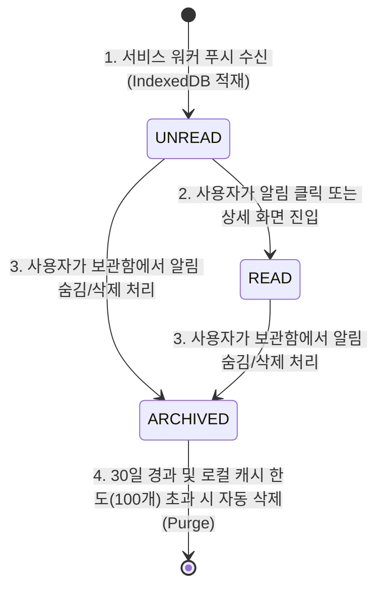

# Data Model Specification: E2E Offline Push & Caching

이 문서는 수신 단말 로컬 스토리지(IndexedDB) 및 백엔드 데이터베이스 상에 적재되는 알림 관련 데이터 엔티티, 유효성 검사 규칙, 그리고 생명주기 상태 전이를 정의합니다.

---

## 1. 개별 엔티티 명세

### 1.1 CachedNotification (IndexedDB - 단말 로컬 영속 캐시)
단말에 도달한 푸시 알림이 백그라운드 서비스 워커에 의해 IndexedDB 스토리지의 `notifications` 오브젝트 스토어(Object Store)에 영속 적재되는 구조입니다.

- **이름**: `CachedNotification`
- **저장소**: Browser IndexedDB (`ai-ledger-notifications` 데이터베이스)
- **속성 (Attributes)**:
  - `id` (KeyPath, String / UUIDv7): 백엔드의 `NotificationLog.id`와 1대1 매핑되는 고유 식별자.
  - `title` (String): 알림 제목.
  - `body` (String): 알림 본문 내용.
  - `status` (String): 알림 읽음 상태 (`UNREAD`, `READ`, `ARCHIVED`).
  - `created_at` (String / ISO-8601 UTC): 알림이 백엔드에서 생성되어 발송된 시각.
  - `synced_at` (String / ISO-8601 UTC): 단말 로컬 스토리지에 최종 적재/동기화된 시각.

### 1.2 NotificationLog (PostgreSQL - 백엔드 영속 적재 로그)
백엔드 데이터베이스 내에서 알림 발송 현황을 추적하고, 동기화 API를 통해 단말에 델타 동기화 셋을 제공하는 마스터 테이블입니다.

- **이름**: `NotificationLog`
- **저장소**: PostgreSQL (`notification_logs` 테이블)
- **속성 (Attributes)**:
  - `id` (UUIDv7, Primary Key): 알림의 고유 식별 키.
  - `user_id` (UUID, Foreign Key): 알림을 수신하는 사용자의 ID.
  - `type` (VARCHAR): 알림 종류 (예: `BUDGET_THRESHOLD_ALERT`, `RECEIPT_PARSED` 등).
  - `payload` (JSONB): 알림 메시지 데이터 (제목, 본문, 상세 이동 링크 등).
  - `status` (VARCHAR): 발송 처리 상태 (`PENDING`, `SENT`, `DELIVERED`, `FAILED`).
  - `created_at` (TIMESTAMP WITH TIME ZONE): 로그 생성 시각.
  - `updated_at` (TIMESTAMP WITH TIME ZONE): 최종 상태 갱신 시각.

---

## 2. 유효성 검사 및 정합성 규칙 (Validation Rules)

1. **고유성 (Uniqueness)**:
   - IndexedDB의 `id` 필드는 Primary Key(KeyPath)로 지정되어 중복 생성이 금지됩니다. 동일한 `id`를 가진 푸시 이벤트가 다중 수신될 경우, `upsert` 로직(멱등성)을 태워 기존 레코드를 덮어쓰고 중복 노출을 차단합니다.
2. **타입 안전성 (Static Types)**:
   - `id`는 항상 유효한 UUIDv7 문자열이어야 합니다.
   - `created_at` 및 `synced_at` 날짜 필드는 ISO-8601 규격(예: `2026-06-21T01:20:00Z`)으로만 표기합니다.
3. **상태 정합성 (Status Consistency)**:
   - `status` 필드는 반드시 `UNREAD`, `READ`, `ARCHIVED` 3가지 값 중 하나여야 하며, 다른 값 유입 시 'UNREAD'로 자동 강제 폴백 처리합니다.

---

## 3. 생명주기 및 상태 전이 (Lifecycle & State Transitions)

IndexedDB 로컬 캐시 `CachedNotification` 레코드의 생명주기와 그에 따른 백엔드 API 상태 전이 규칙은 다음과 같이 관리됩니다.

### 상태 전이 상세 행동
1. **UNREAD 적재 (서비스 워커 수신)**:
   - 오프라인 단말이 복귀하거나 백그라운드 푸시가 도착하면 서비스 워커가 이벤트를 수집하여 IndexedDB에 `status: 'UNREAD'` 상태로 삽입합니다.
   - 삽입 성공 즉시 백엔드의 Acknowledgment API를 비동기 호출하여 백엔드 로그 상태를 `DELIVERED`로 전이시킵니다.
2. **READ 전환 (사용자 조치)**:
   - 사용자가 알림 팝업을 탭하거나 앱 내 알림 목록에서 알림을 클릭하면 로컬 스토리지의 해당 레코드 `status`를 `READ`로 전환합니다.
   - 백엔드로 읽음 업데이트 API 요청을 발송합니다.
3. **ARCHIVED 보관 (보관 처리)**:
   - 사용자가 알림 내역에서 '삭제' 또는 '보관'을 선택하면 `status: 'ARCHIVED'`로 전환하여 기본 목록 뷰에서 즉각 제외시킵니다.
4. **자동 삭제 (Purge)**:
   - 로컬 알림 개수가 100개를 초과하거나 30일이 지난 오래된 알림은 로컬 정기 퍼지 백그라운드 루틴에 의해 IndexedDB에서 완전히 영구 퍼지 처리됩니다.
